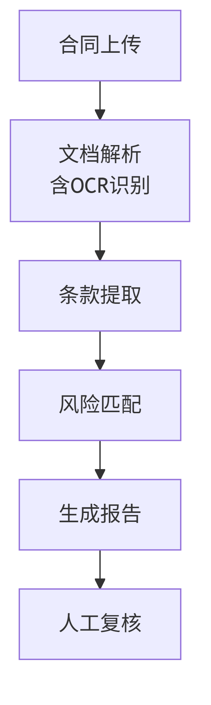
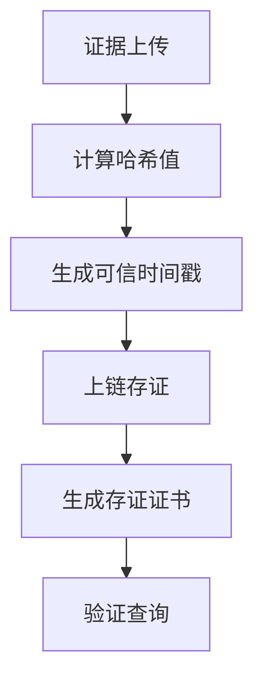
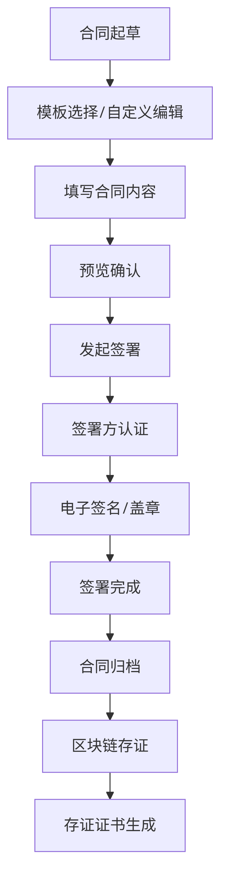
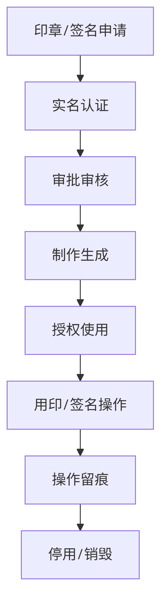
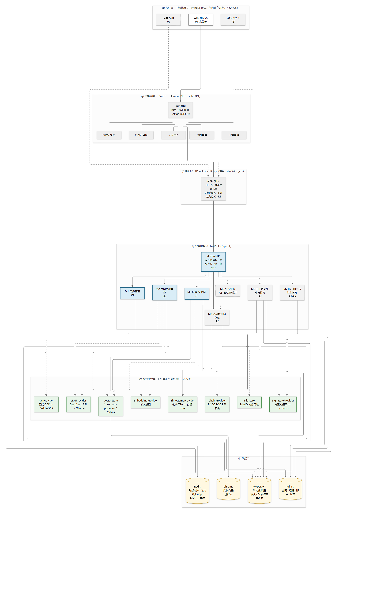

# 《智法宝》项目需求说明书

## 1 引言

### 1.1 编写目的

本项目为《智法宝》—— 一款面向中小企业和个人用户的智能化法律服务平台。本需求说明书旨在明确该软件系统的功能需求、性能需求及运行环境，为后续的系统设计、开发和测试提供依据。预期的读者包括项目开发人员、指导教师及课程评审老师。

### 1.2 项目背景

**项目名称**：智法宝 —— AI 法律助手平台

**项目定位**：智法宝是人工智能技术与法律服务的结合应用，目标是充分提升法治效能，为企业降低法律服务成本，为个人用户提供普惠的法律支持。平台通过 OCR 识别、大语言模型（LLM）、法律知识库和区块链存证等技术的有机整合，为用户提供从「合同起草签署」到「合同风险审查」，再到「法律咨询问答」和「电子证据固化」的全链条一站式法律解决方案。

**核心痛点**：

- 中小企业法务资源匮乏，合同审查依赖人工，成本高、效率低；
- 普通用户获取法律咨询的门槛高、渠道少；
- 电子证据易篡改、易消亡，在诉讼中举证困难、采信率低；
- 传统合同签署线下流程繁琐，电子印章管理不规范，用印风险难以管控。

**项目目标**：

- 打造一个集智能合同审查、法律 AI 问答、区块链证据存证、电子合同生成签署、电子印章与签名管理于一体的全流程法律服务平台；
- 降低法律服务的使用门槛和成本，实现普惠法律服务；
- 通过区块链技术提升电子证据的司法认可度；
- 实现合同从起草、签署到存证、验证的全流程线上化，并通过具备资质的第三方签章服务保障电子签章的法律效力。

> **分期交付说明**：本项目设计覆盖 7 个模块，实现按六期交付。**一期（P1）范围为 M1 用户管理、M2 合同智能审查、M3 法律 AI 问答**，即本项目的**最小可交付成果**；M4 区块链存证、M5 个人中心、M6 电子合同签署、M7 电子印章管理为后期交付内容。分期依据见 [ADR-0002](adr/0002-phased-delivery-ai-first.md) 与 [03-概要设计](03-概要设计.md) §3.3。本文档对全部 7 个模块的需求作完整描述，**后期模块的需求属于已确认的设计范围，但不在本期实现**。

### 1.3 术语

**本项目的领域术语以 [CONTEXT.md](../CONTEXT.md) 为唯一权威来源**，该文件裁定「电子签名／数字签名／电子签章／电子印章」「时间戳／可信时间戳」「身份验证／实名认证／鉴权／授权」等易混术语的确切含义。本节仅列出理解本文档所需的通用技术缩写。

| 术语 | 定义 |
| --- | --- |
| OCR | 光学字符识别（Optical Character Recognition），用于将扫描件、图片中的文字转换为可编辑文本 |
| LLM | 大语言模型（Large Language Model），用于自然语言理解和生成 |
| Agent | 智能体，能够自主完成任务的 AI 程序 |
| RAG | 检索增强生成（Retrieval-Augmented Generation），结合检索与生成的技术方案 |
| 风险点 | 合同审查发现的、需要用户注意的具体问题，含风险等级、所在条款、问题描述、法律依据与修改建议 |
| 法条引用 | 法律问答或审查结论中给出的、具体到条的法律依据（如《民法典》第五百七十七条） |
| 存证 | 将证据材料的哈希值与元数据记录到区块链上的行为。存证固定的是"某份文件在某时刻已存在且此后未变"，**不判断文件内容是否真实、是否合法** |
| 纵切面 | 一条端到端的业务链路，覆盖从数据、后端服务、AI 能力到前端界面的完整实现路径；本项目按纵切面组织团队分工 |

## 2 任务概述

### 2.1 总体目标

本项目的总体目标是建设一个「以智能之法，护权利之宝」的一站式法律服务平台，覆盖合同全生命周期管理与法律辅助服务。具体包括：

- **智能合同审查**：用户上传合同文件（含纸质扫描件），系统通过 OCR 识别文字内容，接入 LLM 并结合法律知识库进行风险分析，自动生成合同风险审查报告。
- **法律 AI 问答**：用户通过对话方式与法律 AI Agent 交互，咨询法律问题，系统基于法律知识库提供专业、可靠的回答。
- **区块链证据存证**：用户可将合同、签名、照片、录音等证据材料上链存证，系统计算证据的哈希值并获取**可信时间戳**后上传至区块链，实现证据的不可篡改和可追溯。**存证固定的是文件在某时刻已存在且此后未变，不对文件内容的真实性、合法性作出判断。**
- **电子合同生成与签署**：支持在线模板起草、AI 智能生成合同，通过**具备资质的第三方电子签章服务**提供的可靠电子签名 / 电子印章完成线上签署，实现合同从起草到签约的全流程线上化。**平台自身不签发证书，负责签署流程编排、签署位置定位与结果存证**（法律效力边界见 §2.3 与 [ADR-0005](adr/0005-signature-provider-abstraction.md)）。
- **电子印章与签名管理**：提供电子印章和电子签名的创建、实名认证、审批授权、使用、停用销毁全生命周期管理，规范用印流程，保障签章安全合规。

其中，电子合同生成签署、区块链证据存证、电子印章管理三大模块协同形成业务闭环，实现从合同起草 → 签署 → 存证 → 验证的完整法律证据链条。

### 2.2 用户特点

本系统的最终用户主要包括以下几类：

| 用户类型 | 特征描述 | 使用场景 |
| --- | --- | --- |
| 中小企业主 | 缺乏专业法务人员，需自行处理合同事务 | 合同审查、法律咨询、电子合同签署、印章使用 |
| 个人用户 | 法律知识有限，有简单法律咨询需求 | 法律问答、简单证据存证、个人电子签名 |
| 律师 / 法务人员 | 具备法律专业背景，追求效率提升 | 批量合同审查、证据管理、合同起草、用印审核 |
| 企业法务部门 | 需系统化管理合同、证据和印章 | 合同全生命周期管理、证据归档、印章管控、权限配置 |

系统的操作界面应简洁直观，降低非法律专业人士的使用门槛。

### 2.3 假定和约束

**假定条件**：

- 用户具备基本的网络操作能力；
- 用户上传的文件格式符合系统要求（PDF、Word、JPG、PNG、MP3、MP4 等）；
- 区块链网络环境稳定可用；
- 电子签名 / 印章服务符合国家相关法律法规要求。

**约束条件**：

- 本项目为课程作业，**一期（M1+M2+M3）开发周期约为 4-6 周**；二期及以后为后续迭代；
- **客户端范围**：一期为 **Web 端**（主战场）；**微信小程序（P5）与安卓 App（P6）为后续移植目标**，三端共用同一套 REST 接口、各自独立开发；**不做 iOS**（团队无设备）。完整决策见 [ADR-0010](adr/0010-multi-client-strategy.md)；
- **移动端前置条件**：微信小程序要求后端域名 **HTTPS 且经 ICP 备案**，并在微信公众平台配置服务器域名白名单 —— 此项需在二期部署阶段确认，不能拖到 P5；
- LLM 服务默认采用 DeepSeek API，后续可换本地自托管模型（Ollama）；
- 区块链存证采用国产开源联盟链 FISCO BCOS；
- 电子签章采用第三方电子签章服务（开发者版），**可靠电子签名的法律效力由该服务商承担**，平台不自行签发证书；
- OCR 一期采用**云端 OCR API**（服务商待定）；本地 PaddleOCR 与 Tesseract 为后续扩展与离线兜底。**服务器不部署本地 OCR**（内存不足，详见 [02-技术栈](02-技术栈.md) §3.9 实测约束）；
- 密码算法主链路采用 RSA-2048 + SHA-256，国密 SM 系列为后期扩展点（见 [ADR-0003](adr/0003-crypto-rsa-first-sm-later.md)）；
- 部署环境为 **Debian 13**，Web 服务器**复用 1Panel 已有的 OpenResty**，不另起独立 Nginx；每个容器须设内存上限。

**合规边界声明**：

| 事项 | 本项目实际达到 | 不宣称 |
| --- | --- | --- |
| 电子签章 | 通过具备资质的第三方签章服务提供可靠电子签名，依据《电子签名法》第十四条具有与手写签名或盖章同等的法律效力 | **不对 GB/T 38540-2020 作合规声明** —— 该标准的合规性依赖经商用密码产品认证的密码模块 |
| 区块链存证 | 文件哈希与可信时间戳上链，可验证文件自存证后未被篡改 | 不宣称存证等同于公证，不对文件内容真实性作判断 |
| 身份核验 | 接入第三方实名认证通道完成核验 | 不宣称接入国家网络身份认证公共服务（需机构资质） |

## 3 功能需求

### 3.1 功能总览

| 模块编号 | 模块名称 | 功能描述 | 优先级 | 实现分期 |
| --- | --- | --- | --- | --- |
| M1 | 用户管理 | 注册、登录、个人信息管理 | 高 | **P1 一期** |
| M2 | 合同智能审查 | 合同上传、OCR 识别、AI 风险分析、报告生成 | 高 | **P1 一期** |
| M3 | 法律 AI 问答 | 对话式法律咨询、知识库检索 | 高 | **P1 一期** |
| M4 | 区块链证据存证 | 证据上传、哈希计算、时间戳、上链存证、验证查询 | 高 | P2 二期 |
| M5 | 个人中心 | 历史记录查看、存证管理 | 中 | P2 二期 |
| M6 | 电子合同生成与签署 | 合同模板管理、AI 起草、在线编辑、电子签署、归档存证、验签 | 高 | P3 三期 |
| M7 | 电子印章与签名管理 | 印章 / 签名制作、实名认证、审批授权、用印管理、停用销毁、权限配置、安全审计 | 高 | P3 / P4 期 |

> **分期说明**：本需求说明书对 7 个模块的需求做**完整描述**，实现按六期交付。一期范围（M1+M2+M3）是本项目的最小可交付成果；M4–M7 的详细需求保留在文档中，实现延后。分期依据与理由见 [ADR-0002](adr/0002-phased-delivery-ai-first.md) 与 [03-概要设计](03-概要设计.md) §3.2 的功能点级对照表。

**编号说明**：`M1`–`M7` 为**功能模块编号**，`01`–`05` 为**文档编号**，两套编号相互独立、不存在对应关系。

### 3.2 模块一：用户管理（M1）

**功能描述**：提供用户注册、登录及账户管理功能。

| 编号 | 功能点 | 输入 | 处理 | 输出 |
| --- | --- | --- | --- | --- |
| M1-01 | 用户注册 | 手机号 / 邮箱、密码、验证码 | 验证信息有效性，创建账户 | 注册成功 / 失败提示 |
| M1-02 | 用户登录 | 账号、密码 | 验证身份，签发**访问令牌**（JWT，短时效）与**刷新令牌**（长时效、存于 Redis、可撤销） | 登录成功 / 失败，跳转首页 |
| M1-03 | 个人信息管理 | 姓名、公司 / 机构信息等 | 更新用户资料 | 更新成功提示 |

> **令牌机制说明**：本系统不采用"JWT 或 Session"的二选一，而是**访问令牌用 JWT（无状态、短时效）+ 刷新令牌用 Redis 存储（可撤销、支持强制下线）**。纯 JWT 无法撤销（登出后令牌仍有效至过期），纯 Session 无法横向扩展，二者结合兼顾两者。详见 [03-概要设计](03-概要设计.md) §5.4。

### 3.3 模块二：合同智能审查（M2）

**功能描述**：用户上传合同文件，系统自动识别文本内容并进行智能风险审查。

**业务流程**：

| 编号 | 功能点 | 输入 | 处理 | 输出 |
| --- | --- | --- | --- | --- |
| M2-01 | 合同文件上传 | 合同文件（PDF/Word/JPG/PNG 格式） | 接收文件，计算 SHA-256 并**以内容哈希存入对象存储**（同名去重、可自校验完整性） | 上传成功提示、文件标识 |
| M2-02 | 文本识别 / 解析 | 扫描件 / 图片格式合同；文本型 PDF/Word | **文本型文件直接解析，不做 OCR**；仅图片与扫描件调用 OCR（PaddleOCR 为主，百度 OCR 备选） | 合同纯文本内容 |
| M2-03 | 关键条款提取 | 合同全文文本 | 调用 LLM 提取合同主体、标的、金额、违约责任、保密义务、管辖法院、付款条款、合同期限等关键信息，**要求返回结构化 JSON** | 结构化条款数据（JSON 格式） |
| M2-04 | 法律知识库检索 | 提取的条款信息 | 在法律知识库中检索相关法条与命中的风险规则 | 相关法律依据与风险规则 |
| M2-05 | 风险智能分析 | 条款信息 + 检索到的法律依据 + 命中的风险规则 | LLM 综合分析，识别法律风险、商务风险、合规风险 | 风险点列表（含等级划分：高 / 中 / 低） |
| M2-06 | 风险报告生成 | 风险分析结果 | 生成结构化审查报告，**区分呈现「检索到的法律依据」「系统依据规则给出的判断」「模型的解释性表述」三类内容** | PDF/HTML 格式的风险审查报告 |
| M2-07 | 审查历史查看 | 用户 ID | 查询历史审查记录 | 历史审查列表及详情 |

**输入输出要求**：

- 支持的文件格式：.pdf、.docx、.jpg、.jpeg、.png
- 单文件大小限制：≤20MB
- 报告输出格式：PDF（含风险点标注、修改建议、法律依据）
- **响应方式**：审查为**异步任务** —— 接口立即返回审查任务号，前端轮询任务状态后取回报告；不将完整审查流程作为同步请求返回
- **不可解析的模型输出不得直接展示给用户**：结构化解析失败时重试一次，仍失败则降级为风险规则判断（见 [03-概要设计](03-概要设计.md) §5.3）

### 3.4 模块三：法律 AI 问答（M3）

**功能描述**：用户通过自然语言对话方式向 AI Agent 咨询法律问题，系统基于法律知识库提供专业回答。

| 编号 | 功能点 | 输入 | 处理 | 输出 |
| --- | --- | --- | --- | --- |
| M3-01 | 法律知识库构建 | 法律语料（见下"语料范围"） | 清洗、**按条切分**（法律文本必须按条切分，不得按固定字符数硬切）、标注元数据（来源、法条号、生效日期、版本、分级）、向量化入库 | 可检索的法律知识库 |
| M3-02 | 智能问答 | 用户输入的法律问题（文本） | 1. 问题语义理解；2. 知识库检索；3. LLM 生成回答 | 法律解答文本（含引用依据） |
| M3-03 | 多轮对话 | 连续对话上下文 | 维护对话状态，结合上下文生成回答 | 连贯的对话回复 |
| M3-04 | 回答溯源 | 用户询问依据 | 展示回答所引用的具体法条或知识库文档 | 引用来源列表 |
| M3-05 | 问答历史 | 用户 ID | 保存并分类管理历史问答 | 历史问答列表 |

**语料范围（一期）**：核心法规（《民法典》合同编、《电子签名法》、合同相关司法解释 2 部，约 1–3 MB 文本）+ 高价值案例（最高法指导性案例与公报案例中的合同类，100–200 份，视时间决定）+ **30–50 条人工编写的风险规则**（检索无结果或模型解析失败时的兜底依据）。

**关于"抓取全部现行有效法律与近 10 年案例"的结论**：**不采用**。理由按重要性排序：① 裁判文书中 99% 以上为刑事、行政、执行、婚姻家事案由，与合同审查无关，海量无关语料会使检索精度崩塌，导致模型**引用真实但不适用的判决** —— 这类错误比凭空编造更隐蔽；② 近 10 年裁判文书为**数千万份**量级、文本量数百 GB、切分后向量块达数亿，超出单机向量库的处理能力；③ 官方渠道存在反爬与访问限制，批量抓取违反网站条款；④ 裁判文书含当事人个人信息，大范围采集入库涉及《个人信息保护法》。**规模化语料采集应通过数据合作或离线授权实现，属于后期扩展任务**，详见 [03-概要设计](03-概要设计.md) §5.2.4。

**输入输出要求**：

- 问答响应时间：≤5 秒（常规问题）
- 回答应包含**具体到条**的法律依据引用，降低「AI 幻觉」风险；检索无依据时**明确标注"未找到直接法律依据"**，不得由模型自由发挥
- 对话历史需持久化保存

### 3.5 模块四：区块链证据存证（M4）

**功能描述**：用户上传证据材料（合同、签名、照片、录音等），系统计算哈希值并获取**可信时间戳**后上链存证，实现证据的不可篡改和可追溯。**存证只固定"某份文件在某时刻已存在且此后未变"，不对文件内容的真实性与合法性作出判断。**

**业务流程**：

| 编号 | 功能点 | 输入 | 处理 | 输出 |
| --- | --- | --- | --- | --- |
| M4-01 | 证据材料上传 | 证据文件（合同 / 签名 / 照片 / 录音等） | 接收并以**内容哈希**存入对象存储 | 上传成功提示、文件标识 |
| M4-02 | 哈希值计算 | 证据文件的二进制数据 | 使用 SHA-256 计算文件哈希值 | 唯一的哈希值字符串 |
| M4-03 | 可信时间戳获取 | 哈希值 | 向**平台之外的时间源**（公共 TSA，RFC 3161）请求时间戳；无外网时降级为自建 TSA 并**标注来源**（自建来源不构成第三方可信时间戳） | 可信时间戳及其来源标识 |
| M4-04 | 区块链上链存证 | 哈希值 + 时间戳 + 元数据 | 调用区块链智能合约将数据上链。**链上只存哈希值、可信时间戳、存证编号与元数据哈希；文件本体存于对象存储** | 区块链交易哈希 / TxID |
| M4-05 | 存证证书生成 | 上链成功信息 | 生成包含哈希值、时间戳及其来源、TxID 的电子存证证书 | PDF 格式存证证书 |
| M4-06 | 存证验证查询 | 存证编号或哈希值 | 在区块链上查询并校验数据完整性 | 验证通过 / 失败及详细信息 |
| M4-07 | 存证记录管理 | 用户 ID | 展示用户所有存证记录 | 存证列表（含状态、时间） |

**输入输出要求**：

- 支持的文件格式：.pdf、.docx、.jpg、.jpeg、.png、.mp3、.mp4、.wav、.m4a
- 单文件大小限制：≤50MB（照片≤10MB，录音≤30MB）
- 上链确认时间：≤30 秒
- 存证证书应包含：文件哈希值、**可信时间戳及其来源类型**、区块链 TxID、存证时间、存证编号
- **术语区分**：存证编号是平台生成的业务标识，**不等于** TxID，两者在界面与证书中不可互换使用

### 3.6 模块五：个人中心（M5）

| 编号 | 功能点 | 输入 | 处理 | 输出 |
| --- | --- | --- | --- | --- |
| M5-01 | 合同审查历史 | 用户 ID | 展示所有历史审查记录 | 历史记录列表 |
| M5-02 | 问答历史 | 用户 ID | 展示所有历史问答 | 对话历史列表 |
| M5-03 | 存证管理 | 用户 ID | 展示所有存证记录，支持下载证书 | 存证列表及证书下载 |

### 3.7 模块六：电子合同生成与签署（M6）

**功能描述**：用户通过系统在线生成电子合同，并通过电子签名 / 电子印章完成合同签署，实现合同从起草到签约的全流程线上化。

**法律依据**：根据《中华人民共和国电子签名法》第十四条规定，**可靠的电子签名**与手写签名或者盖章具有同等的法律效力。2025 年 1 月，最高人民法院进一步明确电子签名的法律效力，可靠的电子合同可作为诉讼、仲裁中的有效证据。2025 年 9 月 27 日，国务院办公厅发布《电子印章管理办法》（国办发〔2025〕33 号），明确电子印章与实物印章具有同等法律效力。

> ⚠️ **法律效力的来源必须说清楚**：上述法律效力属于**可靠的电子签名**，其成立前提是签名制作数据专属于签名人且签署时仅由签名人控制 —— 这依赖**受信任的证书链**。因此：**本平台不自行签发证书**，可靠电子签名能力由**具备资质的第三方电子签章服务**提供，**法律效力由该服务商承担**；本平台负责签署流程编排、签署位置定位与结果存证。平台若声称自己产出的签名具有法律效力，等于声称自己具备电子认证服务资质。详见 [ADR-0005](adr/0005-signature-provider-abstraction.md)。
>
> 另需注意：**用户手写绘制或上传的"签名图片"不是电子签名** —— 它是可被复制粘贴的位图，不满足"制作数据专属于签名人"的条件。平台允许使用签名图片用于视觉呈现，但在对外表述与界面文案中必须与电子签名区分（见 [CONTEXT.md](../CONTEXT.md)）。

**业务流程**：

| 编号 | 功能点 | 输入 | 处理 | 输出 |
| --- | --- | --- | --- | --- |
| M6-01 | 合同模板管理 | 合同模板文件、模板分类、模板标签 | 支持上传、编辑、分类、版本管理合同模板；支持预设签署位置和填写字段 | 模板库列表 |
| M6-02 | 合同起草 / 生成 | 模板选择 + 字段填写（合同主体、标的、金额、期限等） | 基于选定模板自动生成合同文本，支持在线编辑和实时预览 | 待签署合同草稿 |
| M6-03 | AI 智能起草 | 用户输入合同需求描述（自然语言） | 调用 LLM 根据用户需求描述**生成合同全文**（无模板、自定义合同） | 合同草案 |
| M6-04 | AI 引导式填写 | 模板 + 用户需求描述 | **逐轮向用户提问**，依据用户回答填充模板的可填字段，直至合同内容完整 | 填写完成的合同文本 |
| M6-05 | 合同内容编辑 | 合同草案文本 | 提供在线富文本编辑器，支持条款增删改、格式调整 | 修改后的合同文本 |
| M6-06 | 合同参与方管理 | 合同 ID、参与方信息（姓名 / 企业、联系方式、角色） | 维护合同的**参与方**（范围大于签署方：见证方、审批方也是参与方）；各方可在平台上查看与自己相关的合同 | 参与方列表及各方的合同视图 |
| M6-07 | 合同预览与确认 | 待签署合同 | 展示合同完整内容，供签署方最后确认 | 合同预览页面 |
| M6-08 | 签署发起 | 合同 ID、签署方信息（姓名 / 企业、手机号 / 邮箱） | 创建签署任务，向各签署方发送签署通知 | 签署任务 ID、签署链接 / 通知 |
| M6-09 | 签署方身份认证 | 签署人身份信息 | 支持多种认证方式：短信验证码、人脸识别、银行卡四要素认证等 | 认证通过 / 失败 |
| M6-10 | 签署意愿确认 | 签署人 | 签署人明确表达"我同意签署本合同" | 签署意愿确认记录 |
| M6-11 | 电子签名 / 盖章 | 签署人认证通过 + 签署意愿确认 | 调用**第三方电子签章服务**，在合同指定位置添加电子签名或电子印章 | 已签署的电子合同（含签名 / 印章） |
| M6-12 | 签署流程管理 | 签署任务 ID | 支持单人单签、多人顺序签、多人并行签等多种签署模式；实时跟踪各签署方签署状态 | 签署进度状态 |
| M6-13 | 合同归档与存储 | 已签署合同 | 将签署完成的合同归档保存，支持分类、检索、下载 | 归档合同列表 |
| M6-14 | 合同区块链存证 | 已签署合同文件 | 计算合同文件哈希值，获取可信时间戳后上链存证 | 存证证书（含哈希值、时间戳、TxID） |
| M6-15 | 合同验签 | 已签署合同文件 | 验证合同上的电子签名 / 印章是否有效、合同内容是否被篡改 | 验签通过 / 失败及验证报告 |
| M6-16 | 合同到期提醒 | 归档合同 + 合同期限信息 | 在合同到期前自动发送提醒通知 | 到期提醒消息 |
| M6-17 | 合同管理 | 用户 ID、查询条件 | 展示用户所有合同（起草中、签署中、已签署、已归档），支持搜索、筛选、下载 | 合同列表及详情 |

> **功能点编号说明**：本表在原 M6-01 ~ M6-14 的基础上新增了参与方管理、签署意愿确认与 AI 引导式填写三项，编号顺延至 M6-17。原"M6-16 AI 自定义合同生成"**合并入 M6-03**（二者均为"以自然语言生成合同全文"，保留两条会造成功能冗余）；原"M6-18 签署法律效力保障"**不作为独立功能点**，它是 M6-09 ~ M6-11 的约束条件，内容见本节"法律依据"与 [ADR-0005](adr/0005-signature-provider-abstraction.md)。

**输入输出要求**：

- 支持导出格式：.pdf（含电子签名 / 印章）、.docx
- **签署方式**：支持手写签名图片（触屏 / 鼠标绘制，用于视觉呈现）、由第三方签章服务签发的可靠电子签名、预制电子印章（企业公章、合同专用章等）
- 身份认证方式：短信验证码、人脸识别、银行卡四要素认证
- 签署完成时间：签署流程应在发起后 72 小时内完成（可配置）
- 合同存储：签署完成合同自动归档至区块链与对象存储双备份（链上存哈希，文件本体存对象存储）

### 3.8 模块七：电子印章与签名管理（M7）

**功能描述**：为用户提供电子印章和电子签名的创建、管理、授权、使用全生命周期管理功能。根据 2025 年国务院办公厅发布的《电子印章管理办法》，电子印章管理工作遵循统筹推进、分级管理、规范标准、安全可控的原则。

**业务流程**：

| 编号 | 功能点 | 输入 | 处理 | 输出 |
| --- | --- | --- | --- | --- |
| M7-01 | 印章制作 | 印章图像、印章名称、印章类型（公章 / 合同专用章 / 财务章 / 部门章等）、所有者信息 | 基于上传图像和规范要求生成电子印章数据；印章包含印章图像数据、名称、所有者信息和电子签名认证证书 | 电子印章（含唯一标识） |
| M7-02 | 个人签名创建 | 用户手写签名绘制（触屏 / 鼠标）或上传签名图片 | 生成并保存用户的**签名图片**（用于视觉呈现） | 签名图片 |
| M7-03 | 签名图片管理 | 用户 ID、签名图片 | 支持一人多张签名图片、设置默认签名、重命名与停用 | 签名图片列表 |
| M7-04 | 签名唯一标识与证书绑定 | 用户身份信息 + 签名图片 | 将签名图片与**由第三方签章服务签发的数字证书**绑定，形成可用于签署的唯一签名标识 | 绑定后的签名标识 |
| M7-05 | 实名认证 | 个人：身份证信息 + 人脸识别；企业：营业执照 + 法人身份验证 + 对公账户验证 | 验证用户真实身份，确保印章 / 签名归属真实可追溯。**实名认证回答"账号背后是谁"，与登录时的身份验证不是一回事** | 实名认证通过 / 失败 |
| M7-06 | 印章 / 签名审批 | 印章 / 签名申请信息 | 管理员审核印章 / 签名创建申请，确保来源合法 | 审批通过 / 驳回 |
| M7-07 | 印章 / 签名授权 | 印章 ID、被授权人 / 角色、使用权限（使用场景、时间范围、文件类型等） | 按组织架构分级分配权限；可细化到岗位和业务场景 | 授权记录 |
| M7-08 | 印章 / 签名使用 | 合同文件 + 印章 / 签名 ID + 使用人认证 | 在合同指定位置加盖电子印章或添加电子签名，操作全程留痕 | 签章后的合同文件 + 操作日志 |
| M7-09 | 用印审批流程 | 用印申请（合同信息、用印人、用印理由） | 发起用印申请 → 审批人审核 → 批准后自动调用印章签署 | 审批通过 / 驳回，通过后自动签章 |
| M7-10 | 印章 / 签名停用 | 印章 ID、停用原因 | 将印章 / 签名标记为停用状态，禁止继续使用 | 停用确认 |
| M7-11 | 印章 / 签名销毁 | 印章 ID、销毁授权 | 永久删除电子印章 / 签名数据（需多重授权） | 销毁确认 |
| M7-12 | 用印记录查询 | 查询条件（时间范围、使用人、合同类型等） | 展示所有印章 / 签名使用记录；每一次用印操作的发起者、审批者、时间、内容等信息实时记录 | 用印日志列表 |
| M7-13 | 印章 / 签名列表管理 | 用户 ID | 展示用户所有电子印章和签名，支持分类查看、搜索 | 印章 / 签名列表 |
| M7-14 | 权限配置 | 角色 / 用户 + 权限规则 | 支持多级权限管理，围绕主体、印章、场景三个维度配置；遵循最小权限原则 | 权限配置生效 |
| M7-15 | 安全审计 | 审计员权限 | 审计员可调取用印日志但无修改权限；支持异常用印行为识别和预警 | 审计报告 |

> **功能点编号说明**：本表在原 M7-01 ~ M7-13 的基础上新增了签名图片管理与签名唯一标识两项，编号顺延至 M7-15。

**输入输出要求**：

- 印章类型：支持公章、合同专用章、财务专用章、部门章、法人名章等多种类型
- 认证方式：个人实名认证（身份证 + 人脸识别）、企业实名认证（营业执照 + 法人身份验证 + 对公账户验证）
- **安全标准：参照 GB/T 38540-2020《信息安全技术 安全电子签章密码技术规范》的安全目标进行设计，但不作合规声明** —— 该标准的合规性依赖经商用密码产品认证的密码模块，非"使用国密算法"即可达成（见 [ADR-0003](adr/0003-crypto-rsa-first-sm-later.md)）
- **签名效力**：平台生成的"签名图片"仅用于视觉呈现，**不是电子签名**；具备法律效力的电子签名由第三方签章服务签发的数字证书产生
- 权限管理：支持按组织架构分级配置权限
- 操作留痕：每一次用印操作的发起者、审批者、时间、内容等信息实时记录

## 4 非功能需求

### 4.1 性能需求

| 指标 | 要求 |
| --- | --- |
| 页面加载时间 | ≤3 秒 |
| OCR 识别响应时间 | ≤10 秒（单页） |
| 合同审查完整流程 | ≤60 秒（常规合同） |
| AI 问答响应时间 | ≤5 秒 |
| 区块链上链确认 | ≤30 秒 |
| 电子签章操作响应 | ≤3 秒 |
| 系统并发用户数 | 支持 ≥100 并发用户 |

### 4.2 安全性需求

- 用户数据加密：用户个人信息、合同内容、证据材料等敏感数据应加密存储；
- 传输安全：所有数据传输采用 HTTPS 协议加密；
- **身份验证与令牌**：登录状态采用**访问令牌（JWT，短时效、无状态）+ 刷新令牌（存于 Redis，长时效、可撤销）** 的双令牌机制，不使用"JWT 或 Session"的二选一方案（见 §3.2 说明）；
- **密钥与凭据管理**：区块链私钥、第三方签章服务的接口凭据应安全存储于环境变量或密钥管理服务，**不得硬编码于代码、不得提交进版本库**，不得明文传输；
- **数据备份**：定期备份用户数据、合同数据和区块链存证数据；
- **操作留痕**：合同签署、用印、上链等关键操作全程记录审计日志，不可篡改。

### 4.3 可靠性需求

- 系统可用性 ≥99%（计划内维护除外）；
- 区块链存证数据、电子合同数据应具备冗余备份机制；
- 关键操作（上链存证、合同审查、电子签章）应有操作日志记录；
- 系统应具备异常恢复能力，服务中断后可自动恢复。

### 4.4 易用性需求

- 界面设计简洁清晰，符合大众使用习惯；
- 合同上传、审查、存证、签署等核心功能操作步骤不超过 3 步；
- 提供操作引导和帮助文档；
- 风险报告、法律解答应通俗易懂，非法律专业人士也能理解。

### 4.5 可维护性与可扩展性需求

- 系统采用模块化设计，各功能模块可独立升级；
- 法律知识库支持动态更新，可接入最新法律法规；
- **外部能力应可替换**：大模型、OCR、向量存储、签章、时间戳、区块链六类能力都不应与业务逻辑耦合，且**同一个能力只在一处封装**。[ADR-0012](adr/0012-defer-capability-abstraction.md) 决定**一期不预先建 Provider 接口体系** —— 等某个能力真的出现第二种实现时再抽接口，那时接口形状才是已知的；
- 电子签章服务支持对接不同第三方服务商，支持能力扩展；
- **后期可扩展的身份核验通道**：国家网络身份认证公共服务（需机构资质，本期不实现），记录于此以说明该路径已被评估而非遗漏。

### 4.6 运行环境

本系统采用以下运行环境（技术栈已确认，详见 [02-技术栈.md](02-技术栈.md)）：

| 项目 | 要求 |
| --- | --- |
| 服务器操作系统 | Linux（**Debian 13 trixie**，服务器实测环境） |
| 容器化部署 | Docker Compose（**每容器须设内存上限**） |
| 服务器运维面板 | 1Panel（目标主机已部署） |
| Web 服务器 | **复用 1Panel 的 OpenResty**（已占用 80/443），不另起独立 Nginx |
| 后端框架 | FastAPI（Python） |
| 前端框架 | Vue 3 + Element Plus |
| 数据库 | MySQL 9.7 |
| 向量数据库 | Chroma（进程内） |
| LLM 服务 | DeepSeek API（后续可换本地 Ollama） |
| 区块链平台 | FISCO BCOS |
| OCR 服务 | **云端 OCR API（默认，服务商待定）**；本地 PaddleOCR / Tesseract 为后续扩展与离线兜底（**不在服务器运行**） |
| 电子签章服务 | 第三方电子签章服务（开发者版，承担可靠电子签名效力） |
| 时间戳服务 | 公共 TSA（RFC 3161）；自建 TSA 为离线兜底并标注来源 |
| 对象存储 | MinIO（内容寻址存储） |
| 缓存与令牌 | Redis |

> **能力替换说明**：上表六类外部能力（大模型、OCR、向量存储、签章、时间戳、区块链）在设计上均可替换；但如 [ADR-0012](adr/0012-defer-capability-abstraction.md) 所述，**一期不预先建接口体系**，替换时会涉及改动接入处。**短信通道、人脸识别、银行卡四要素验证依赖运营商或持牌机构，无法以开源方案替代**，只能接入第三方或降级处理（见 [02-技术栈.md](02-技术栈.md) §3.6）。

## 5 附录

### 5.1 技术架构建议

系统采用**分层架构**设计，自上而下分为用户端、前端应用层、接入层、业务服务层、**外部能力接入**、数据层，各层之间解耦，支持独立扩展。

> **图的源码**：[`assets/fig-architecture.mmd`](assets/fig-architecture.mmd)（Mermaid）。**改图请改源码后重新渲染**，方法见 [`assets/README.md`](assets/README.md)。
>
> **本图已于 2026-09-13 重画**，原因是原图为位图且内容已与设计脱节（图中写"React / Vue.js"二选一、未表达外部能力接入、业务层只有 5 个模块、数据层未含 Chroma、未区分交付分期）。重画后的图与 [03-概要设计](03-概要设计.md) §2.4 一致，并新增了两项表达：
>
> 1. **外部能力接入** —— 大模型、嵌入、OCR、向量存储、对象存储，以及 P2/P3 的签章、时间戳、区块链。**一期由需要的切片直接接入，同一能力只在一处封装**（见 [ADR-0012](adr/0012-defer-capability-abstraction.md)）。
> 2. **交付分期标注** —— M1–M3 为蓝色实线（P1 一期），M4–M7 为灰色虚线（P2 及以后），使「设计完整、分期交付」在图上直接可见。

### 5.2 参考标准与规范

- 《软件需求说明书》编写规范（GB/T 8567-2006）
- 《区块链司法存证技术要求》（T/CIIA XXX—XXXX）
- 《电子数据存证技术规范》（SF/T 0076-2020）
- 《人民法院在线诉讼规则》（2021 年）第 16-18 条
- 《最高人民法院关于民事诉讼证据的若干规定》（2019 年修正）
- 《中华人民共和国电子签名法》（2004 年通过，2015 年第一次修正，2019 年第二次修正，2025 年启动新一轮修订征求意见）
- 《电子印章管理办法》（国办发〔2025〕33 号，2025 年 9 月 27 日）
- GB/T 38540-2020《信息安全技术 安全电子签章密码技术规范》（**参照其安全目标，不作合规声明**，见 §2.3 合规边界声明）
- 《中华人民共和国个人信息保护法》（涉及裁判文书等含个人信息语料的采集与使用）

### 5.3 项目里程碑与交付分期

本项目按六期交付，一期为主体周期，二期及以后为后续迭代。各期范围与判据如下：

| 分期 | 周期 | 范围 | 交付判据 |
| --- | --- | --- | --- |
| **P1 一期** | 第 1–6 周 | 基座与设计冻结（M1、数据库设计、接口契约）→ M2 合同智能审查 → M3 法律 AI 问答 | 用户可注册登录；上传合同可得到含法律依据的风险审查报告；可就法律问题获得带**法条级引用**的问答 |
| **P2 二期** | 后续 1–2 周 | 部署运维（Docker Compose / Nginx / CI）+ M4 区块链证据存证 + M5 个人中心 | 全栈可一键部署；证据可上链并生成可独立验证的存证证书 |
| **P3 三期** | 后续 2–3 周 | M6 电子合同生成与签署 + M7 电子印章与签名管理 | 合同可在线起草、由双方签署、签章后自动归档并存证；印章全生命周期可管理 |
| **P4 四期** | 视时间 | 多方签署模式、合同到期提醒、印章分级授权、停用与销毁、权限配置、安全审计、异常用印预警 | 合规与管控增强能力可用 |

**一期内部节奏**（第 1–6 周）：

| 阶段 | 主要任务 |
| --- | --- |
| 第 1 周 | 需求与设计收口（03 概要设计、04 数据库设计、05 接口设计）；契约冻结；**语料采集与治理启动**（不依赖代码，是关键路径起点） |
| 第 2–3 周 | 基座落地（M1 认证授权、数据层、公共层工具）；M2 主干（上传→文本化→条款提取）；M3 知识库索引与检索 |
| 第 4 周 | M2 风险分析与报告生成；M3 问答、多轮对话与回答溯源；前端页面集成 |
| 第 5 周 | 端到端联调、功能测试、AI 输出质量调优、性能与限流、界面完善 |
| 第 6 周 | 文档整理、演示材料、答辩准备 |

**补充说明**：M6（电子合同生成与签署）和 M7（电子印章与签名管理）模块与 M4（区块链证据存证）模块形成紧密的业务闭环 —— 用户通过 M6 生成的电子合同在签署完成后，可直接通过 M4 进行区块链存证；而 M7 管理的电子印章 / 签名则为 M6 的电子签署提供法律效力的技术支撑。**三个模块的依赖顺序不可颠倒**：必须先有 M4 的存证能力与 M7 的签章能力，M6 的签署才有法律闭环，这也是它们排在 P2/P3 的原因。三个模块协同运作，实现从合同起草 → 签署 → 存证 → 验证的完整法律证据链条。
