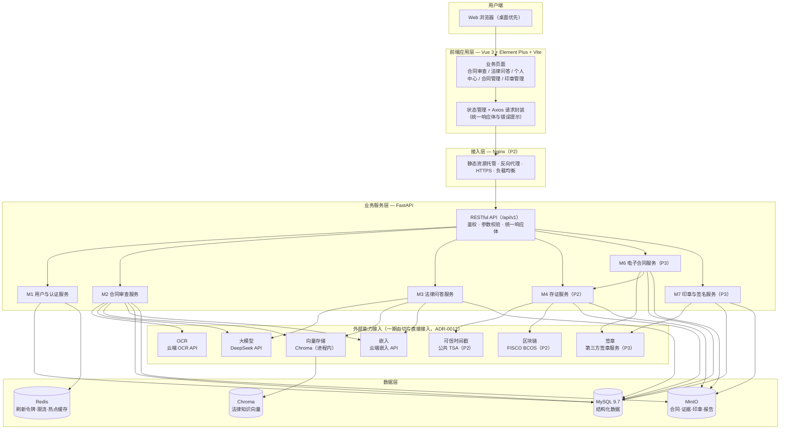
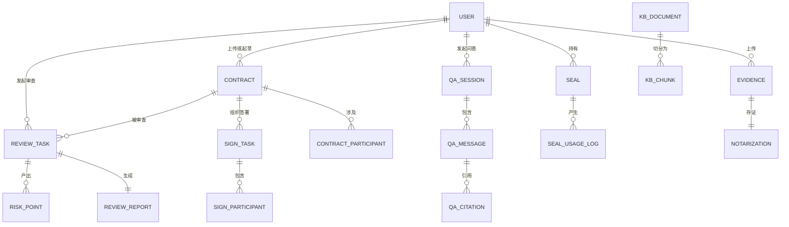
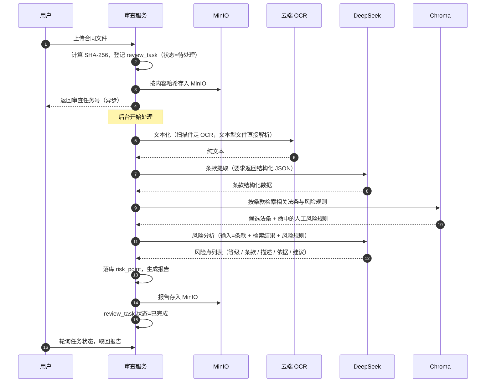
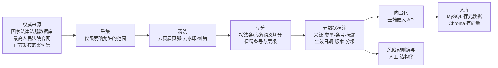
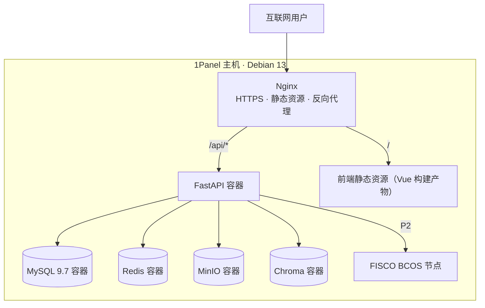

# 《智法宝》概要设计说明书

| 项目 | 内容 |
| --- | --- |
| 项目名称 | 智法宝（law-wiz）—— AI 法律助手平台 |
| 文档编号 | 03 |
| 文档版本 | v1.0（待评审） |
| 编写日期 | 2026-09-12 |
| 上游文档 | [01-需求说明书](01-需求说明书.md)、[02-技术栈.md](02-技术栈.md) |
| 下游文档 | 04-数据库设计说明书、05-接口设计说明书 |

---

## 1 引言

### 1.1 编写目的

本文档确定《智法宝》的系统总体结构、模块划分、模块间依赖与关键接口，并明确**交付分期**与**团队分工的纵切面边界**。它是《04-数据库设计说明书》与《05-接口设计说明书》的输入，也是开发阶段判定"某个改动是否破坏架构"的依据。

预期读者：项目开发人员、指导教师、课程评审老师。

### 1.2 范围

本文档覆盖 M1–M7 全部 7 个功能模块的**总体设计**，并对每个功能点标注实现分期（P1–P6）。**设计完整、分期交付**：后期功能的设计在本文件中保留，代码实现延后。

各模块内部的算法级细节（如条款提取的提示词结构、印章合成算法）不在本文档范围，属详细设计。

### 1.3 术语

本文档使用 `CONTEXT.md` 定义的术语，不再重复定义。**术语以 [../CONTEXT.md](../CONTEXT.md) 为唯一权威来源**；需求说明书 §1.3 的术语表仅作历史保留。

以下三组术语在本项目中**不可混用**，请特别注意：

| 词组 | 区别 |
| --- | --- |
| 身份验证 / 实名认证 | 前者校验"你是否是账号主人"，后者核验"账号背后是谁" |
| 时间戳 / 可信时间戳 | 前者仅记录时刻，后者要求信任锚在平台之外 |
| 电子签名 / 数字签名 / 电子签章 / 电子印章 | 依次为：法律意义上的数据、密码学技术、加盖动作、印章实体 |

### 1.4 参考文献

- [01-需求说明书.md](01-需求说明书.md)
- [02-技术栈.md](02-技术栈.md)
- [CONTEXT.md](../CONTEXT.md) —— 领域术语表
- [docs/adr/](adr/) —— 架构决策记录（ADR-0001 ~ ADR-0006）
- GB/T 8567-2006《计算机软件文档编制规范》
- GB/T 38540-2020《信息安全技术 安全电子签章密码技术规范》（**参照**，合规边界见 ADR-0003）

---

## 2 总体设计

### 2.1 设计目标

1. **可交付**：一期（M2+M3）独立构成一个可运行、可演示的 AI 法律助手能力面，不依赖后期模块。
2. **可分期**：后期模块的接入不要求重构一期代码。
3. **可替换**：所有外部能力（大模型、OCR、向量存储、签章、时间戳）均通过接口接入，替换实现不触及业务逻辑。
4. **可追责**：每一次 AI 结论都可溯源到具体法条或知识库文档；每一次签署、用印、上链都可审计。

### 2.2 设计约束

| 约束 | 内容 | 来源 |
| --- | --- | --- |
| 周期 | 4–6 周，4 名开发者 | 01 §2.3 |
| 一期范围 | 仅 M2 + M3 | ADR-0002 |
| 后端语言 | Python（FastAPI） | 02 §3.3 |
| 前端框架 | Vue 3 + Element Plus + Vite | 02 §3.2 |
| 数据库 | MySQL 9.7 + Chroma + MinIO + Redis | 02 §3.7 |
| 大模型 | DeepSeek API（经 OpenAI 兼容接口 / LangChain） | 02 §3.4 |
| 密码算法 | RSA-2048 + SHA-256 为主链路 | ADR-0003 |
| 运行环境 | Debian 13 (trixie) + Docker Compose + Nginx（复用 1Panel OpenResty） | 02 §3.9 / 服务器实测 |
| 部署主机 | 单台 1Panel 主机，**2 vCPU / 1.7 GiB 内存 / 24 GB 可用磁盘 / 8 GB swap** | 服务器实测 |
| 容器内存上限 | 后端与数据库各需设 `mem_limit`，**禁止引入 `paddlepaddle` / `torch`** | 服务器实测 |
| 项目管理 | 禅道（ZenTao）；数据经其 API 导入 | 部署环境确认 |
| 客户端范围 | 一期只有 Web；小程序（P5）与安卓（P6）后续移植，**不做 iOS** | [ADR-0010](adr/0010-multi-client-strategy.md) |

### 2.3 设计原则

1. **接口先行**：任何跨模块调用必须先冻结契约（[05-接口设计](05-接口设计.md)），再并行开发实现。
2. **单源真相**：接口契约的唯一真源是 FastAPI 代码（Pydantic 模型 + 路由注解），`/openapi.json` 自动生成；Apifox 与文档均为其下游消费者，**不存在需要手工同步的第二份契约**。
3. **能力可降级**：AI 能力不可用时系统必须仍能给出**可解释的结构化结论**，而非直接失败（见 §3.5 风险规则兜底）。
4. **链路优先于分层**：团队按纵切面（端到端链路）分工，而非按技术层分工（ADR-0001）。
5. **内容寻址**：用户上传的文件以内容哈希存储，天然去重且可验证完整性（见 §4.3）。

### 2.4 系统分层架构

**层间约束**：

- 业务服务层之间**只允许**通过服务接口调用，不允许跨模块直接读写对方的数据表。
- 外部能力（LLM / OCR / 向量库 / 对象存储）**一期由需要的切片直接接入**，
  但**同一个能力只在一处封装**，其它地方复用该封装；不建 Provider 接口体系（[ADR-0012](adr/0012-defer-capability-abstraction.md)）。
- 前端**不得**直接调用外部能力，所有 AI 与链上操作均经后端发起。

### 2.5 技术栈到架构层的映射

| 架构层 | 对应技术（见 02-技术栈.md） |
| --- | --- |
| 前端应用层 | Vue 3、Element Plus、Vite、Axios、TinyMCE/Quill、Signature Pad |
| 接入层 | Nginx、Docker Compose |
| 业务服务层 | FastAPI、SQLAlchemy、PyJWT、PyPDF2/python-docx、Pillow/OpenCV |
| 外部能力接入 | DeepSeek API、LangChain、Chroma、云端 OCR API、Web3.py、第三方签章服务 |
| 数据层 | MySQL 9.7、Chroma、MinIO、Redis |

---

## 3 模块分解与交付边界

### 3.1 模块清单

| 编号 | 模块名称 | 主要职责 | 依赖的前置模块 | 分期 |
| --- | --- | --- | --- | --- |
| M1 | 用户管理 | 注册、登录、令牌管理、个人信息、账户体系 | 无（**基座**） | **P1** |
| M2 | 合同智能审查 | 文件接入与文本化、条款提取、知识库检索、风险分析、报告生成、审查历史 | M1 | **P1** |
| M3 | 法律 AI 问答 | 知识库构建、智能问答、多轮对话、回答溯源、问答历史 | M1 | **P1** |
| M4 | 区块链证据存证 | 证据上传、哈希计算、可信时间戳、上链存证、存证证书、验证查询、记录管理 | M1 | P2 |
| M5 | 个人中心 | 审查历史、问答历史、存证管理（**聚合读取层**） | M1、M2、M3、M4 | P2 |
| M6 | 电子合同生成与签署 | 模板管理、合同起草、AI 起草、在线编辑、签署发起、身份认证、签章、归档、存证、验签、到期提醒、合同管理 | M1、M4、M7 | P3 |
| M7 | 电子印章与签名管理 | 印章制作、签名图片管理、实名认证、审批、授权、用印、停用销毁、记录查询、权限配置、安全审计 | M1 | P3 |

> **M5 的定位说明**：M5 不产生新数据，它是 M2/M3/M4/M6 产出物的**聚合读取层**。其设计难点不在功能，而在**跨模块读取契约的冻结**——M5 开始开发前，M2/M3/M4/M6 必须已发布各自的"历史记录查询接口"。

### 3.2 功能点分期对照表

下表逐条对照 `01-需求说明书` §3 的功能点编号，标注实现分期。**未列入表中"本期收录"的功能点，一律为后期收录。**

| 模块 | 本期收录（P1） | 后期收录 |
| --- | --- | --- |
| **M1** | M1-01 用户注册、M1-02 用户登录、M1-03 个人信息管理 | 企业主体与成员管理（P3，M7 实名认证所需） |
| **M2** | **M2-01 ~ M2-07（全部）** | —— |
| **M3** | **M3-01 ~ M3-05（全部）** | 知识库动态更新与语料扩充（P4，见 §5.2） |
| **M4** | —— | M4-01 ~ M4-07（全部，P2） |
| **M5** | —— | M5-01 ~ M5-03（全部，P2） |
| **M6** | —— | M6-01 ~ M6-14（P3）；**新增**：M6-15 AI 引导式合同填写、M6-17 合同参与方与双方协同（P3） |
| **M7** | —— | M7-01 ~ M7-13（P3/P4）；**新增**：M7-14 手写签名管理（P3/P4）、M7-15 签名唯一标识与证书绑定（P3） |

**两处功能合并裁定**：

1. **M6-16（AI 自定义合同生成）合并进 M6-03**：二者均为"以自然语言需求描述生成合同全文"，无功能差异，保留两条会导致评审质疑功能冗余。
2. **M6-18（签署法律效力保障）不作为独立功能点**：它是 M6-07/M6-08 的**约束条件**，其内容落在 ADR-0005 与 §6.6。

### 3.3 交付边界与分期

| 分期 | 范围 | 交付判据 | 预估周期 |
| --- | --- | --- | --- |
| **P1** | M1 + M2 + M3 | 用户可注册登录，上传合同得到含法律依据的风险审查报告，可就法律问题获得带法条引用的问答 | 4–6 周（课程周期主体） |
| **P2** | 部署运维 + M4 + M5 | Docker Compose 一键起全栈；证据可上链并获得可验证的存证证书 | 1–2 周 |
| **P3** | M6 + M7 | 合同可在线起草、由双方签署、签章后自动归档并存证；印章全生命周期可管理 | 2–3 周 |
| **P4** | 合规与管控增强 | 多方签署模式、到期提醒、分级授权、停用销毁、安全审计可用 | 视时间 |
| **P5** | **微信小程序端** | 小程序可完成注册登录、合同审查发起与报告查看、法律问答 | 视时间 |
| **P6** | **安卓 App** | 安卓端具备与 Web 一致的核心能力 | 视时间 |

> ⚠️ **对抗"设计庞大但只做两成"的评审风险**：本表必须随每份文档一并提交。分期不是事后解释，而是显式的范围管理。

### 3.4 多端路线与一期的约束

本项目的客户端不只 Web。需求明确移动端要"先以网页为主，后面移植小程序和安卓 APP"，且**明确不做 iOS**（团队无设备）。完整决策见 [ADR-0010](adr/0010-multi-client-strategy.md)。

| 客户端 | 技术 | 分期 | 说明 |
| --- | --- | --- | --- |
| **Web**（主） | Vue 3 + Element Plus（现有选型不变） | **P1** | 主战场，是本项目的交付主体 |
| **微信小程序** | 微信原生 WXML / WXSS | P5 | 排在安卓之前，因为其前置条件是**外部依赖** |
| **安卓 App** | Kotlin + Jetpack Compose | P6 | 技术门槛低，无外部依赖，故可后置 |
| iOS | — | **不做** | 团队无设备，明确放弃 |

**三端共用同一套 REST 接口（`/api/v1`），各自独立开发，不引入 uni-app / Taro 等跨端框架。** 被否决的理由见 ADR-0010，其中最关键的一条：跨端框架会使 Web 端**无法使用** Element Plus、TinyMCE、Signature Pad 等浏览器专属库，而这些正是本项目合同编辑与手写签名的关键交互。

#### 一期（P1）必须为多端做对的事

一期**不写任何移动端代码**，但下面五条若做错，P5/P6 必须返工：

| 序号 | 必须做对 | 若做错的后果 |
| --- | --- | --- |
| 1 | **接口不对任何客户端做特殊处理** —— 不做 User-Agent 嗅探，不加"只有浏览器能用"的字段 | 三端看到同一份契约；一旦为 Web 特化，小程序就要另开一套字段 |
| 2 | **鉴权维持"访问令牌走请求头 + 刷新令牌走请求体"** | 若改成 `HttpOnly` Cookie，小程序与安卓不走浏览器 Cookie 机制，后端需维护**两套鉴权**（见 05 §4.1） |
| 3 | **分页与异步任务约定对小程序可用** —— 保持"创建 + 轮询" | 小程序对长连接支持有限，轮询恰是其最稳的异步模式；若改用 WebSocket 则小程序端要重做 |
| 4 | **文件上传保持 `multipart/form-data`** | 小程序用 `wx.uploadFile`、安卓用 OkHttp，均支持该格式；若改成 Base64 内嵌，三端都要额外处理 |
| 5 | **响应体与错误码不含 Web 专有语义** —— 不返回 HTML、不依赖浏览器行为、不把 `302` 重定向当业务语义 | 非浏览器客户端无法处理这些语义 |

#### 两件不能拖到 P5 的事

1. **生产域名必须是 HTTPS 且经 ICP 备案** —— 这是微信小程序的硬性前置条件，**必须在 P2 部署阶段就确认**。若域名通不过微信校验，安卓做完也白做。
2. **后端不得依赖 Cookie 与 `Referer` 判断来源** —— 这两者在三端的行为不一致。

> **为什么小程序排在安卓之前**：微信的域名校验与备案是**我们无法控制的外部依赖**，要尽早暴露；反之安卓晚做没有任何外部风险。且小程序所需的后端能力（HTTPS + 域名白名单 + 无 Cookie 鉴权）是安卓所需能力的**超集**。

---

## 4 数据设计

> 本章只确定**数据实体与总体数据策略**；字段级定义、类型、索引与约束见《04-数据库设计说明书》。

### 4.1 分库职责

| 存储 | 存放内容 | 不放内容 |
| --- | --- | --- |
| **MySQL 9.7** | 用户、合同、审查记录、风险点、知识库文档元数据、问答会话与消息、存证记录、印章与签署任务 | **大对象**（文件本体）、向量本体 |
| **Chroma** | 知识库文档切分后的向量与检索元数据 | 业务数据 |
| **MinIO** | 合同文件、证据材料、印章图片、签名图片、生成的报告 | 结构化数据 |
| **Redis** | 刷新令牌、令牌黑名单、接口限流计数、热点法条缓存 | 唯一数据（Redis 中的数据必须可从 MySQL 重建） |

### 4.2 核心实体

| 实体 | 职责 | 归期 |
| --- | --- | --- |
| `user` | 账户主体（个人 / 企业） | P1 |
| `contract` | 合同文档实体，含生命周期状态与文件引用 | P1（仅上传态）/ P3（起草态） |
| `review_task` | 一次合同审查的执行实例，含处理阶段与状态 | **P1** |
| `risk_point` | 单条风险点：等级、条款定位、描述、法律依据、修改建议 | **P1** |
| `review_report` | 风险审查报告的产物引用（MinIO 路径 + 生成时间） | **P1** |
| `kb_document` | 知识库文档元数据：来源、类型、法条号、标题、生效日期、版本、语料分级 | **P1** |
| `kb_chunk` | 知识库文档的切分单元，含**外部向量 ID** 映射与切分元数据 | **P1** |
| `qa_session` / `qa_message` | 问答会话与消息 | **P1** |
| `qa_citation` | 回答引用的知识库文档与法条 | **P1** |
| `evidence` / `notarization` | 证据材料与存证记录 | P2 |
| `contract_participant` / `sign_task` / `sign_participant` | 合同参与方与签署任务 | P3 |
| `seal` / `seal_usage_log` | 电子印章与用印日志 | P3 |

### 4.3 数据设计的三条关键决策

**决策一：向量本体不入 MySQL。**
`kb_chunk` 只保存**外部向量 ID** 与切分元数据，向量本体存放于 `VectorStore`（本期为 Chroma）。理由：MySQL 无原生向量类型，大对象会显著拖慢备份与迁移；且此设计使更换向量实现（ADR-0004）时关系型数据无需迁移。

**决策二：文件采用内容寻址存储。**
MinIO 中的对象路径为 `files/{sha256前两位}/{sha256}`，**以文件内容哈希命名而非 UUID**。带来两项性质：

- **天然去重**：同一份文件重复上传只占一份空间；
- **完整性自校验**：读取时重算哈希即可判定文件是否被篡改。

原始文件名、上传者、上传时间等以元数据形式保存在 MySQL，与哈希解耦。

**决策三：AI 中间产物结构化落库，不落自由文本。**
条款提取结果、风险点、法条引用均以结构化字段保存，而非把 LLM 的原始输出整段存起来。理由：只有结构化才能支持后续的**筛选、统计、人工修正与报告重生成**；整段存文本等于把 AI 输出变成不可处理的日志。

---

## 5 关键设计

### 5.1 合同智能审查链路（P1 核心）

**要点说明**：

1. **异步执行**：审查耗时远超 HTTP 合理等待时间，采用"创建任务 + 轮询状态"，接口立即返回任务号。**不使用 WebSocket**——轮询实现简单、前端可靠，且并发量（≥100）完全可由 FastAPI 异步承担。
2. **文本化分流**：文本型 PDF/DOCX 直接解析，不做 OCR。OCR 仅用于图片与扫描件——**避免对已含文本的文件做 OCR 而引入识别误差**（02-技术栈 §3.4 中的 Tesseract 保留为离线兜底，百度 OCR 为备选）。
3. **结构化输出强约束**：条款提取与风险分析均要求 LLM 返回符合指定 JSON Schema 的结构，解析失败时重试一次，仍失败则降级为规则判断（见 §5.3），**不允许把无法解析的模型输出直接展示给用户**。
4. **检索先于生成**：风险分析必须携带检索到的法条与命中规则，使结论可溯源。无检索结果的条款单独标注为"未找到直接法律依据"，而非让模型自由发挥。

### 5.2 法律知识库与语料治理策略（P1 关键路径）

#### 5.2.1 语料分级

| 级别 | 内容 | 规模 | 归期 |
| --- | --- | --- | --- |
| **P1 核心法规** | 《民法典》合同编、《电子签名法》、合同相关司法解释 2 部 | 约 1–3 MB 文本 | **本期** |
| **P2 高价值案例** | 最高法指导性案例与公报案例中的合同类、合同效力/违约/违约金调整典型案例 | 100–200 份 | **本期（可选，若时间允许）** |
| **P3 全量案例** | 全量法律法规与近 10 年裁判文书 | 数百 GB / 数亿向量块 | **不建**，见 §5.2.4 |
| **兜底** | 人工编写的「条件—结论—法条依据」风险规则 | 30–50 条 | **本期（必做）** |

#### 5.2.2 语料治理流水线

**切分原则**：法律文本**必须按条切分**，不得按固定字符数硬切——一条法条被截断会导致检索到半句话，进而产生错误的法律依据。切分单元保留「所属法律 → 编/章/节 → 条号」的层级路径，作为检索结果的可读引用。

#### 5.2.3 知识库文档的元数据最小集

来源、文档类型（法律/司法解释/案例/合同范本）、法条号、标题、生效日期、版本、语料分级、内容哈希。**法条号与生效日期必须结构化保存**——否则无法处理"同一法条被修订"的情形，也无法在报告中给出可核对的引用。

#### 5.2.4 关于"抓取全部现行法律与近 10 年案例"的评估结论

**结论：一期不做，且不建议以爬虫方式尝试。** 理由按重要性排序：

1. **检索精度会崩塌（决定性理由）**：RAG 的效果取决于检索返回的 Top-K 中有多少相关。裁判文书中 99% 以上为刑事、行政、执行、婚姻家事案由，与合同审查无关。向库中灌入海量无关语料，会使模型**引用真实但不适用的判决**——这类错误比凭空编造更隐蔽，也更难在评审与使用中被发现。
2. **规模超出单机能力**：近 10 年裁判文书为**数千万份**量级，文本量达数百 GB，切分后向量块数量达数亿。一期运行的 Chroma 单机模式（本质为 SQLite + 进程内索引）无法完成索引构建；仅嵌入调用即为数十万次以上。
3. **来源不可得**：官方渠道存在反爬、限流与访问限制，批量抓取违反网站条款，且与 02-技术栈 §4「低成本适配课程项目」的选型原则相冲突。
4. **合规风险**：裁判文书含当事人姓名、住址、企业信息等个人信息，大范围采集入库涉及《个人信息保护法》与《民法典》隐私权条款，与课程项目的收益完全不成比例。

**规模化扩展的正确路径**（记为后期扩展，不作为爬虫任务）：通过**数据合作或离线授权**获得合规语料，或在司法区块链/法律数据服务商提供接口的前提下接入。触发条件为出现真实的数据需求与合规路径。

> 本节结论的意义不在于"少做"，而在于**把"我们评估过全量方案、知道其代价、并因此选择分级策略"这一判断记录下来**。这属于设计决策，而非偷工。

### 5.3 AI 不可靠性的应对设计

AI 幻觉是本项目最主要的质量风险。设计上采取四层应对，**不宣称消除，只宣称降低并使其可见**：

| 层次 | 措施 | 效果 |
| --- | --- | --- |
| **输入约束** | 检索增强（RAG）：风险分析必须携带检索到的法条 | 把生成限制在有依据的范围内 |
| **输出约束** | 强制 JSON Schema 结构化输出 + 解析失败重试 | 避免自由文本直接呈现 |
| **兜底** | 30–50 条人工**风险规则**：检索无结果或模型解析失败时，按规则给出可解释结论 | 系统在 AI 失效时仍可用 |
| **可见性** | **回答溯源**：每条结论标注依据的具体法条与知识库文档；无依据时**明确标注"未找到直接法律依据"** | 让不可靠之处暴露给用户，而非隐藏 |

**一条明确的界面约束**：风险审查报告与法律问答的回答中，必须区分呈现三类内容——**检索到的法律依据**、**系统依据规则给出的判断**、**模型的解释性表述**。三者混为一谈是本项目最容易被质疑的设计缺陷。

### 5.4 身份验证与令牌策略

`01-需求说明书` §4.2 写"采用 JWT 或 Session"，`02-技术栈` §3.3 定为 PyJWT、§3.7 又要求 Redis 缓存用户会话 —— 三者口径不一。本设计统一为：

| 令牌 | 形式 | 有效期 | 存储 | 可撤销 |
| --- | --- | --- | --- | --- |
| **访问令牌** | JWT（无状态） | 短（建议 30 分钟） | 前端内存 | 否（依赖自然过期） |
| **刷新令牌** | 随机串（有状态） | 长（建议 7 天） | **Redis** | **是**（登出即失效，支持强制下线） |

**理由**：纯 JWT 无法撤销（登出后令牌仍有效至过期），纯 Session 无法横向扩展。二者结合既保留无状态校验的性能，又获得可撤销能力。Redis 中的会话数据**可从 MySQL 重建**，符合 §4.1 的存储职责约束。

### 5.5 接口契约与版本策略

- 所有业务接口统一前缀 **`/api/v1`**，版本号在路径中而非请求头，便于文档与调试。
- 统一响应体：`{ code, message, data, request_id }`。`code` 为**按段分配**的 5 位业务错误码（非 HTTP 状态码），段位表示错误类别（参数与格式 / 未认证 / 无权限 / 资源不存在 / 业务冲突 / 限流 / 服务端 / 外部能力）。**完整分段表与错误码清单以 [05-接口设计](05-接口设计.md) §3.3 为唯一来源，本文件不复述** —— 复述会造成两处口径不一致。
- 每个响应携带 `request_id`，与后端日志关联，便于定位问题。
- **契约真源**：FastAPI 的 Pydantic 模型与路由注解，`/openapi.json` 自动生成并导出至 Apifox 用于 Mock 与调试。[05-接口设计](05-接口设计.md) 是其**按周快照**，用于课程交付与评审，不作为开发中的实时契约。
- **契约冻结**：M2/M3 的接口在《05-接口设计说明书》通过评审后冻结。冻结不禁止变更，只要求**变更在仓库内可见**（PR 描述说明影响范围 + 知会受影响成员）。

### 5.6 签章能力与法律效力边界（P3）

签章能力在 P3 接入，本期（P1）不实现。关于法律效力的表述已在需求说明书中修正完毕，现口径为：

> **"通过具备资质的第三方电子签章服务提供可靠的电子签名，依据《电子签名法》第十四条与手写签名或盖章具有同等法律效力；本平台不自行签发证书，负责签署流程编排、签署位置定位与结果存证。"**（01 §3.7、§2.3 合规边界声明）

理由见 ADR-0005：法律效力的来源是第三方 CA 证书，而非平台自身。**平台若声称自己产出具有法律效力的电子签名，等于声称自己具备电子认证服务资质**——这是课程项目无法成立的断言。同时，"用户手写绘制的签名图片"在法律上**不是电子签名**，界面与文档中不得简称。

---

## 6 运行与部署设计

### 6.1 部署拓扑（P2）

- **编排**：Docker Compose 单文件定义全部服务，开发与生产使用同一份编排文件，仅以环境变量区分（02-技术栈 §4「一键部署」）。
- **主机入口**：单台主机同时承载运维面板（1Panel）与项目管理（禅道），由 OpenResty 按域名分流。**主机地址、端口与连接方式不入库**，由团队内部维护（理由见根目录 README 的「凭据纪律」）。
- **本机与服务器差异**：本机开发时仅起 MySQL/Redis/MinIO/Chroma 四个依赖容器，后端与前端在宿主运行以保留热更新。
- **资源约束**：全部服务（含区块链节点）需在单台课程服务器上运行，因此**不引入 Kubernetes、消息队列集群、ELK 等重型组件**——它们会使单机资源不可承受，且对课程规模无收益。ELK 与 Prometheus 仅作为后期可选。

### 6.2 工程环境约定

- Python 依赖管理使用 **`uv` + 项目级 `.venv`**（Python 3.14 标准构建），提交 `uv.lock`。新成员克隆仓库后执行 `uv sync` 即可复现环境，**不修改系统环境变量**。
- 分支模型：`main` 为受保护主干，功能分支命名 `feat/M2-条款提取`，缺陷分支 `fix/M2-报告乱码`。
- 提交信息格式：`<类型>(<模块>): <简述> #<issue号>`，类型为 `feat` / `fix` / `docs` / `refactor` / `test` / `chore`。**提交信息是过程记录的主要载体**（不使用独立的开发日志文档）。
- 未完成的工作**不进 `main`**：可通过功能开关或分支隔离。

---

## 7 团队分工与协作模型

### 7.1 纵切面划分（P1）

| 角色 | 纵切面 | 端到端职责 | 依赖 |
| --- | --- | --- | --- |
| **A** | 基座与数据层 | M1 认证授权；AI 链路的数据层（合同表、审查记录表、文件存储封装）；数据库迁移；CI 与容器编排 | **无，最先启动** |
| **B** | M2 主干 | 文件接入与文本化（上传、格式校验、MinIO、OCR、解析）、条款提取、风险分析与报告生成 | 依赖 A 的数据层；依赖 C 的检索接口（契约先冻结） |
| **C** | AI 底座与 M3 | 语料治理、知识库索引、LangChain 编排、检索、M3 问答/多轮/溯源 | 语料部分**立即开工**；编排依赖 B 的接口 |
| **D** | 前端与契约 | 合同审查页、问答页、上传与报告展示组件；[05-接口设计](05-接口设计.md) 契约维护 | 契约冻结后可并行 |

**关键路径**：`语料治理 → 索引 → 检索 → 风险分析 → 报告`。其中**语料治理不依赖任何代码**，是唯一可以立即开工的工作，且它决定 B、C 的产出是否可信 —— **因此它是本项目第一个必须启动的任务**。

### 7.2 协作规则

**协作模型与裁决规则**（完整理由见 ADR-0001）：

1. **需求拆解**：每个功能点为一个 Issue，标签为 `M<模块号>` + 技术域（`backend` / `frontend` / `ai` / `chain` / `docs`）。
2. **实现**：任何成员均可为自己负责或非负责的 Issue 提 PR —— **把关人是裁决者而非唯一实现者**。
3. **投票**：把关人持 **2 票**，其他成员各 **1 票**（总票重 5，结构上不会平票）；**弃权计为反对**。
4. **否决边界**：代码缺陷、安全漏洞、违反契约、跨切片直接读写对方数据表 —— 属技术缺陷，**由把关人直接驳回，不进入投票**；两种实现均合法的方案分歧才投票。
5. **决策存档**：被否决的方案及其原因记入 ADR 或 PR 讨论，作为过程性证据（**提交信息记"改了什么"，ADR 记"为什么没选另一条路"**，二者不可互相替代）。

---

## 8 设计决策索引

| 编号 | 决策 | 文档 |
| --- | --- | --- |
| ADR-0001 | monorepo + 纵切面分工 + 把关人 2 票制 | [adr/0001](adr/0001-monorepo-and-vertical-slice-collaboration.md) |
| ADR-0002 | 分期交付，AI 核心链路先行（一期范围的表述已由 ADR-0011 修正） | [adr/0002](adr/0002-phased-delivery-ai-first.md) |
| ADR-0003 | RSA-2048 + SHA-256 主链路，国密延后 | [adr/0003](adr/0003-crypto-rsa-first-sm-later.md) |
| ADR-0004 | 向量存储抽象为接口 | [adr/0004](adr/0004-vector-store-abstraction.md) |
| ADR-0005 | 签章能力通道抽象，效力由第三方承担 | [adr/0005](adr/0005-signature-provider-abstraction.md) |
| ADR-0006 | 可信时间戳用公共 TSA，自建仅兜底 | [adr/0006](adr/0006-timestamp-source.md) |
| ADR-0007 | 软删除只用于需保留历史的表，`user` 表硬删除 | [adr/0007](adr/0007-soft-delete-scope.md) |
| ADR-0008 | 数据库采用 MySQL 9.7 LTS（8.0 已 EOL、9.0 为已过期的创新版） | [adr/0008](adr/0008-mysql-version-97-lts.md) |
| ADR-0009 | Python 用 3.14 标准构建（不用 3.15，不用 free-threaded） | [adr/0009](adr/0009-python-version-and-free-threading.md) |
| ADR-0010 | 多端策略：三端共用 REST API、各自独立开发、不引入跨端框架 | [adr/0010](adr/0010-multi-client-strategy.md) |
| ADR-0011 | 一期范围修正为 M1+M2+M3（M1 是必要前置，非并列目标） | [adr/0011](adr/0011-p1-scope-includes-m1.md) |
| ADR-0012 | 一期不建能力抽象层，外部能力由切片直接接入（出现第二种实现时再抽） | [adr/0012](adr/0012-defer-capability-abstraction.md) |

---

## 9 待办与未决事项

| 编号 | 事项 | 影响 | 责任 | 状态 |
| --- | --- | --- | --- | --- |
| T-01 | **课程任务书与评分标准尚未取得** | 交付物清单、格式规范、截止时间均无权威依据，当前按自定分期推进 | 全体 | 未解决 |
| T-02 | 语料的**具体采集清单**（哪些法律、哪些案例）需细化到条目 | 决定知识库质量与 C 的工作量 | C | 未解决 |
| T-03 | 实训报告第 2–6 章未写；docx 部分（3）的 5 张截图无文字与图题 | 课业交付物完整性 | 全体 | 未解决 |
| T-04 | 报告导出格式（Word/PDF）规范待确认；暂参照同校既往格式 | 最终交付形态 | D | 未解决 |
| T-05 | 禅道服务的 API 能力边界与自动导入脚本 | 项目管理工具线能否落地为可演示成果 | A | 未解决 |

---

**文档结束**
