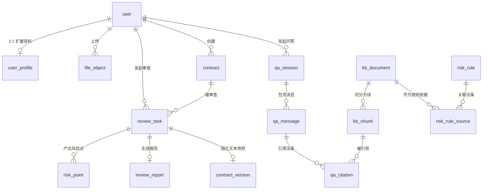

# 《智法宝》数据库设计说明书

| 项目 | 内容 |
| --- | --- |
| 项目名称 | 智法宝（law-wiz）—— AI 法律助手平台 |
| 文档编号 | 04 |
| 文档版本 | v1.0（待评审） |
| 编写日期 | 2026-09-13 |
| 数据库 | MySQL 9.7 |
| 上游文档 | [01-需求说明书](01-需求说明书.md)、[02-技术栈.md](02-技术栈.md)、[03-概要设计.md](03-概要设计.md) |
| 下游文档 | [05-接口设计说明书](05-接口设计.md) |

---

## 1 引言

### 1.1 编写目的

本文档确定《智法宝》系统数据库的逻辑结构与物理结构，包括库与环境、命名规范、实体关系、表结构、字段定义、索引与约束、以及一期可执行的建表 DDL。它是后端持久层实现与《05-接口设计说明书》的依据。

预期读者：项目开发人员、指导教师、课程评审老师。

### 1.2 范围

- **本文档完整给出**：一期（P1，M1+M2+M3）全部表的结构定义与 DDL。
- **本文档给出表清单与职责**：二期及以后（P2–P4）的表。其字段级定义在对应分期开工前补充，原因是这些表依赖区块链、签章等尚未定型的外部能力接口。
- **不在本文档范围**：SQL 查询优化、分库分表、数据库高可用方案（本项目为单机课程环境，不涉及）。

### 1.3 术语

术语以 [../CONTEXT.md](../CONTEXT.md) 为唯一权威来源。本文档涉及的关键区分：

| 术语 | 在本数据库中的体现 |
| --- | --- |
| 合同 / 证据 | 两张不同的表（`contract` / `evidence`），**合同不会自动成为证据**，需用户显式发起存证 |
| 存证编号 / TxID | `notarization.notarization_no`（平台业务号）与 `notarization.tx_id`（链上交易哈希）是两个不同字段，**不可互换** |
| 时间戳 / 可信时间戳 | `notarization.tsa_timestamp` 存可信时间戳，`notarization.tsa_source` **必须同时记录来源类型** |
| 电子签名 / 签名图片 | `user_signature` 存的是**签名图片**（metaphor：可复制的位图），不是电子签名 |
| 知识库文档 / 文件 | `kb_document` 是**语料**，`file_object` 是**用户上传的文件**，两者完全不同 |

---

## 2 数据库环境与规范

### 2.1 数据库环境

| 项目 | 值 |
| --- | --- |
| 数据库管理系统 | **MySQL 9.7**（Docker 容器 `mysql:9.7`，服务器部署） |
| 数据库名 | `law_wiz` |
| 字符集 | `utf8mb4` |
| 排序规则 | `utf8mb4_0900_ai_ci`（MySQL 9.7 默认，中文与 emoji 均正常） |
| 存储引擎 | `InnoDB`（事务与外键支持） |
| 时区策略 | 统一使用 `DATETIME(3)` 存**北京时间（UTC+8）**，由应用层保证；**不使用 `TIMESTAMP`**，避免会话时区导致的隐式转换 |
| 迁移工具 | Alembic（版本化迁移脚本，见 02-技术栈 §3.3） |
| 字符集校验 | 建库后执行 `SHOW VARIABLES LIKE 'character_set_database'` 确认为 `utf8mb4` |

> ⚠️ **服务器资源约束**：目标服务器仅 1.7 GiB 内存（可用约 700 MiB），MySQL 容器**必须设内存上限 384 MB** 并调优参数（`innodb_buffer_pool_size=128M`、`max_connections=50`、`performance_schema=OFF`）。

### 2.2 命名规范

| 对象 | 规范 | 示例 |
| --- | --- | --- |
| 表名 | 小写 + 下划线，**单数**（不用复数，避免 `user`/`users` 混用） | `review_task`、`risk_point` |
| 字段名 | 小写 + 下划线 | `created_at`、`contract_id` |
| 主键 | 一律 `id`，`BIGINT UNSIGNED AUTO_INCREMENT` | `id` |
| 外键字段 | `<被引用表单数>_id` | `contract_id`、`user_id` |
| 索引 | `idx_<表>_<字段>` | `idx_review_task_user_status` |
| 唯一索引 | `uk_<表>_<字段>` | `uk_user_phone` |
| 外键约束 | `fk_<表>_<字段>` | `fk_risk_point_review_task` |
| 布尔字段 | 前缀 `is_`，类型 `TINYINT` | `is_default` |
| 枚举字段 | 类型 `VARCHAR(32)` + 应用层校验 | `status`、`risk_level` |

**三条刻意为之的规范**（均为可执行性考虑，不是风格偏好）：

1. **枚举用 `VARCHAR` 而非 MySQL `ENUM`**：`ENUM` 增删值需 `ALTER TABLE`（锁表且不可回退），而 `VARCHAR` + 应用层校验的变更成本为零。代价是失去数据库层面的取值约束，由 Pydantic 模型承担。
2. **不使用数据库触发器与存储过程**：业务逻辑集中在应用层，便于测试与版本管理；数据库只负责存储与约束。
3. **金额一律 `DECIMAL(18,2)`，禁止浮点**：`FLOAT`/`DOUBLE` 在金额上会产生精度误差。

**⚠️ 一条环境要求（实测发现）**：数据库**必须启用严格模式**。实测中，向 `content_hash CHAR(64)` 插入 `'x'` **竟然成功** —— 因为 MySQL 在**非严格 `sql_mode`** 下把超长/不足的值**静默截断或补齐**而非拒绝。这不只影响长度：非法枚举值、超长字符串、`NULL` 插入 `NOT NULL` 列都会被静默处理，**数据会在无人察觉的情况下被改写**。

- 部署时**必须**确认 `sql_mode` 含 `STRICT_TRANS_TABLES`（MySQL 9.7 的默认值已包含，但配置文件或容器参数可能覆盖它）。
- 验证命令：`SELECT @@sql_mode;` —— 输出须含 `STRICT_TRANS_TABLES`。
- 生产与开发环境必须一致，否则"本地正常、服务器写入异常"这类问题极难定位。
- **额外防线**：对关键格式字段加 `CHECK` 约束（如 `kb_document` 的 `content_hash` 已有 `CHECK (CHAR_LENGTH(content_hash) = 64)`），因为 `CHECK` 在任何模式下都会生效，而列长度不会。

### 2.3 通用字段约定

业务实体表（非日志表）一律包含以下三个字段：

| 字段 | 类型 | 说明 |
| --- | --- | --- |
| `created_at` | `DATETIME(3) NOT NULL DEFAULT CURRENT_TIMESTAMP(3)` | 创建时间 |
| `updated_at` | `DATETIME(3) NOT NULL DEFAULT CURRENT_TIMESTAMP(3) ON UPDATE CURRENT_TIMESTAMP(3)` | 更新时间 |
| `deleted_at` | `DATETIME(3) NULL DEFAULT NULL` | 软删除标记，`NULL` 表示未删除 |

**关于软删除的三条说明**：

- **为什么用 `deleted_at` 而非 `is_deleted`**：`deleted_at` 同时记录了"是否删除"与"何时删除"，信息量更大且不增加字段数。
- **⛔ 一个反直觉的事实（已实测验证）：MySQL 的唯一索引不约束 `NULL`。** 因此**不能**用 `uk(phone, deleted_at)` 来表达"未删除的行唯一"—— 恰恰相反，`deleted_at IS NULL` 的那些行**完全不受唯一性保护**，可以插入任意多行。**实测证据**：`(13800000000, NULL)` 连插 3 次**全部成功**；而 `(13800000000, '2026-01-01 00:00:00.000')` 第二次插入即报 `ERROR 1062 Duplicate entry`。**结论：唯一性必须建立在"对未删除行非空"的列上**，例如 `user` 表的 `uk_user_phone(phone)`。
- **`user` 表不使用软删除**：账户是"要么存在、要么不存在"的实体，且按《个人信息保护法》，用户要求删除账户时**继续保留其手机号与邮箱是隐私风险**。因此 `user` 表采用**硬删除**，`phone` / `email` 用普通唯一索引保证唯一。该决定记为 [ADR-0007](adr/0007-soft-delete-scope.md)。
- **只有需要保留历史的表才用软删除**：`contract`、`contract_version`、`review_task`、`kb_document`、`qa_session`、`file_object` 使用 `deleted_at` —— 它们承载业务关系与历史，删除会破坏引用链。这些表的唯一索引均建立在**不含 `deleted_at` 的业务列**上（如 `uk_kb_document_hash(content_hash)`），因此不受本条限制影响。

日志类表（`qa_message`、`seal_usage_log`）不加 `deleted_at`：它们应当只增不改。

---

## 3 数据库逻辑设计

### 3.1 实体关系图（一期）



**关系说明**：

- `contract 1:N review_task`：同一份合同可被多次审查（例如修改后重审）。**审查针对的是"某个版本的合同"**，因此存在 `contract_version`。
- `review_task 1:N risk_point`：一次审查产出多条风险点。
- `kb_document 1:N kb_chunk`：一份语料按条切分为多个向量块（见 §4.3）。
- `qa_message 1:N qa_citation`：一条回答可引用多个法条 —— 这正是"回答溯源"的数据基础。

### 3.2 表清单

#### 3.2.1 一期表（P1，本文档给出 DDL）

| 表名 | 中文名 | 职责 |
| --- | --- | --- |
| `user` | 用户 | 账户主体与登录凭据 |
| `user_profile` | 用户资料 | 姓名、机构信息等扩展资料（与 `user` 一对一） |
| `file_object` | 文件对象 | 所有上传文件的对象存储引用，**内容寻址** |
| `contract` | 合同 | 合同文档实体与生命周期状态 |
| `contract_version` | 合同版本 | 每次产生新文本时固化一个不可变版本 |
| `review_task` | 审查任务 | 一次合同审查的执行实例与处理阶段 |
| `risk_point` | 风险点 | 单条风险：等级、条款定位、描述、法律依据、修改建议 |
| `review_report` | 审查报告 | 报告的产物引用（对象存储路径 + 生成时间） |
| `kb_document` | 知识库文档 | 法律语料的元数据（来源、法条号、生效日期、语料分级） |
| `kb_chunk` | 知识库分块 | 语料切分单元，含**外部向量 ID** 映射 |
| `risk_rule` | 风险规则 | 人工编写的「条件—结论—法条依据」结构化规则（AI 兜底依据） |
| `risk_rule_source` | 规则法条关联 | 规则与 `kb_document` 的多对多关联 |
| `qa_session` | 问答会话 | 一次多轮对话 |
| `qa_message` | 问答消息 | 会话中的单条消息（用户提问或 AI 回答） |
| `qa_citation` | 回答引用 | 回答所引用的知识库文档与法条 |

#### 3.2.2 后期表（P2–P4，字段级定义待补）

| 表名 | 中文名 | 归期 | 说明 |
| --- | --- | --- | --- |
| `evidence` | 证据材料 | P2 | 与 `contract` 是**不同的表**；证据是"为证明某事而提交的材料"，合同不会自动成为证据 |
| `notarization` | 存证记录 | P2 | 哈希值、TxID、**可信时间戳及其来源**、存证编号、证书引用 |
| `contract_participant` | 合同参与方 | P3 | 参与方范围大于签署方（含见证方、审批方） |
| `sign_task` | 签署任务 | P3 | 签署方、签署顺序、各方的签署状态与截止时间 |
| `sign_participant` | 签署参与方 | P3 | 单个签署方在某签署任务中的状态 |
| `signature_record` | 签署记录 | P3 | 签署意愿确认、认证方式、签章服务返回凭据 |
| `seal` | 电子印章 | P3 | 印章图像、类型、所有者、证书绑定、状态 |
| `user_signature` | **签名图片** | P3 | 手写绘制的位图。**它不是电子签名**（见 CONTEXT.md） |
| `seal_grant` | 印章授权 | P4 | 主体—印章—场景三维度的授权记录 |
| `seal_usage_log` | 用印日志 | P3 | 只增不改；用印人、审批人、时间、文件 |
| `approval_flow` / `approval_node` | 审批流与节点 | P4 | 用印审批、印章创建审批 |
| `audit_log` | 审计日志 | P4 | 关键操作留痕，只增不改 |
| `notification` | 通知 | P3 | 签署通知、合同到期提醒 |

> **为什么后期表不在本文档细化**：它们依赖区块链、签章、时间戳三类尚未选定具体实现的外部能力。**实现未定就细化表结构，等于把外部系统的字段假设固化进数据库**，而这些假设在 P2/P3 极可能改变。分期开工前补充，成本更低。

---

## 4 物理设计的关键决策

### 4.1 文件采用内容寻址存储（`file_object`）

**决策**：文件存于 MinIO，对象路径为 `files/{sha256前两位}/{sha256}`，**以内容哈希命名而非 UUID**；`file_object` 表保存哈希、对象路径、原始文件名、大小、MIME 类型。

**带来的三项性质**：

1. **天然去重**：同一文件重复上传只占一份存储。`uk_file_object_sha256` 唯一索引保证数据库层面也只有一条记录，重复上传时直接复用已有 `file_object` 行。
2. **完整性自校验**：读取时重算哈希即可判断对象是否被篡改，无需额外校验字段。
3. **审计友好**：任何一次存证的哈希值都能直接定位到对象路径，链上记录与对象存储之间的对应关系是确定的。

**代价**：对象路径不含业务语义，无法通过路径直接看出"这是哪份合同"。这是刻意的 —— 业务语义由数据库承担，对象存储只负责按内容存放。

### 4.2 向量本体不入 MySQL（`kb_chunk`）

**决策**：`kb_chunk` 只保存切分元数据与**外部向量 ID（`vector_id`）**，向量本体存放于 `VectorStore`（一期为进程内 Chroma）。

**理由**：MySQL 无原生向量类型，若以 BLOB 存向量会显著拖慢备份与迁移；且此设计使更换向量实现（[ADR-0004](adr/0004-vector-store-abstraction.md)）时**关系型数据无需迁移**。

**一致性风险与应对**：向量库与 MySQL 是两个存储，可能出现"MySQL 有记录、向量库无对应向量"的不一致。应对措施：知识库导入采用**「先写 MySQL，再写向量库，最后回填 `vector_id`」**的顺序，并提供**一致性校验脚本**（比对 `kb_chunk` 中 `vector_id` 非空的行数与向量库实际条目数）。**不引入分布式事务** —— 对课程项目而言，一个可重复运行的校验脚本比两阶段提交更实用。

### 4.3 语料按条切分（`kb_document` / `kb_chunk`）

**决策**：法律文本**按条切分**，不按固定字符数硬切；`kb_chunk` 存 `chunk_no`（块序号）、`chunk_type`（法条/段落/案例要旨）、`article_no`（条号）、`char_start`/`char_end`（原文偏移）。

**理由**：按字符数硬切会把一条法条截成两半，检索到半句话会直接导致**错误的法律依据** —— 这是本项目最不能接受的失败形态。`char_start`/`char_end` 保留原文偏移，使检索结果能精确定位回原文，支撑"回答溯源"。

**`kb_chunk` 中刻意冗余的三个字段**：`law_name`、`article_no`、`effective_date` 在 `kb_document` 中已有，此处冗余一份。这是**刻意的反范式**：检索命中向量块后需要立即给出可读引用（如"《民法典》第五百七十七条"）并**按生效日期过滤已废止法条**，每次都回表关联会显著增加检索延迟。冗余代价是语料更新时需同步两处，由导入脚本统一处理。

### 4.4 AI 中间产物结构化落库

**决策**：条款提取结果（`review_task.extracted_terms`）与风险点（`risk_point`）均以结构化字段保存，**不把 LLM 的原始输出整段存起来**。

**理由**：只有结构化才能支持后续的**筛选、统计、人工修正与报告重生成**。整段存文本等于把 AI 输出变成不可处理的日志。

**唯一保留原始输出的地方**：`review_task.raw_llm_output`（`JSON NULL`）。它**仅用于排错与模型输出质量分析**，不参与任何业务逻辑，允许为 `NULL`。这是"可调试性"与"结构化"之间的折中。

### 4.5 审查结果必须标注依据类型（`risk_point.source_type`）

**决策**：`risk_point` 增加 `source_type` 字段，取值为 `retrieved_law`（检索到的法律依据）/ `rule`（人工风险规则）/ `llm_inference`（模型推断）。

**理由**：这是 [03-概要设计](03-概要设计.md) §5.3 那条界面约束的数据基础 —— 报告中必须**区分呈现「检索到的法律依据」「系统依据规则给出的判断」「模型的解释性表述」三类内容**。若数据库不区分，前端就无法区分，这条约束就落不了地。

`source_type = 'retrieved_law'` 时 `kb_document_id` 必填；`= 'rule'` 时 `risk_rule_id` 必填。**由应用层校验，数据库保留字段**（不用 `CHECK` 约束是因为跨字段条件约束在 MySQL 9.7 中表达力有限且报错信息不友好）。

### 4.6 存证相关字段的区分（P2 预留）

虽然 `notarization` 表在 P2 才细化，但两条约束现在就要写进设计：

1. **`notarization_no` 与 `tx_id` 必须分开**：前者是平台业务编号（用户检索用），后者是链上交易哈希（独立验证用），**不可互换**。
2. **`tsa_source` 必填**：可信时间戳必须记录来源类型（公共 TSA / 自建 TSA）。若为自建，界面与证书中必须标注其不构成第三方可信时间戳（见 [ADR-0006](adr/0006-timestamp-source.md)）。

---

## 5 表结构详细设计

> 下列各表均为**一期表**。字段类型以 DDL（§6）为准，此处给出说明性定义。

### 5.1 user —— 用户

| 字段 | 类型 | 允许空 | 默认 | 说明 |
| --- | --- | --- | --- | --- |
| `id` | BIGINT UNSIGNED | 否 | 自增 | 主键 |
| `phone` | VARCHAR(20) | 是 | NULL | 手机号，登录标识之一 |
| `email` | VARCHAR(120) | 是 | NULL | 邮箱，登录标识之一 |
| `password_hash` | VARCHAR(255) | 否 | — | 密码哈希（**绝不存明文**） |
| `account_type` | VARCHAR(16) | 否 | `personal` | `personal` / `enterprise` |
| `status` | VARCHAR(16) | 否 | `active` | `active` / `disabled` |
| `last_login_at` | DATETIME(3) | 是 | NULL | 最后登录时间 |
| `created_at` / `updated_at` / `deleted_at` | DATETIME(3) | — | — | 通用字段 |

**唯一约束**：`uk_user_phone(phone)`、`uk_user_email(email)`。**切勿改成 `(phone, deleted_at)`** —— 见 §2.3 的实测说明，那样会让唯一性完全失效。
**删除语义**：**硬删除**。本表的 `deleted_at` 列**不参与业务逻辑**（保留仅为与其他表结构统一）；账户注销即物理删除行，见 [ADR-0007](adr/0007-soft-delete-scope.md)。

> ⚠️ **一次实证教训（2026-09-13 实测）**：本表最初设计为 `uk_user_phone(phone, deleted_at)`，意图是"未删除的行唯一、已删除的可以并存"。实测证明**该意图完全不成立** —— `deleted_at IS NULL` 的行不受唯一索引约束，同一手机号可插入任意多行。**这是一个真实的设计缺陷，只有把 DDL 真的在 MySQL 里跑一遍才会暴露**，仅审阅 DDL 文本无法发现。

**约束**：`phone` 与 `email` 至少一个非空（应用层校验）。历史上"采用 JWT 或 Session"的口径已统一为**访问令牌 JWT + 刷新令牌存 Redis**，刷新令牌**不入库**（见 03 §5.4）。

### 5.2 user_profile —— 用户资料

| 字段 | 类型 | 允许空 | 说明 |
| --- | --- | --- | --- |
| `id` | BIGINT UNSIGNED | 否 | 主键 |
| `user_id` | BIGINT UNSIGNED | 否 | 一对一外键 |
| `real_name` | VARCHAR(64) | 是 | 姓名 |
| `org_name` | VARCHAR(200) | 是 | 公司 / 机构名称 |
| `org_role` | VARCHAR(64) | 是 | 职务 |
| `avatar_object_id` | BIGINT UNSIGNED | 是 | 头像文件 |
| `created_at` / `updated_at` / `deleted_at` | DATETIME(3) | — | 通用字段 |

**说明**：`real_name` 在此仅作**展示用**；**实名认证是 P3 的独立流程**（M7-05），其结果与证书绑定另行建表，不混入本表。

### 5.3 file_object —— 文件对象（内容寻址）

| 字段 | 类型 | 允许空 | 说明 |
| --- | --- | --- | --- |
| `id` | BIGINT UNSIGNED | 否 | 主键 |
| `sha256` | CHAR(64) | 否 | 文件 SHA-256（十六进制小写），**唯一** |
| `storage_bucket` | VARCHAR(64) | 否 | MinIO 桶名 |
| `object_key` | VARCHAR(512) | 否 | 对象路径 `files/{sha256前两位}/{sha256}` |
| `original_name` | VARCHAR(255) | 是 | 用户上传时的原始文件名 |
| `byte_size` | BIGINT UNSIGNED | 否 | 字节数 |
| `mime_type` | VARCHAR(128) | 是 | MIME 类型 |
| `uploader_id` | BIGINT UNSIGNED | 是 | 首位上传者（**非所有者**，同一文件可能被多人引用） |
| `created_at` / `updated_at` / `deleted_at` | DATETIME(3) | — | 通用字段 |

**唯一索引**：`uk_file_object_sha256(sha256)` —— 内容寻址的去重由此保证。

> **注意 `uploader_id` 的语义**：它记录"谁最先上传了这个内容"，**不代表这个文件属于他**。文件归属由引用它的业务表决定（如 `contract.owner_id`）。这样设计是因为同一份文件（例如一份标准合同范本）可能被多个用户上传，去重后只有一条 `file_object`。

### 5.4 contract —— 合同

| 字段 | 类型 | 允许空 | 默认 | 说明 |
| --- | --- | --- | --- | --- |
| `id` | BIGINT UNSIGNED | 否 | 自增 | 主键 |
| `owner_id` | BIGINT UNSIGNED | 否 | — | 所有者 |
| `title` | VARCHAR(200) | 否 | — | 合同名称 |
| `contract_type` | VARCHAR(32) | 是 | NULL | 采购/销售/劳务/租赁/保密等 |
| `status` | VARCHAR(16) | 否 | `draft` | `draft`/`pending_sign`/`signing`/`signed`/`archived` |
| `source` | VARCHAR(16) | 否 | `upload` | `upload`（上传）/ `template` / `ai_draft` |
| `current_version_id` | BIGINT UNSIGNED | 是 | NULL | 当前版本（**循环外键，建表后 `ALTER` 添加**） |
| `created_at` / `updated_at` / `deleted_at` | DATETIME(3) | — | — | 通用字段 |

**说明**：合同的**文件与文本不放在本表**，而在 `contract_version`。这样"上传 → 修改 → 重审"每次都产生一个不可变版本，审查任务指向具体版本，**不会出现"审查报告对应的是哪一版文本"说不清的情况**。

### 5.5 contract_version —— 合同版本（不可变）

| 字段 | 类型 | 允许空 | 说明 |
| --- | --- | --- | --- |
| `id` | BIGINT UNSIGNED | 否 | 主键 |
| `contract_id` | BIGINT UNSIGNED | 否 | 所属合同 |
| `version_no` | INT UNSIGNED | 否 | 版本号，从 1 递增 |
| `file_object_id` | BIGINT UNSIGNED | 是 | 该版本的文件（上传或导出的 PDF/DOCX） |
| `plain_text` | LONGTEXT | 是 | 文本化结果（用于审查与检索） |
| `text_source` | VARCHAR(16) | 是 | `parse`（直接解析）/ `ocr`（识别）——**记录文本是怎么来的** |
| `page_count` | INT UNSIGNED | 是 | 页数 |
| `created_by` | BIGINT UNSIGNED | 否 | 产生该版本的用户 |
| `created_at` | DATETIME(3) | — | 创建时间 |

**唯一索引**：`uk_contract_version(contract_id, version_no)`。
**不可变约定**：本表**只增不改**。修改合同文本产生新版本，不更新旧行。

> **`text_source` 为什么重要**：OCR 识别结果与直接解析结果的可信度不同。审查报告需要知道"这段文字是识别来的"，以便在结论存疑时提示用户核对原件。这是可溯源性的一部分。

### 5.6 review_task —— 审查任务

| 字段 | 类型 | 允许空 | 默认 | 说明 |
| --- | --- | --- | --- | --- |
| `id` | BIGINT UNSIGNED | 否 | 自增 | 主键 |
| `contract_id` | BIGINT UNSIGNED | 是 | NULL | 关联合同（允许为空以支持"仅上传未建合同"的轻量审查） |
| `contract_version_id` | BIGINT UNSIGNED | 是 | NULL | 被审查的版本 |
| `user_id` | BIGINT UNSIGNED | 否 | — | 发起人 |
| `status` | VARCHAR(16) | 否 | `pending` | `pending`/`processing`/`succeeded`/`failed` |
| `stage` | VARCHAR(32) | 是 | NULL | `ocr`/`extract_terms`/`retrieve`/`analyze`/`report` —— **用于前端轮询显示进度** |
| `progress` | TINYINT UNSIGNED | 否 | 0 | 0–100，粗粒度进度 |
| `extracted_terms` | JSON | 是 | NULL | 条款提取的结构化结果 |
| `raw_llm_output` | JSON | 是 | NULL | **仅供排错**，不参与业务逻辑 |
| `error_code` | VARCHAR(64) | 是 | NULL | 失败错误码 |
| `error_message` | VARCHAR(500) | 是 | NULL | 失败原因（**面向用户，不含堆栈**） |
| `started_at` / `finished_at` | DATETIME(3) | 是 | NULL | 起止时间 |
| `created_at` / `updated_at` / `deleted_at` | DATETIME(3) | — | — | 通用字段 |

**索引**：`idx_review_task_user_status(user_id, status, created_at)` —— 支撑"我的审查历史"列表。
**说明**：`stage` 与 `progress` 是为**异步任务 + 轮询**（03 §5.1）服务的：接口立即返回任务号，前端据此显示"正在识别文字 / 正在分析风险"。没有这两个字段，用户面对的是一个无反馈的等待。

### 5.7 risk_point —— 风险点

| 字段 | 类型 | 允许空 | 默认 | 说明 |
| --- | --- | --- | --- | --- |
| `id` | BIGINT UNSIGNED | 否 | 自增 | 主键 |
| `review_task_id` | BIGINT UNSIGNED | 否 | — | 所属审查任务 |
| `risk_level` | VARCHAR(8) | 否 | — | `high` / `medium` / `low` |
| `risk_category` | VARCHAR(32) | 是 | NULL | `legal` / `commercial` / `compliance` |
| `clause_title` | VARCHAR(200) | 是 | NULL | 所在条款标题 |
| `clause_text` | TEXT | 是 | NULL | 条款原文摘录 |
| `char_start` / `char_end` | INT UNSIGNED | 是 | NULL | 在合同全文中的偏移，用于**定位高亮** |
| `description` | TEXT | 否 | — | 问题描述 |
| `suggestion` | TEXT | 是 | NULL | 修改建议 |
| `legal_basis` | TEXT | 是 | NULL | 法律依据（可读文本，如"《民法典》第五百八十五条"） |
| `source_type` | VARCHAR(32) | 否 | — | `retrieved_law` / `rule` / `llm_inference`（见 §4.5） |
| `kb_document_id` | BIGINT UNSIGNED | 是 | NULL | `source_type='retrieved_law'` 时必填 |
| `risk_rule_id` | BIGINT UNSIGNED | 是 | NULL | `source_type='rule'` 时必填 |
| `confidence` | DECIMAL(3,2) | 是 | NULL | 0.00–1.00，模型置信度（可选） |
| `is_dismissed` | TINYINT | 否 | 0 | 用户是否标记为"已确认无风险" |
| `created_at` / `updated_at` / `deleted_at` | DATETIME(3) | — | — | 通用字段 |

**索引**：`idx_risk_point_task_level(review_task_id, risk_level)`。
**`is_dismissed` 的作用**：允许用户驳回误报。**这是收集模型误报样本的唯一途径** —— 后续调优提示词与规则时，这些数据就是依据。

### 5.8 review_report —— 审查报告

| 字段 | 类型 | 允许空 | 说明 |
| --- | --- | --- | --- |
| `id` | BIGINT UNSIGNED | 否 | 主键 |
| `review_task_id` | BIGINT UNSIGNED | 否 | **唯一**，一个任务一份报告 |
| `file_object_id` | BIGINT UNSIGNED | 是 | PDF 报告文件 |
| `format` | VARCHAR(8) | 否 | `pdf` / `html` |
| `summary` | TEXT | 是 | 摘要 |
| `high_count` / `medium_count` / `low_count` | INT UNSIGNED | 否 | 各等级风险点数量（**冗余统计**，避免列表页反复聚合） |
| `generated_at` | DATETIME(3) | 否 | 生成时间 |
| `created_at` / `updated_at` / `deleted_at` | DATETIME(3) | — | 通用字段 |

**唯一索引**：`uk_review_report_task(review_task_id)`。

### 5.9 kb_document —— 知识库文档

| 字段 | 类型 | 允许空 | 默认 | 说明 |
| --- | --- | --- | --- | --- |
| `id` | BIGINT UNSIGNED | 否 | 自增 | 主键 |
| `doc_type` | VARCHAR(16) | 否 | — | `law`（法律）/ `interpretation`（司法解释）/ `case`（案例）/ `template`（合同范本） |
| `corpus_tier` | TINYINT UNSIGNED | 否 | 1 | **语料分级**：1=核心法规、2=高价值案例、3=全量（本库不建），见 §5.9.1 |
| `title` | VARCHAR(300) | 否 | — | 标题 |
| `law_name` | VARCHAR(200) | 是 | NULL | 所属法律名称，如"中华人民共和国民法典" |
| `article_no` | VARCHAR(64) | 是 | NULL | 条号，如"第五百七十七条" |
| `chapter_path` | VARCHAR(300) | 是 | NULL | 层级路径（编/章/节） |
| `effective_date` | DATE | 是 | NULL | **生效日期** —— 用于过滤已废止法条 |
| `abolished_date` | DATE | 是 | NULL | 废止日期，`NULL` 表示现行有效 |
| `revision` | VARCHAR(32) | 是 | NULL | 版本 / 修正案次 |
| `source` | VARCHAR(200) | 是 | NULL | 来源（如"国家法律法规数据库"） |
| `source_url` | VARCHAR(512) | 是 | NULL | 来源链接 |
| `content_hash` | CHAR(64) | 否 | — | 内容的 SHA-256，**用于变更检测与去重** |
| `char_count` | INT UNSIGNED | 是 | NULL | 字符数 |
| `index_status` | VARCHAR(16) | 否 | `pending` | `pending`/`indexed`/`failed` —— 向量化状态 |
| `indexed_at` | DATETIME(3) | 是 | NULL | 完成向量化时间 |
| `created_at` / `updated_at` / `deleted_at` | DATETIME(3) | — | — | 通用字段 |

**唯一索引**：`uk_kb_document_hash(content_hash)`。
**索引**：`idx_kb_document_type_tier(doc_type, corpus_tier)`、`idx_kb_document_article(law_name, article_no)`。

#### 5.9.1 关于 `corpus_tier`（语料分级）

语料分级是 [01-需求说明书](01-需求说明书.md) §3.4 与 [03-概要设计](03-概要设计.md) §5.2 决定的落地字段：

| 值 | 含义 | 一期是否收录 |
| --- | --- | --- |
| `1` | 核心法规（《民法典》合同编、《电子签名法》、相关司法解释） | ✅ |
| `2` | 高价值案例（最高法指导性案例、公报案例中的合同类） | ✅ 视时间 |
| `3` | 全量案例 | ❌ **不建** |

**为什么把分级做成字段而不是硬编码**：检索时可以按分级**加权或过滤**（如优先返回核心法规），且后期若通过数据合作获得全量语料，无需改表结构即可导入。

### 5.10 kb_chunk —— 知识库分块

| 字段 | 类型 | 允许空 | 说明 |
| --- | --- | --- | --- |
| `id` | BIGINT UNSIGNED | 否 | 主键 |
| `kb_document_id` | BIGINT UNSIGNED | 否 | 所属语料 |
| `chunk_no` | INT UNSIGNED | 否 | 块序号，从 1 递增 |
| `chunk_type` | VARCHAR(16) | 否 | `article`（法条）/ `paragraph` / `case_summary`（案例要旨） |
| `article_no` | VARCHAR(64) | 是 | 条号（**冗余**，见 §4.3） |
| `law_name` | VARCHAR(200) | 是 | 法律名称（**冗余**） |
| `effective_date` | DATE | 是 | 生效日期（**冗余**，用于过滤废止法条） |
| `content` | TEXT | 否 | 块文本（保留原文，供溯源展示） |
| `char_start` / `char_end` | INT UNSIGNED | 否 | 在原文中的字符偏移 |
| `vector_id` | VARCHAR(128) | 是 | **外部向量库中的 ID**；`NULL` 表示尚未完成向量化 |
| `created_at` / `updated_at` | DATETIME(3) | — | 通用字段（**无软删除**：重新导入应整份替换） |

**唯一索引**：`uk_kb_chunk(doc_id_no)` → `(kb_document_id, chunk_no)`。
**索引**：`idx_kb_chunk_vector(vector_id)`。

### 5.11 risk_rule —— 风险规则（AI 兜底）

| 字段 | 类型 | 允许空 | 说明 |
| --- | --- | --- | --- |
| `id` | BIGINT UNSIGNED | 否 | 主键 |
| `rule_code` | VARCHAR(32) | 否 | 规则编号，如 `R-0001`，**唯一** |
| `name` | VARCHAR(200) | 否 | 规则名称 |
| `category` | VARCHAR(32) | 是 | 分类 |
| `risk_level` | VARCHAR(8) | 否 | 命中时给出的风险等级 |
| `condition_expr` | TEXT | 否 | **触发条件**（表达式或自然语言描述） |
| `conclusion` | TEXT | 否 | **结论**（命中的判定） |
| `suggestion` | TEXT | 是 | 修改建议 |
| `legal_basis` | TEXT | 是 | 法条依据（可读文本） |
| `match_keywords` | VARCHAR(500) | 是 | 关键词（逗号分隔），供轻量匹配 |
| `is_active` | TINYINT | 否 | 是否启用 |
| `created_at` / `updated_at` / `deleted_at` | DATETIME(3) | — | 通用字段 |

**唯一索引**：`uk_risk_rule_code(rule_code)`。

> **本表的定位**：一期计划人工编写 30–50 条。它在**检索无结果或模型输出无法解析时**提供可解释的兜底结论（03 §5.3）。**它不是 AI 的替代品，而是 AI 失效时的保险**。

### 5.12 risk_rule_source —— 规则法条关联

| 字段 | 类型 | 允许空 | 说明 |
| --- | --- | --- | --- |
| `id` | BIGINT UNSIGNED | 否 | 主键 |
| `risk_rule_id` | BIGINT UNSIGNED | 否 | 规则 |
| `kb_document_id` | BIGINT UNSIGNED | 否 | 知识库文档 |
| `created_at` | DATETIME(3) | — | 创建时间 |

**唯一索引**：`uk_risk_rule_source(risk_rule_id, kb_document_id)`。

### 5.13 qa_session —— 问答会话

| 字段 | 类型 | 允许空 | 默认 | 说明 |
| --- | --- | --- | --- | --- |
| `id` | BIGINT UNSIGNED | 否 | 自增 | 主键 |
| `user_id` | BIGINT UNSIGNED | 否 | — | 用户 |
| `title` | VARCHAR(200) | 是 | NULL | 会话标题（取首条问题前 N 字） |
| `status` | VARCHAR(16) | 否 | `active` | `active` / `archived` |
| `message_count` | INT UNSIGNED | 否 | 0 | 消息数（**冗余统计**） |
| `last_message_at` | DATETIME(3) | 是 | NULL | 最后消息时间 |
| `created_at` / `updated_at` / `deleted_at` | DATETIME(3) | — | — | 通用字段 |

**索引**：`idx_qa_session_user(user_id, last_message_at)`。

### 5.14 qa_message —— 问答消息（只增不改）

| 字段 | 类型 | 允许空 | 说明 |
| --- | --- | --- | --- |
| `id` | BIGINT UNSIGNED | 否 | 主键 |
| `qa_session_id` | BIGINT UNSIGNED | 否 | 所属会话 |
| `role` | VARCHAR(16) | 否 | `user` / `assistant` |
| `content` | MEDIUMTEXT | 否 | 消息内容 |
| `has_citation` | TINYINT | 否 | 该回答是否带法条引用（**无依据时必须为 0 并在内容中标注"未找到直接法律依据"**） |
| `model_name` | VARCHAR(64) | 是 | 生成该回答的模型标识（**可替换 LLM 的追溯依据**） |
| `token_usage` | INT UNSIGNED | 是 | 消耗 token 数（成本统计） |
| `latency_ms` | INT UNSIGNED | 是 | 响应耗时（性能指标，对应需求"问答 ≤5 秒"） |
| `created_at` | DATETIME(3) | — | 创建时间（**无 `updated_at`**：只增不改） |

**索引**：`idx_qa_message_session(qa_session_id, id)`。
**说明**：`model_name` 与 `latency_ms` 不是冗余 —— 需求要求"LLM 服务支持替换"，替换后必须能对比不同模型的表现；需求也规定了问答响应时间指标，不记录耗时就无法证明达标。

### 5.15 qa_citation —— 回答引用（溯源）

| 字段 | 类型 | 允许空 | 说明 |
| --- | --- | --- | --- |
| `id` | BIGINT UNSIGNED | 否 | 主键 |
| `qa_message_id` | BIGINT UNSIGNED | 否 | 所属回答消息 |
| `kb_document_id` | BIGINT UNSIGNED | 是 | 引用的知识库文档 |
| `kb_chunk_id` | BIGINT UNSIGNED | 是 | 引用的具体块 |
| `quoted_text` | TEXT | 是 | 被引用的原文片段 |
| `relevance_score` | DECIMAL(5,4) | 是 | 检索相关度得分 |
| `created_at` | DATETIME(3) | — | 创建时间 |

**索引**：`idx_qa_citation_message(qa_message_id)`。

> **本表是"回答溯源"功能（M3-04）的全部数据基础**。用户点击"依据"时，界面展示的正是本表关联的 `quoted_text` 与 `kb_document` 的法条信息。

---

## 6 建表 DDL（一期）

> 以下 DDL 面向 **MySQL 9.7**，可直接在空库执行。执行前需先创建数据库（§6.1）。
> **本 DDL 尚未在服务器执行** —— 服务器 MySQL 容器与 `deploy/` 脚手架尚未搭建。执行后应回填本节末尾的验证结果。

### 6.1 创建数据库

```sql
CREATE DATABASE IF NOT EXISTS `law_wiz`
  DEFAULT CHARACTER SET utf8mb4
  DEFAULT COLLATE utf8mb4_0900_ai_ci;
USE `law_wiz`;
```

### 6.2 建表语句

```sql
-- ============================================================
-- 智法宝（law-wiz）一期数据库结构  v1.0
-- MySQL 9.7 / utf8mb4 / utf8mb4_0900_ai_ci / InnoDB
-- ============================================================

-- ---------- M1 用户管理 ----------

CREATE TABLE `user` (
  `id`            BIGINT UNSIGNED NOT NULL AUTO_INCREMENT COMMENT '主键',
  `phone`         VARCHAR(20)     NULL DEFAULT NULL      COMMENT '手机号',
  `email`         VARCHAR(120)    NULL DEFAULT NULL      COMMENT '邮箱',
  `password_hash` VARCHAR(255)    NOT NULL               COMMENT '密码哈希，绝不存明文',
  `account_type`  VARCHAR(16)     NOT NULL DEFAULT 'personal' COMMENT 'personal/enterprise',
  `status`        VARCHAR(16)     NOT NULL DEFAULT 'active'   COMMENT 'active/disabled',
  `last_login_at` DATETIME(3)     NULL DEFAULT NULL      COMMENT '最后登录时间',
  `created_at`    DATETIME(3)     NOT NULL DEFAULT CURRENT_TIMESTAMP(3),
  `updated_at`    DATETIME(3)     NOT NULL DEFAULT CURRENT_TIMESTAMP(3) ON UPDATE CURRENT_TIMESTAMP(3),
  `deleted_at`    DATETIME(3)     NULL DEFAULT NULL      COMMENT '软删除时间',
  PRIMARY KEY (`id`),
  UNIQUE KEY `uk_user_phone` (`phone`),
  UNIQUE KEY `uk_user_email` (`email`)
) ENGINE=InnoDB DEFAULT CHARSET=utf8mb4 COLLATE=utf8mb4_0900_ai_ci COMMENT='用户账户';

CREATE TABLE `user_profile` (
  `id`               BIGINT UNSIGNED NOT NULL AUTO_INCREMENT,
  `user_id`          BIGINT UNSIGNED NOT NULL COMMENT '一对一关联 user',
  `real_name`        VARCHAR(64)     NULL DEFAULT NULL COMMENT '姓名（展示用，非实名认证结果）',
  `org_name`         VARCHAR(200)    NULL DEFAULT NULL COMMENT '公司/机构名称',
  `org_role`         VARCHAR(64)     NULL DEFAULT NULL COMMENT '职务',
  `avatar_object_id` BIGINT UNSIGNED NULL DEFAULT NULL COMMENT '头像文件',
  `created_at`       DATETIME(3)     NOT NULL DEFAULT CURRENT_TIMESTAMP(3),
  `updated_at`       DATETIME(3)     NOT NULL DEFAULT CURRENT_TIMESTAMP(3) ON UPDATE CURRENT_TIMESTAMP(3),
  `deleted_at`       DATETIME(3)     NULL DEFAULT NULL,
  PRIMARY KEY (`id`),
  UNIQUE KEY `uk_user_profile_user` (`user_id`, `deleted_at`),
  CONSTRAINT `fk_user_profile_user` FOREIGN KEY (`user_id`) REFERENCES `user` (`id`)
) ENGINE=InnoDB DEFAULT CHARSET=utf8mb4 COLLATE=utf8mb4_0900_ai_ci COMMENT='用户扩展资料';

-- ---------- 文件对象（内容寻址） ----------

CREATE TABLE `file_object` (
  `id`             BIGINT UNSIGNED NOT NULL AUTO_INCREMENT,
  `sha256`         CHAR(64)        NOT NULL COMMENT '文件 SHA-256，内容寻址的唯一标识',
  `storage_bucket` VARCHAR(64)     NOT NULL COMMENT 'MinIO 桶名',
  `object_key`     VARCHAR(512)    NOT NULL COMMENT '对象路径 files/{sha256前两位}/{sha256}',
  `original_name`  VARCHAR(255)    NULL DEFAULT NULL COMMENT '上传时的原始文件名',
  `byte_size`      BIGINT UNSIGNED NOT NULL COMMENT '字节数',
  `mime_type`      VARCHAR(128)    NULL DEFAULT NULL,
  `uploader_id`    BIGINT UNSIGNED NULL DEFAULT NULL COMMENT '首位上传者（非所有者）',
  `created_at`     DATETIME(3)     NOT NULL DEFAULT CURRENT_TIMESTAMP(3),
  `updated_at`     DATETIME(3)     NOT NULL DEFAULT CURRENT_TIMESTAMP(3) ON UPDATE CURRENT_TIMESTAMP(3),
  `deleted_at`     DATETIME(3)     NULL DEFAULT NULL,
  PRIMARY KEY (`id`),
  UNIQUE KEY `uk_file_object_sha256` (`sha256`),
  KEY `idx_file_object_uploader` (`uploader_id`),
  CONSTRAINT `fk_file_object_uploader` FOREIGN KEY (`uploader_id`) REFERENCES `user` (`id`)
) ENGINE=InnoDB DEFAULT CHARSET=utf8mb4 COLLATE=utf8mb4_0900_ai_ci COMMENT='文件对象（内容寻址，天然去重）';

-- ---------- 合同与版本 ----------

CREATE TABLE `contract` (
  `id`                 BIGINT UNSIGNED NOT NULL AUTO_INCREMENT,
  `owner_id`           BIGINT UNSIGNED NOT NULL COMMENT '所有者',
  `title`              VARCHAR(200)    NOT NULL COMMENT '合同名称',
  `contract_type`      VARCHAR(32)     NULL DEFAULT NULL COMMENT '采购/销售/劳务/租赁/保密等',
  `status`             VARCHAR(16)     NOT NULL DEFAULT 'draft'
                       COMMENT 'draft/pending_sign/signing/signed/archived',
  `source`             VARCHAR(16)     NOT NULL DEFAULT 'upload'
                       COMMENT 'upload/template/ai_draft',
  `current_version_id` BIGINT UNSIGNED NULL DEFAULT NULL COMMENT '当前版本（建表后 ALTER 添加外键）',
  `created_at`         DATETIME(3)     NOT NULL DEFAULT CURRENT_TIMESTAMP(3),
  `updated_at`         DATETIME(3)     NOT NULL DEFAULT CURRENT_TIMESTAMP(3) ON UPDATE CURRENT_TIMESTAMP(3),
  `deleted_at`         DATETIME(3)     NULL DEFAULT NULL,
  PRIMARY KEY (`id`),
  KEY `idx_contract_owner_status` (`owner_id`, `status`, `created_at`),
  CONSTRAINT `fk_contract_owner` FOREIGN KEY (`owner_id`) REFERENCES `user` (`id`)
) ENGINE=InnoDB DEFAULT CHARSET=utf8mb4 COLLATE=utf8mb4_0900_ai_ci COMMENT='合同';

CREATE TABLE `contract_version` (
  `id`             BIGINT UNSIGNED NOT NULL AUTO_INCREMENT,
  `contract_id`    BIGINT UNSIGNED NOT NULL,
  `version_no`     INT UNSIGNED    NOT NULL COMMENT '版本号，从 1 递增',
  `file_object_id` BIGINT UNSIGNED NULL DEFAULT NULL COMMENT '该版本文件',
  `plain_text`     LONGTEXT        NULL COMMENT '文本化结果',
  `text_source`    VARCHAR(16)     NULL DEFAULT NULL COMMENT 'parse（直接解析）/ocr（识别）',
  `page_count`     INT UNSIGNED    NULL DEFAULT NULL,
  `created_by`     BIGINT UNSIGNED NOT NULL,
  `created_at`     DATETIME(3)     NOT NULL DEFAULT CURRENT_TIMESTAMP(3),
  PRIMARY KEY (`id`),
  UNIQUE KEY `uk_contract_version` (`contract_id`, `version_no`),
  KEY `idx_contract_version_file` (`file_object_id`),
  CONSTRAINT `fk_contract_version_contract` FOREIGN KEY (`contract_id`) REFERENCES `contract` (`id`),
  CONSTRAINT `fk_contract_version_file`     FOREIGN KEY (`file_object_id`) REFERENCES `file_object` (`id`),
  CONSTRAINT `fk_contract_version_creator`  FOREIGN KEY (`created_by`) REFERENCES `user` (`id`)
) ENGINE=InnoDB DEFAULT CHARSET=utf8mb4 COLLATE=utf8mb4_0900_ai_ci COMMENT='合同版本（只增不改）';
-- ---------- M3 法律知识库（必须先于 risk_point 与 review 系列创建） ----------


-- ---------- M3 法律知识库（必须先于 risk_point / review 系列创建） ----------

CREATE TABLE `kb_document` (
  `id`              BIGINT UNSIGNED NOT NULL AUTO_INCREMENT,
  `doc_type`        VARCHAR(16)     NOT NULL COMMENT 'law/interpretation/case/template',
  `corpus_tier`     TINYINT UNSIGNED NOT NULL DEFAULT 1
                    COMMENT '语料分级：1核心法规 2高价值案例 3全量（本库不建）',
  `title`           VARCHAR(300)    NOT NULL,
  `law_name`        VARCHAR(200)    NULL DEFAULT NULL COMMENT '如：中华人民共和国民法典',
  `article_no`      VARCHAR(64)     NULL DEFAULT NULL COMMENT '如：第五百七十七条',
  `chapter_path`    VARCHAR(300)    NULL DEFAULT NULL COMMENT '编/章/节层级路径',
  `effective_date`  DATE            NULL DEFAULT NULL COMMENT '生效日期',
  `abolished_date`  DATE            NULL DEFAULT NULL COMMENT '废止日期，NULL 表示现行有效',
  `revision`        VARCHAR(32)     NULL DEFAULT NULL COMMENT '版本/修正案次',
  `source`          VARCHAR(200)    NULL DEFAULT NULL COMMENT '来源',
  `source_url`      VARCHAR(512)    NULL DEFAULT NULL,
  `content_hash`    CHAR(64)        NOT NULL COMMENT '内容 SHA-256，变更检测与去重',
  `char_count`      INT UNSIGNED    NULL DEFAULT NULL,
  `index_status`    VARCHAR(16)     NOT NULL DEFAULT 'pending' COMMENT 'pending/indexed/failed',
  `indexed_at`      DATETIME(3)     NULL DEFAULT NULL,
  `created_at`      DATETIME(3)     NOT NULL DEFAULT CURRENT_TIMESTAMP(3),
  `updated_at`      DATETIME(3)     NOT NULL DEFAULT CURRENT_TIMESTAMP(3) ON UPDATE CURRENT_TIMESTAMP(3),
  `deleted_at`      DATETIME(3)     NULL DEFAULT NULL,
  PRIMARY KEY (`id`),
  UNIQUE KEY `uk_kb_document_hash` (`content_hash`),
  CONSTRAINT `ck_kb_document_hash_len` CHECK (CHAR_LENGTH(`content_hash`) = 64),
  KEY `idx_kb_document_type_tier` (`doc_type`, `corpus_tier`),
  KEY `idx_kb_document_article` (`law_name`, `article_no`),
  KEY `idx_kb_document_status` (`index_status`)
) ENGINE=InnoDB DEFAULT CHARSET=utf8mb4 COLLATE=utf8mb4_0900_ai_ci COMMENT='法律知识库语料元数据';

CREATE TABLE `kb_chunk` (
  `id`             BIGINT UNSIGNED NOT NULL AUTO_INCREMENT,
  `kb_document_id` BIGINT UNSIGNED NOT NULL,
  `chunk_no`       INT UNSIGNED    NOT NULL COMMENT '块序号，从 1 递增',
  `chunk_type`     VARCHAR(16)     NOT NULL DEFAULT 'article'
                   COMMENT 'article/paragraph/case_summary',
  `article_no`     VARCHAR(64)     NULL DEFAULT NULL COMMENT '冗余，供检索后直接引用',
  `law_name`       VARCHAR(200)    NULL DEFAULT NULL COMMENT '冗余',
  `effective_date` DATE            NULL DEFAULT NULL COMMENT '冗余，用于过滤已废止法条',
  `content`        TEXT            NOT NULL COMMENT '块文本（原文，供溯源展示）',
  `char_start`     INT UNSIGNED    NOT NULL COMMENT '原文起始偏移',
  `char_end`       INT UNSIGNED    NOT NULL COMMENT '原文结束偏移',
  `vector_id`      VARCHAR(128)    NULL DEFAULT NULL COMMENT '外部向量库 ID，NULL 表示未向量化',
  `created_at`     DATETIME(3)     NOT NULL DEFAULT CURRENT_TIMESTAMP(3),
  `updated_at`     DATETIME(3)     NOT NULL DEFAULT CURRENT_TIMESTAMP(3) ON UPDATE CURRENT_TIMESTAMP(3),
  PRIMARY KEY (`id`),
  UNIQUE KEY `uk_kb_chunk_doc_no` (`kb_document_id`, `chunk_no`),
  KEY `idx_kb_chunk_vector` (`vector_id`),
  CONSTRAINT `fk_kb_chunk_document` FOREIGN KEY (`kb_document_id`) REFERENCES `kb_document` (`id`)
) ENGINE=InnoDB DEFAULT CHARSET=utf8mb4 COLLATE=utf8mb4_0900_ai_ci COMMENT='语料切分块（按条切分）';

CREATE TABLE `risk_rule` (
  `id`              BIGINT UNSIGNED NOT NULL AUTO_INCREMENT,
  `rule_code`       VARCHAR(32)     NOT NULL COMMENT '规则编号，如 R-0001',
  `name`            VARCHAR(200)    NOT NULL,
  `category`        VARCHAR(32)     NULL DEFAULT NULL,
  `risk_level`      VARCHAR(8)      NOT NULL COMMENT 'high/medium/low',
  `condition_expr`  TEXT            NOT NULL COMMENT '触发条件',
  `conclusion`      TEXT            NOT NULL COMMENT '结论',
  `suggestion`      TEXT            NULL COMMENT '修改建议',
  `legal_basis`     TEXT            NULL COMMENT '法条依据',
  `match_keywords`  VARCHAR(500)    NULL DEFAULT NULL COMMENT '关键词，逗号分隔',
  `is_active`       TINYINT      NOT NULL DEFAULT 1,
  `created_at`      DATETIME(3)     NOT NULL DEFAULT CURRENT_TIMESTAMP(3),
  `updated_at`      DATETIME(3)     NOT NULL DEFAULT CURRENT_TIMESTAMP(3) ON UPDATE CURRENT_TIMESTAMP(3),
  `deleted_at`      DATETIME(3)     NULL DEFAULT NULL,
  PRIMARY KEY (`id`),
  UNIQUE KEY `uk_risk_rule_code` (`rule_code`),
  KEY `idx_risk_rule_active` (`is_active`, `risk_level`)
) ENGINE=InnoDB DEFAULT CHARSET=utf8mb4 COLLATE=utf8mb4_0900_ai_ci COMMENT='人工风险规则（AI 失效时的兜底依据）';

CREATE TABLE `risk_rule_source` (
  `id`             BIGINT UNSIGNED NOT NULL AUTO_INCREMENT,
  `risk_rule_id`   BIGINT UNSIGNED NOT NULL,
  `kb_document_id` BIGINT UNSIGNED NOT NULL,
  `created_at`     DATETIME(3)     NOT NULL DEFAULT CURRENT_TIMESTAMP(3),
  PRIMARY KEY (`id`),
  UNIQUE KEY `uk_risk_rule_source` (`risk_rule_id`, `kb_document_id`),
  CONSTRAINT `fk_rule_source_rule` FOREIGN KEY (`risk_rule_id`) REFERENCES `risk_rule` (`id`),
  CONSTRAINT `fk_rule_source_doc`  FOREIGN KEY (`kb_document_id`) REFERENCES `kb_document` (`id`)
) ENGINE=InnoDB DEFAULT CHARSET=utf8mb4 COLLATE=utf8mb4_0900_ai_ci COMMENT='规则与法条关联';

-- ---------- M2 合同智能审查 ----------

CREATE TABLE `review_task` (
  `id`                  BIGINT UNSIGNED NOT NULL AUTO_INCREMENT,
  `contract_id`         BIGINT UNSIGNED NULL DEFAULT NULL COMMENT '可为空：支持未建合同的轻量审查',
  `contract_version_id` BIGINT UNSIGNED NULL DEFAULT NULL COMMENT '被审查的版本',
  `user_id`             BIGINT UNSIGNED NOT NULL COMMENT '发起人',
  `status`              VARCHAR(16)     NOT NULL DEFAULT 'pending'
                        COMMENT 'pending/processing/succeeded/failed',
  `stage`               VARCHAR(32)     NULL DEFAULT NULL
                        COMMENT 'ocr/extract_terms/retrieve/analyze/report，供前端显示进度',
  `progress`            TINYINT UNSIGNED NOT NULL DEFAULT 0 COMMENT '0-100',
  `extracted_terms`     JSON            NULL COMMENT '条款提取的结构化结果',
  `raw_llm_output`      JSON            NULL COMMENT '仅供排错，不参与业务逻辑',
  `error_code`          VARCHAR(64)     NULL DEFAULT NULL,
  `error_message`       VARCHAR(500)    NULL DEFAULT NULL COMMENT '面向用户，不含堆栈',
  `started_at`          DATETIME(3)     NULL DEFAULT NULL,
  `finished_at`         DATETIME(3)     NULL DEFAULT NULL,
  `created_at`          DATETIME(3)     NOT NULL DEFAULT CURRENT_TIMESTAMP(3),
  `updated_at`          DATETIME(3)     NOT NULL DEFAULT CURRENT_TIMESTAMP(3) ON UPDATE CURRENT_TIMESTAMP(3),
  `deleted_at`          DATETIME(3)     NULL DEFAULT NULL,
  PRIMARY KEY (`id`),
  KEY `idx_review_task_user_status` (`user_id`, `status`, `created_at`),
  KEY `idx_review_task_version` (`contract_version_id`),
  CONSTRAINT `fk_review_task_contract` FOREIGN KEY (`contract_id`) REFERENCES `contract` (`id`),
  CONSTRAINT `fk_review_task_version`  FOREIGN KEY (`contract_version_id`) REFERENCES `contract_version` (`id`),
  CONSTRAINT `fk_review_task_user`     FOREIGN KEY (`user_id`) REFERENCES `user` (`id`)
) ENGINE=InnoDB DEFAULT CHARSET=utf8mb4 COLLATE=utf8mb4_0900_ai_ci COMMENT='合同审查任务（异步）';

CREATE TABLE `risk_point` (
  `id`              BIGINT UNSIGNED NOT NULL AUTO_INCREMENT,
  `review_task_id`  BIGINT UNSIGNED NOT NULL,
  `risk_level`      VARCHAR(8)      NOT NULL COMMENT 'high/medium/low',
  `risk_category`   VARCHAR(32)     NULL DEFAULT NULL COMMENT 'legal/commercial/compliance',
  `clause_title`    VARCHAR(200)    NULL DEFAULT NULL,
  `clause_text`     TEXT            NULL COMMENT '条款原文摘录',
  `char_start`      INT UNSIGNED    NULL DEFAULT NULL COMMENT '在合同全文中的偏移（高亮用）',
  `char_end`        INT UNSIGNED    NULL DEFAULT NULL,
  `description`     TEXT            NOT NULL COMMENT '问题描述',
  `suggestion`      TEXT            NULL COMMENT '修改建议',
  `legal_basis`     TEXT            NULL COMMENT '法律依据（可读文本）',
  `source_type`     VARCHAR(32)     NOT NULL
                    COMMENT 'retrieved_law/rule/llm_inference —— 决定界面如何呈现依据',
  `kb_document_id`  BIGINT UNSIGNED NULL DEFAULT NULL COMMENT 'source_type=retrieved_law 时必填',
  `risk_rule_id`    BIGINT UNSIGNED NULL DEFAULT NULL COMMENT 'source_type=rule 时必填',
  `confidence`      DECIMAL(3,2)    NULL DEFAULT NULL COMMENT '0.00-1.00',
  `is_dismissed`    TINYINT      NOT NULL DEFAULT 0 COMMENT '用户标记为误报',
  `created_at`      DATETIME(3)     NOT NULL DEFAULT CURRENT_TIMESTAMP(3),
  `updated_at`      DATETIME(3)     NOT NULL DEFAULT CURRENT_TIMESTAMP(3) ON UPDATE CURRENT_TIMESTAMP(3),
  `deleted_at`      DATETIME(3)     NULL DEFAULT NULL,
  PRIMARY KEY (`id`),
  KEY `idx_risk_point_task_level` (`review_task_id`, `risk_level`),
  KEY `idx_risk_point_kb_doc` (`kb_document_id`),
  KEY `idx_risk_point_rule` (`risk_rule_id`),
  CONSTRAINT `fk_risk_point_task` FOREIGN KEY (`review_task_id`) REFERENCES `review_task` (`id`),
  CONSTRAINT `fk_risk_point_kb_doc` FOREIGN KEY (`kb_document_id`) REFERENCES `kb_document` (`id`),
  CONSTRAINT `fk_risk_point_rule`   FOREIGN KEY (`risk_rule_id`) REFERENCES `risk_rule` (`id`)
) ENGINE=InnoDB DEFAULT CHARSET=utf8mb4 COLLATE=utf8mb4_0900_ai_ci COMMENT='风险点';

CREATE TABLE `review_report` (
  `id`             BIGINT UNSIGNED NOT NULL AUTO_INCREMENT,
  `review_task_id` BIGINT UNSIGNED NOT NULL COMMENT '一个任务一份报告',
  `file_object_id` BIGINT UNSIGNED NULL DEFAULT NULL COMMENT 'PDF/HTML 报告文件',
  `format`         VARCHAR(8)      NOT NULL DEFAULT 'pdf' COMMENT 'pdf/html',
  `summary`        TEXT            NULL,
  `high_count`     INT UNSIGNED    NOT NULL DEFAULT 0,
  `medium_count`   INT UNSIGNED    NOT NULL DEFAULT 0,
  `low_count`      INT UNSIGNED    NOT NULL DEFAULT 0,
  `generated_at`   DATETIME(3)     NOT NULL DEFAULT CURRENT_TIMESTAMP(3),
  `created_at`     DATETIME(3)     NOT NULL DEFAULT CURRENT_TIMESTAMP(3),
  `updated_at`     DATETIME(3)     NOT NULL DEFAULT CURRENT_TIMESTAMP(3) ON UPDATE CURRENT_TIMESTAMP(3),
  `deleted_at`     DATETIME(3)     NULL DEFAULT NULL,
  PRIMARY KEY (`id`),
  UNIQUE KEY `uk_review_report_task` (`review_task_id`),
  KEY `idx_review_report_file` (`file_object_id`),
  CONSTRAINT `fk_review_report_task` FOREIGN KEY (`review_task_id`) REFERENCES `review_task` (`id`),
  CONSTRAINT `fk_review_report_file` FOREIGN KEY (`file_object_id`) REFERENCES `file_object` (`id`)
) ENGINE=InnoDB DEFAULT CHARSET=utf8mb4 COLLATE=utf8mb4_0900_ai_ci COMMENT='风险审查报告';

-- ---------- M3 法律问答 ----------

CREATE TABLE `qa_session` (
  `id`              BIGINT UNSIGNED NOT NULL AUTO_INCREMENT,
  `user_id`         BIGINT UNSIGNED NOT NULL,
  `title`           VARCHAR(200)    NULL DEFAULT NULL COMMENT '取首条问题前 N 字',
  `status`          VARCHAR(16)     NOT NULL DEFAULT 'active' COMMENT 'active/archived',
  `message_count`   INT UNSIGNED    NOT NULL DEFAULT 0,
  `last_message_at` DATETIME(3)     NULL DEFAULT NULL,
  `created_at`      DATETIME(3)     NOT NULL DEFAULT CURRENT_TIMESTAMP(3),
  `updated_at`      DATETIME(3)     NOT NULL DEFAULT CURRENT_TIMESTAMP(3) ON UPDATE CURRENT_TIMESTAMP(3),
  `deleted_at`      DATETIME(3)     NULL DEFAULT NULL,
  PRIMARY KEY (`id`),
  KEY `idx_qa_session_user` (`user_id`, `last_message_at`),
  CONSTRAINT `fk_qa_session_user` FOREIGN KEY (`user_id`) REFERENCES `user` (`id`)
) ENGINE=InnoDB DEFAULT CHARSET=utf8mb4 COLLATE=utf8mb4_0900_ai_ci COMMENT='问答会话';

CREATE TABLE `qa_message` (
  `id`            BIGINT UNSIGNED NOT NULL AUTO_INCREMENT,
  `qa_session_id` BIGINT UNSIGNED NOT NULL,
  `role`          VARCHAR(16)     NOT NULL COMMENT 'user/assistant',
  `content`       MEDIUMTEXT      NOT NULL,
  `has_citation`  TINYINT      NOT NULL DEFAULT 0
                  COMMENT '该回答是否带法条引用；无依据时必须为 0 且内容中标注"未找到直接法律依据"',
  `model_name`    VARCHAR(64)     NULL DEFAULT NULL COMMENT '生成该回答的模型（LLM 可替换的追溯依据）',
  `token_usage`   INT UNSIGNED    NULL DEFAULT NULL,
  `latency_ms`    INT UNSIGNED    NULL DEFAULT NULL COMMENT '响应耗时，对应"问答 ≤5 秒"指标',
  `created_at`    DATETIME(3)     NOT NULL DEFAULT CURRENT_TIMESTAMP(3),
  PRIMARY KEY (`id`),
  KEY `idx_qa_message_session` (`qa_session_id`, `id`),
  CONSTRAINT `fk_qa_message_session` FOREIGN KEY (`qa_session_id`) REFERENCES `qa_session` (`id`)
) ENGINE=InnoDB DEFAULT CHARSET=utf8mb4 COLLATE=utf8mb4_0900_ai_ci COMMENT='问答消息（只增不改）';

CREATE TABLE `qa_citation` (
  `id`               BIGINT UNSIGNED NOT NULL AUTO_INCREMENT,
  `qa_message_id`    BIGINT UNSIGNED NOT NULL,
  `kb_document_id`   BIGINT UNSIGNED NULL DEFAULT NULL,
  `kb_chunk_id`      BIGINT UNSIGNED NULL DEFAULT NULL,
  `quoted_text`      TEXT            NULL COMMENT '被引用的原文片段',
  `relevance_score`  DECIMAL(5,4)    NULL DEFAULT NULL COMMENT '检索相关度',
  `created_at`       DATETIME(3)     NOT NULL DEFAULT CURRENT_TIMESTAMP(3),
  PRIMARY KEY (`id`),
  KEY `idx_qa_citation_message` (`qa_message_id`),
  KEY `idx_qa_citation_doc` (`kb_document_id`),
  CONSTRAINT `fk_qa_citation_message` FOREIGN KEY (`qa_message_id`) REFERENCES `qa_message` (`id`),
  CONSTRAINT `fk_qa_citation_doc`     FOREIGN KEY (`kb_document_id`) REFERENCES `kb_document` (`id`),
  CONSTRAINT `fk_qa_citation_chunk`   FOREIGN KEY (`kb_chunk_id`) REFERENCES `kb_chunk` (`id`)
) ENGINE=InnoDB DEFAULT CHARSET=utf8mb4 COLLATE=utf8mb4_0900_ai_ci COMMENT='回答引用（溯源数据基础）';

-- ---------- 循环外键：contract.current_version_id ----------
-- 建表后单独添加，因为 contract 与 contract_version 互相引用
ALTER TABLE `contract`
  ADD CONSTRAINT `fk_contract_current_version`
  FOREIGN KEY (`current_version_id`) REFERENCES `contract_version` (`id`);
```

### 6.3 DDL 的三处说明

1. **表创建顺序**：`risk_point` 的外键引用了 `kb_document` 与 `risk_rule`，因此**这两张表必须先建**。上文 DDL 已按 `user → user_profile → file_object → contract → contract_version → kb_document → kb_chunk → risk_rule → risk_rule_source → review_task → risk_point → review_report → qa_session → qa_message → qa_citation` 的顺序排列；若使用 Alembic 迁移，同样需遵守该顺序（或先建表后补外键）。
2. **循环外键单独添加**：`contract.current_version_id` ↔ `contract_version.contract_id` 互相引用，无法在两条 `CREATE TABLE` 中同时声明，因此放在末尾用 `ALTER TABLE` 添加。
3. **唯一索引一律不含 `deleted_at`**：因为 MySQL 的唯一索引**不约束 `NULL`**，含 `deleted_at` 会让"未删除行唯一"这一意图完全失效。详见 §2.3 与 [ADR-0007](adr/0007-soft-delete-scope.md)。

### 6.4 执行验证结果（2026-09-13 实测通过）

本 DDL 已在**两个 MySQL 版本**上完整执行并验证，均通过（每次使用临时容器，限内存 512–640 MB，验证后即刻删除容器与镜像，服务器不留任何变更）。

| 验证轮次 | 版本 | 结论 |
| --- | --- | --- |
| 第一轮 | **MySQL 8.0.46** | ✅ 通过（用于暴露并修复缺陷） |
| **第二轮（目标版本）** | **MySQL 9.7.2** | ✅ **通过，与 8.0 结果完全一致** |

**第二轮（MySQL 9.7.2）执行环境**：`sql_mode` 含 `STRICT_TRANS_TABLES` ✅ · 服务器排序规则 `utf8mb4_0900_ai_ci` ✅ · 库排序规则 `utf8mb4_0900_ai_ci` ✅

| 编号 | 验证项 | MySQL 8.0.46 | MySQL 9.7.2 |
| --- | --- | --- | --- |
| D-01 | 执行全部 DDL | ✅ 无错误、无警告 | ✅ **无错误、无警告** |
| D-02 | 字符集与排序规则 | ✅ `utf8mb4_0900_ai_ci` | ✅ `utf8mb4_0900_ai_ci` |
| D-03 | 建表数量（全部 InnoDB） | ✅ 15 张 | ✅ **15 张** |
| D-04 | 外键约束 | ✅ 23 条 | ✅ **23 条** |
| D-05 | CHECK 约束 | ✅ 1 条 | ✅ **1 条** |
| D-06 | 唯一索引 | ✅ 25 个 | ✅ **25 个** |
| D-07 | 索引合计 | ✅ 48 个 | ✅ **48 个** |
| D-08 | 唯一约束拒绝重复 | ✅ `ERROR 1062` | ✅ `ERROR 1062` |
| D-09 | CHECK 拒绝过短哈希 | ✅ `ERROR 3819` | ✅ `ERROR 3819` |
| D-10 | 外键拒绝无效引用 | ✅ `ERROR 1452` | ✅ `ERROR 1452` |
| D-11 | 同合同版本号唯一 | ✅ 重复被拒 | ✅ `Duplicate entry '1-1'` |
| D-12 | 循环外键回填 | ✅ 成功 | ✅ `current_version_id = 1` |

> **两轮验证的意义**：第一轮在 8.0 上暴露了缺陷（见下），修复后**在目标版本 9.7 上重跑同一份 DDL 脚本**，确认修复有效且 9.7 无兼容性问题 —— 而不是假设"8.0 能跑的 9.7 也能跑"。版本选型理由见 [ADR-0008](adr/0008-mysql-version-97-lts.md)。

**验证过程中发现并修复的两个真实缺陷**（仅审阅 DDL 文本无法发现）：

1. **表创建顺序错误**：`risk_point` 排在被其引用的 `kb_document` / `risk_rule` 之前，执行报 `ERROR 1824 Failed to open the referenced table`。已重排。
2. **`uk(phone, deleted_at)` 的唯一性完全失效**：`deleted_at IS NULL` 的行不受唯一索引约束，同一手机号可插入任意多行。已改为 `uk_user_phone(phone)` 并让 `user` 表改用硬删除，见 [ADR-0007](adr/0007-soft-delete-scope.md)。

### 6.5 尚待完成事项

| 编号 | 事项 | 说明 |
| --- | --- | --- |
| D-09 | MySQL 参数调优 | `innodb_buffer_pool_size=128M`、`max_connections=50`、`performance_schema=OFF`（服务器内存约束，见 §2.1） |
| D-10 | 部署时**必须确认** `sql_mode` 含 `STRICT_TRANS_TABLES` | 非严格模式下超长值会被静默截断（见 §2.2 末尾的环境要求） |
| D-11 | 二期表结构补充 | `evidence`、`notarization` 等在 P2 开工前细化 |
| D-12 | Alembic 迁移脚本 | 由本 DDL 转写，纳入 `deploy/` 脚手架 |

---

## 7 数据安全与备份

### 7.1 安全设计

| 事项 | 措施 |
| --- | --- |
| 密码存储 | 仅存哈希（bcrypt / argon2），**绝不存明文**；`password_hash` 字段注释已明确 |
| 敏感字段 | `user.phone`、`user.email` 属个人信息，接口返回时按需脱敏（如 `138****8888`） |
| 数据库凭据 | 通过环境变量注入，**不写入代码、不提交进仓库**（见 [.gitignore](../.gitignore)） |
| 访问控制 | 应用使用**专用数据库账号**，仅授予 `law_wiz` 库的 DML 权限，不给 `DROP`/`GRANT` |
| 传输 | 数据库不对外暴露端口（服务器上 MySQL 仅容器内网可达），应用与数据库同机通信 |
| 审计 | 签署、用印、上链等关键操作写入 `audit_log`（P4），只增不改 |

### 7.2 备份策略

| 项目 | 方案 |
| --- | --- |
| 备份对象 | `law_wiz` 库（`mysqldump`）+ MinIO 对象目录 + Chroma 持久化目录 |
| 频率 | 每日一次全量（课程环境规模小，无需增量） |
| 保留 | 保留最近 7 份 |
| 存储位置 | 服务器本地独立目录，**不与数据库容器共用卷**（避免容器故障同时损坏数据与备份） |
| 恢复演练 | 至少执行一次"备份 → 清空 → 恢复"的完整验证，并记录结果 |

> ⚠️ **服务器磁盘仅 24 GB 可用**，备份目录需设保留上限，避免备份把磁盘占满。建议保留 7 份并监控占用。

---

## 8 附录

### 8.1 表清单速查（一期）

```
user                 用户账户
user_profile         用户扩展资料
file_object          文件对象（内容寻址）
contract             合同
contract_version     合同版本（只增不改）
review_task          合同审查任务
risk_point           风险点
review_report        风险审查报告
kb_document          知识库语料元数据
kb_chunk             语料切分块
risk_rule            人工风险规则
risk_rule_source     规则与法条关联
qa_session           问答会话
qa_message           问答消息（只增不改）
qa_citation          回答引用（溯源）
```

共 **15 张表**。

### 8.2 与上游文档的对应关系

| 本文档内容 | 依据 |
| --- | --- |
| 实体与关系 | [03-概要设计](03-概要设计.md) §4.2 |
| 内容寻址存储 | 03 §4.3 决策二 |
| 向量不入库 | 03 §4.3 决策一；[ADR-0004](adr/0004-vector-store-abstraction.md) |
| AI 产物结构化 | 03 §4.3 决策三 |
| 语料分级 | 01 §3.4；03 §5.2.1 |
| 依据类型区分 | 03 §5.3（AI 不可靠性四层应对） |
| 时间戳来源标注 | [ADR-0006](adr/0006-timestamp-source.md) |
| 软删除范围与 `user` 硬删除 | [ADR-0007](adr/0007-soft-delete-scope.md) |
| MySQL 参数调优 | §2.1 环境要求 |

### 8.3 本文档的三条可复用经验

写这份文档的过程产生了三条超出本项目本身的结论，记录在此以免重蹈：

1. **设计必须可执行验证**。§6.4 发现的两个缺陷（建表顺序、唯一索引含 `NULL` 列失效）**都无法通过阅读 DDL 文本发现** —— 第一个看起来顺序合理，第二个甚至是我在文档里写得理直气壮的一条"设计技巧"。**只有把 DDL 真的跑一遍才会暴露**。
2. **测试脚本本身也会骗人**。验证过程中出现过三类假结果：① `mysqladmin ping` 在认证失败时仍报成功；② 容器初始化窗口内 `SELECT 1` 短暂通过；③ 用 `&&/||` 判断约束是否生效时，**连接失败被误判为"约束生效"**。因此最终的验证脚本把「连接失败」与「约束拒绝」**显式区分**，并要求连续 3 次探测通过才认为数据库就绪。
3. **不要依赖 `NULL` 表达业务语义**。`deleted_at IS NULL` 看起来直观，但在唯一索引、聚合函数、外键比较中 `NULL` 都有特殊行为。**当某个字段要参与约束或判断时，优先考虑用非空值表达状态**。

---

**文档结束**
