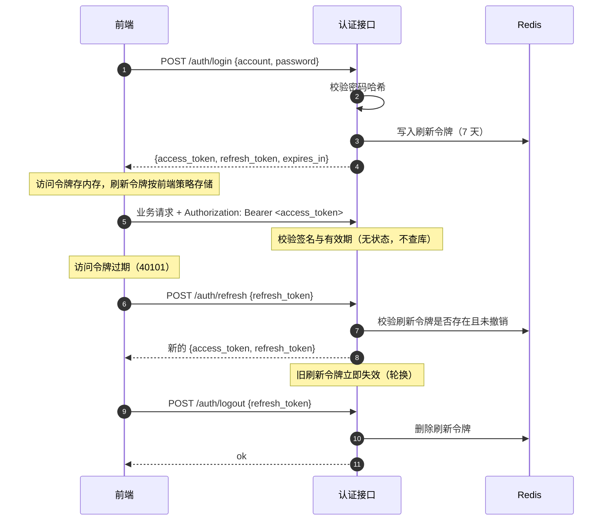
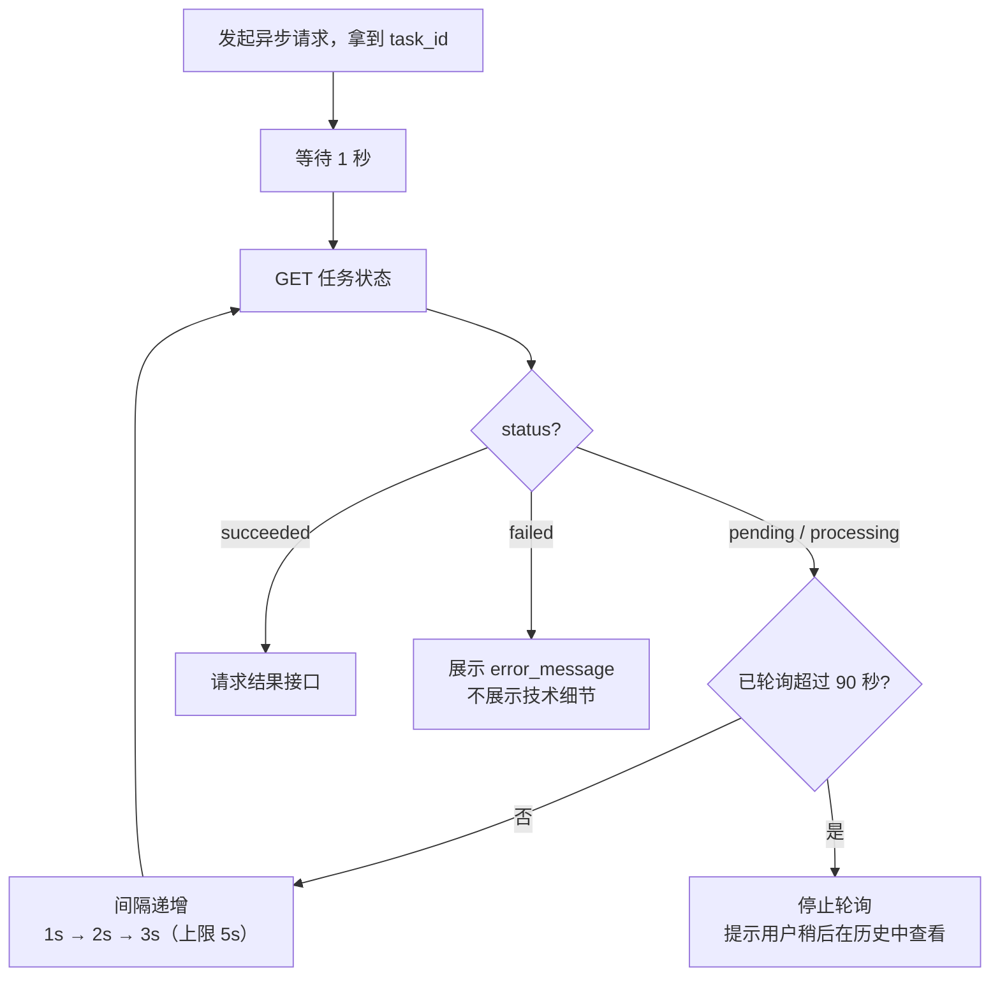

# 《智法宝》接口设计说明书

| 项目 | 内容 |
| --- | --- |
| 项目名称 | 智法宝（law-wiz）—— AI 法律助手平台 |
| 文档编号 | 05 |
| 文档版本 | v1.0（待评审） |
| 编写日期 | 2026-09-13 |
| 接口版本 | `/api/v1` |
| 上游文档 | [01-需求说明书](01-需求说明书.md)、[02-技术栈.md](02-技术栈.md)、[03-概要设计.md](03-概要设计.md)、[04-数据库设计.md](04-数据库设计.md) |

---

## 1 引言

### 1.1 编写目的

本文档确定《智法宝》一期（M1 用户管理、M2 合同智能审查、M3 法律 AI 问答）的对外 HTTP 接口契约，以及外部能力的接入约定。它是前后端并行开发与联调的依据。

预期读者：项目开发人员、指导教师、课程评审老师。

### 1.2 范围

- **本文档完整定义**：一期全部对外 REST 接口（§5）、统一响应体与错误码（§3）、鉴权与版本策略（§4）、异步任务的轮询契约（§6）、外部能力接入约定（§7）。
- **本文档不定义**：二期及以后的接口（M4 存证、M6 签署、M7 印章）。它们的接口依赖区块链、签章、时间戳三个尚未选定具体实现的能力，现在定义等于把外部系统的字段假设固化进契约。
- **M5 个人中心的接口待定**：M5 是聚合读取层（见 [03-概要设计](03-概要设计.md) §3.1），它要么**复用** M2/M3 已有的查询接口（`C-05`、`E-02`/`E-03`），要么需要**新增聚合接口**。该选择在 P2 开工前确定，确定时须把结论回写本文档。
- **不在本文档范围**：前端路由设计、UI 交互细节、部署与运维接口。

### 1.3 术语

术语以 [../CONTEXT.md](../CONTEXT.md) 为唯一权威来源。与接口相关的关键约定：

| 术语 | 在接口中的体现 |
| --- | --- |
| 合同 / 证据 | 一期只有合同（`/reviews`），无证据接口 |
| 存证编号 / TxID | 一期不涉及；二期接口中**必须是两个不同字段** |
| 时间戳 / 可信时间戳 | 一期不涉及 |
| 风险点 / 风险等级 | `risk_point` 对象，`risk_level` 取 `high`/`medium`/`low` |
| 法条引用 / 回答溯源 | `citations` 数组，含 `law_name`、`article_no`、`quoted_text` |
| 依据类型 | `source_type` 取 `retrieved_law`/`rule`/`llm_inference`，**前端必须据此区分呈现** |

---

## 2 设计原则

1. **契约真源是代码，不是本文档。** 唯一真源是 FastAPI 的 Pydantic 模型与路由注解；`/openapi.json` 自动生成。**本文档是该契约在某时点的快照**，用于评审与课程交付，不作为开发中的实时契约（见 03-概要设计 §5.5）。
2. **本文档冻结的是"形状"，不是"实现"。** 字段名、类型、错误码一经冻结即不得私自变更；具体 SQL 与算法不受本文档约束。
3. **一切响应同一外壳。** 成功与失败都是同一个信封结构，前端只需写一处解析逻辑。
4. **异步长任务一律"创建 + 轮询"。** 不引入 WebSocket 与 SSE（见 03 §5.1）。
5. **外部能力的字段假设不泄漏到对外接口。** 大模型、OCR、签章返回的原始结构一律在后端转换后再返回。
6. **敏感信息默认不返回。** 手机号、邮箱按需脱敏；密码哈希、内部错误堆栈永不返回。
7. **面向多客户端设计。** 本契约同时服务 Web、微信小程序与安卓 App，因此**不对任何客户端做特殊处理**：不做 User-Agent 嗅探、不依赖 Cookie 与 `Referer`、不返回 HTML、不把 `302` 重定向当业务语义（见 [ADR-0010](adr/0010-multi-client-strategy.md)）。

---

## 3 通用约定

### 3.1 请求约定

| 项目 | 约定 |
| --- | --- |
| 基地址 | `https://<host>/api/v1` |
| 请求体格式 | `application/json; charset=utf-8`（文件上传除外，用 `multipart/form-data`） |
| 字符编码 | 一律 UTF-8 |
| 时间字段 | 一律 **ISO 8601 带时区偏移**，如 `2026-09-13T22:05:00.000+08:00`（对应数据库的 `DATETIME(3)`，存北京时间） |
| **ID 字段** | 一律**序列化为 JSON 字符串**，如 `"id": "15"`（理由见 §3.4） |
| 字段命名 | 一律 `snake_case`（与数据库一致，避免一层映射） |
| 分页参数 | `page`（从 1 开始，默认 1）、`page_size`（默认 20，最大 100） |
| 排序参数 | `sort`，格式 `字段名` 或 `-字段名`（`-` 表示降序），如 `sort=-created_at` |

### 3.2 统一响应体

**所有**接口（含失败）返回同一结构：

```jsonc
{
  "code": 0,                    // 业务码，0 表示成功；非 0 见 §3.3
  "message": "ok",              // 面向用户的简短提示，可直接展示
  "data": { },                  // 业务数据；失败时为 null
  "request_id": "req_7f3a9c21"  // 请求追踪号，与后端日志关联
}
```

**失败示例**：

```jsonc
{
  "code": 40901,
  "message": "该手机号已被注册",
  "data": null,
  "request_id": "req_7f3a9c21"
}
```

**带字段级错误的失败示例**（表单校验场景，前端可据此高亮字段）：

```jsonc
{
  "code": 40001,
  "message": "请求参数校验失败",
  "data": {
    "details": [
      { "field": "phone", "reason": "手机号格式不正确" },
      { "field": "password", "reason": "长度至少 8 位" }
    ]
  },
  "request_id": "req_7f3a9c21"
}
```

**分页响应的 `data` 结构**（统一形状，便于前端封装）：

```jsonc
{
  "code": 0,
  "message": "ok",
  "data": {
    "items": [ /* ... */ ],
    "page": 1,
    "page_size": 20,
    "total": 137
  },
  "request_id": "req_7f3a9c21"
}
```

**关于 HTTP 状态码**：业务失败**同时**设置 HTTP 状态码（便于网关、监控与浏览器 DevTools 观察），但**前端应以 `code` 为准**判断业务结果。映射关系见 §3.3。

### 3.3 错误码规范

错误码为 5 位整数，**按段分配**，便于一眼判断问题归属：

| 段 | 含义 | HTTP 状态码 | 示例 |
| --- | --- | --- | --- |
| `0` | 成功 | 200 / 201 | — |
| `400xx` | 请求参数与格式错误 | 400 | `40001` 参数校验失败 |
| `401xx` | 未认证（凭据缺失/无效/过期） | 401 | `40101` 访问令牌无效或已过期 |
| `403xx` | 已认证但无权限 | 403 | `40301` 无权访问该资源 |
| `404xx` | 资源不存在 | 404 | `40401` 审查任务不存在 |
| `405xx` | 请求方法不被允许 | 405 | `40500` 请求方法不被允许 |
| `409xx` | 业务规则冲突 | 409 | `40901` 手机号已被注册 |
| `413xx` | 请求体过大 | 413 | `41301` 文件超出大小限制 |
| `415xx` | 不支持的文件类型 | 415 | `41501` 不支持的文件格式 |
| `429xx` | 触发限流 | 429 | `42901` 请求过于频繁 |
| `500xx` | 服务端内部错误 | 500 | `50000` 服务器内部错误 |
| `502xx` | **外部能力可用但返回异常** | 502 | `50201` 大模型服务返回异常 |
| `503xx` | **外部能力不可用** | 503 | `50301` 大模型服务不可用 |

| 错误码 | 消息 | 触发场景 |
| --- | --- | --- |
| `40001` | 请求参数校验失败 | 字段缺失、类型错误、格式不符（`data.details` 给出字段级原因） |
| `40002` | 请求体格式错误 | JSON 解析失败 |
| `40003` | 分页参数超出范围 | `page_size` > 100 或 < 1 |
| `40101` | 访问令牌无效或已过期 | 令牌缺失、签名错误、已过期 |
| `40102` | 刷新令牌无效或已被撤销 | 登出后使用旧刷新令牌、令牌不存在 |
| `40301` | 无权访问该资源 | 访问他人的审查任务或会话 |
| `40400` | 请求的资源不存在 | **框架级** 404：请求未匹配到任何路由 |
| `40401` | 审查任务不存在 | 任务号不存在或已删除 |
| `40402` | 问答会话不存在 | 会话号不存在或已删除 |
| `40403` | 知识库文档不存在 | 文档号不存在 |
| `40404` | 文件不存在 | 文件号不存在 |
| `40500` | 请求方法不被允许 | **框架级** 405：路径存在但方法不匹配 |
| `40901` | 手机号已被注册 | 注册时手机号重复 |
| `40902` | 邮箱已被注册 | 注册时邮箱重复 |
| `40903` | 账号或密码错误 | 登录失败（**不区分账号不存在与密码错误**，避免账号枚举） |
| `40904` | 账号已被停用 | 账号 `status = disabled` |
| `40905` | 该文件正在审查中 | 对同一文件重复发起审查，且已有进行中的任务 |
| `40906` | 审查任务尚未完成 | 在任务未成功时请求结果 |
| `40907` | 审查任务已失败，无法获取结果 | 任务 `status = failed` |
| `40908` | 知识库文档已存在 | 重复导入（`content_hash` 冲突） |
| `40909` | 会话已归档，无法继续提问 | 向 `archived` 的会话发消息 |
| `41301` | 文件超出大小限制 | 超过 20 MB |
| `41501` | 不支持的文件格式 | 非 `.pdf/.docx/.jpg/.jpeg/.png` |
| `42901` | 请求过于频繁 | 触发限流，响应头含 `Retry-After` |
| `50000` | 服务器内部错误 | 未捕获异常（**不返回堆栈**） |
| `50201` | 大模型服务返回异常 | LLM 返回不可解析或超时 |
| `50202` | OCR 服务返回异常 | OCR 调用失败 |
| `50300` | 数据库不可用 | 健康检查用：数据库连不上，服务实质不可用 |
| `50301` | 大模型服务不可用 | LLM 不可达或限流 |
| `50302` | OCR 服务不可用 | OCR 服务不可达 |
| `50303` | 向量检索不可用 | 向量库异常 |

> **`503xx` 与 `502xx` 的区别**：`503xx` 表示**能力整体不可用**（网络不通、服务宕机），应提示用户稍后重试；`502xx` 表示**能力可用但返回异常**（返回内容无法解析、超时），通常已在后端重试过。

### 3.4 为什么 ID 序列化为字符串（一条容易踩坑的约定）

JavaScript 的 `Number` 是 IEEE-754 双精度浮点，**能精确表示的最大整数是 2^53−1 = 9007199254740991**。数据库主键是 `BIGINT UNSIGNED`（上限约 1.8×10^19），超出该范围后，前端拿到的 ID 会**静默丢失精度**——表现为"同一个 ID 在列表里和在详情里对不上"，且极难排查。

本项目的 ID 目前远小于该上限，但这是**契约层面的问题，不是当前数据量的问题**：一旦契约定为数字，将来数据量增长后改动会波及前端所有代码。

**因此现在就把 ID 定为 JSON 字符串**，由后端序列化层统一转换（Pydantic 模型中使用 `str` 类型 + 自定义序列化）。前端只需把 ID 当作不透明字符串传递与比较，**不得做算术运算**。

### 3.5 幂等性

| 接口类型 | 幂等策略 |
| --- | --- |
| `GET` / `DELETE` | 天然幂等 |
| `PUT` | 天然幂等（全量替换语义） |
| `POST` 创建资源 | **支持 `Idempotency-Key` 请求头**：同一 key 在 24 小时内重复提交，返回首次的结果而不重复创建 |

**必须携带 `Idempotency-Key` 的接口**：`POST /reviews`（发起审查）、`POST /qa/sessions/{id}/messages`（发消息，**避免重复计费与重复消息**）。

> 为什么这两个特别需要：审查会消耗 LLM 调用额度；问答消息重复提交会产生两条内容不同的回答，用户无法判断哪条有效。前端在网络超时重试时**必须**带上同一个 key。

---

## 4 鉴权与版本

### 4.1 令牌机制

采用**访问令牌 + 刷新令牌**双令牌（对应 03-概要设计 §5.4）：

| 令牌 | 形式 | 有效期 | 传递方式 | 可撤销 |
| --- | --- | --- | --- | --- |
| 访问令牌 | JWT（无状态） | 30 分钟 | 请求头 `Authorization: Bearer <token>` | 否（依赖过期） |
| 刷新令牌 | 随机串（有状态，存于 Redis） | 7 天 | 请求体字段 | **是** |

**为什么这样设计**：纯 JWT 无法撤销（登出后令牌仍然有效到过期），纯 Session 无法横向扩展。二者结合既保留无状态校验的性能，又获得可撤销能力（登出、强制下线）。

> **本鉴权设计对三端通用（有意的多端决定）**：访问令牌走 `Authorization` 请求头、刷新令牌走请求体，**对浏览器、微信小程序、原生安卓 App 三者均成立**。
>
> 其真正的替代方案是**把刷新令牌放进 `HttpOnly` Cookie**（Web 端更安全），但**小程序与原生 App 不使用浏览器 Cookie 机制**，该方案会迫使后端维护**两套鉴权逻辑**。因此维持现方案。完整理由见 [ADR-0010](adr/0010-multi-client-strategy.md)。
>
> ⚠️ **由此产生的一条接口约束**：后端**不得依赖 Cookie 与 `Referer` 判断来源**——这两者在三端行为不一致，一旦依赖，非浏览器客户端即无法接入。

### 4.2 鉴权流程



**关键约定**：

1. **刷新令牌轮换**：每次刷新都签发**新的**刷新令牌，旧的立即失效。这使令牌被盗用后的可用窗口缩短，且异常刷新可被检测。
2. **访问令牌不查库**：校验仅验签名与有效期，保证高并发下的性能。
3. **登出即撤销**：登出删除 Redis 中的刷新令牌，此后无法再换取访问令牌（已签发的访问令牌在剩余有效期内仍可用，这是无状态设计的固有取舍，通过 30 分钟的短有效期限制影响）。

### 4.3 接口的鉴权要求

| 类别 | 接口 | 要求 |
| --- | --- | --- |
| 公开 | `POST /auth/register`、`POST /auth/login`、`POST /auth/refresh`、`GET /health` | 无需令牌 |
| 需认证 | 其余全部业务接口 | `Authorization: Bearer <access_token>` |

**资源归属校验**：凡带 `{id}` 的资源接口，后端**必须**校验该资源属于当前用户，否则返回 `40301`。**不得仅凭"前端不会传别人的 ID"作为安全依据**。

### 4.4 版本策略

- 版本号置于路径：`/api/v1/...`。理由：在日志、浏览器 DevTools、Apifox 中**直接可见**，无需解包请求头。
- **兼容性约定**：在同一大版本内，**只允许新增可选字段与新增接口**；不得删除字段、不得改变已有字段的类型或语义、不得收紧校验规则。
- 破坏性变更必须升大版本（`/api/v2`），且新旧版本并行一段时间。

### 4.5 限流

| 接口类别 | 限制 | 说明 |
| --- | --- | --- |
| 认证类（注册/登录/刷新） | 10 次 / 分钟 / IP | 防暴力破解 |
| 触发 AI 的接口（发起审查、发消息） | 10 次 / 分钟 / 用户 | 保护 LLM 额度 |
| 查询类 | 120 次 / 分钟 / 用户 | — |
| 轮询查询任务状态 | 60 次 / 分钟 / 用户 | 见 §6.2 |

触发限流返回 `42901`，响应头包含：

```
Retry-After: 30
X-RateLimit-Limit: 10
X-RateLimit-Remaining: 0
X-RateLimit-Reset: 1757800000
```

---

## 5 接口清单与详细定义

### 5.1 接口总览

| 编号 | 方法 | 路径 | 说明 | 鉴权 | 模块 |
| --- | --- | --- | --- | --- | --- |
| **认证与用户** | | | | | |
| A-01 | POST | `/auth/register` | 用户注册 | 公开 | M1 |
| A-02 | POST | `/auth/login` | 用户登录 | 公开 | M1 |
| A-03 | POST | `/auth/refresh` | 刷新令牌 | 公开 | M1 |
| A-04 | POST | `/auth/logout` | 登出 | 需认证 | M1 |
| A-05 | GET | `/users/me` | 获取当前用户信息 | 需认证 | M1 |
| A-06 | PUT | `/users/me` | 更新当前用户信息 | 需认证 | M1 |
| **文件** | | | | | |
| B-01 | POST | `/files` | 上传文件 | 需认证 | M2 |
| B-02 | GET | `/files/{file_id}` | 获取文件元数据 | 需认证 | M2 |
| **合同智能审查** | | | | | |
| C-01 | POST | `/reviews` | 发起合同审查（**异步**） | 需认证 | M2 |
| C-02 | GET | `/reviews/{task_id}` | 查询审查任务状态 | 需认证 | M2 |
| C-03 | GET | `/reviews/{task_id}/result` | 获取审查结果 | 需认证 | M2 |
| C-04 | GET | `/reviews/{task_id}/report` | 下载审查报告 | 需认证 | M2 |
| C-05 | GET | `/reviews` | 审查历史列表 | 需认证 | M2 |
| C-06 | PATCH | `/reviews/{task_id}/risk-points/{rp_id}` | 标记风险点为误报 | 需认证 | M2 |
| **法律知识库** | | | | | |
| D-01 | POST | `/kb/documents` | 创建语料元数据 | 需认证 | M3 |
| D-02 | POST | `/kb/documents/{id}/index` | 触发向量化索引（**异步**） | 需认证 | M3 |
| D-03 | GET | `/kb/documents` | 语料列表 | 需认证 | M3 |
| D-04 | GET | `/kb/documents/{id}` | 语料详情 | 需认证 | M3 |
| D-05 | GET | `/kb/search` | 语义检索 | 需认证 | M3 |
| **法律问答** | | | | | |
| E-01 | POST | `/qa/sessions` | 创建问答会话 | 需认证 | M3 |
| E-02 | GET | `/qa/sessions` | 会话列表 | 需认证 | M3 |
| E-03 | GET | `/qa/sessions/{id}` | 会话详情（含消息） | 需认证 | M3 |
| E-04 | POST | `/qa/sessions/{id}/messages` | 提问（**异步**） | 需认证 | M3 |
| E-05 | DELETE | `/qa/sessions/{id}` | 归档会话 | 需认证 | M3 |
| **系统** | | | | | |
| F-01 | GET | `/health` | 健康检查 | 公开 | — |

**共 25 个接口**（A 组 6 + B 组 2 + C 组 6 + D 组 5 + E 组 5 + F 组 1）。

### 5.2 认证与用户（A 组）

#### A-01 `POST /auth/register` —— 用户注册

**请求体**

| 字段 | 类型 | 必填 | 约束 |
| --- | --- | --- | --- |
| `phone` | string | 二选一 | 中国大陆手机号，11 位 |
| `email` | string | 二选一 | 合法邮箱 |
| `password` | string | 是 | 8–64 位，至少含字母与数字 |
| `verify_code` | string | 是 | 验证码（开发环境由 `/health` 之外的方式提供，见 §8） |

> `phone` 与 `email` **至少提供一个**，否则 `40001`。

**响应 `data`**

```jsonc
{ "user_id": "1" }
```

**错误码**：`40001`（参数校验失败）、`40901`（手机号已注册）、`40902`（邮箱已注册）、`42901`（限流）

#### A-02 `POST /auth/login` —— 用户登录

**请求体**

| 字段 | 类型 | 必填 | 说明 |
| --- | --- | --- | --- |
| `account` | string | 是 | 手机号或邮箱 |
| `password` | string | 是 | 密码 |

**响应 `data`**

```jsonc
{
  "access_token": "eyJhbGciOiJIUzI1NiIs...",
  "refresh_token": "rt_9f2c8e1a4b7d...",
  "token_type": "Bearer",
  "expires_in": 1800
}
```

**错误码**：`40001`、`40903`（账号或密码错误）、`40904`（账号已停用）、`42901`

> **安全约定**：`40903` **不区分"账号不存在"与"密码错误"**，避免攻击者据此枚举已注册账号。

#### A-03 `POST /auth/refresh` —— 刷新令牌

**请求体**：`{ "refresh_token": "rt_..." }`

**响应 `data`**：同 A-02（**新的**访问令牌与**轮换后的**刷新令牌）

**错误码**：`40001`、`40102`（刷新令牌无效或已撤销）

#### A-04 `POST /auth/logout` —— 登出

**请求体**：`{ "refresh_token": "rt_..." }`
**响应 `data`**：`null`
**错误码**：`40101`

#### A-05 `GET /users/me` —— 获取当前用户信息

**响应 `data`**

```jsonc
{
  "id": "1",
  "phone": "138****0000",     // 脱敏返回
  "email": "a***@example.com", // 脱敏返回
  "account_type": "personal",
  "status": "active",
  "last_login_at": "2026-09-13T22:05:00.000+08:00",
  "created_at": "2026-09-10T09:00:00.000+08:00",
  "profile": {
    "real_name": "张三",
    "org_name": "某某科技有限公司",
    "org_role": "法务"
  }
}
```

> **脱敏规则**：`phone` 保留前 3 后 4 位；`email` 保留首字符与域名首字符。**完整值不通过任何接口返回** —— 用户自己也不需要看到自己已提交的值被原文回显。

#### A-06 `PUT /users/me` —— 更新当前用户信息

**请求体**（全部可选，仅传需要修改的字段）

| 字段 | 类型 | 约束 |
| --- | --- | --- |
| `real_name` | string | ≤ 64 字符 |
| `org_name` | string | ≤ 200 字符 |
| `org_role` | string | ≤ 64 字符 |

**响应 `data`**：同 A-05
**错误码**：`40001`、`40101`

### 5.3 文件（B 组）

#### B-01 `POST /files` —— 上传文件

**请求**：`multipart/form-data`

| 字段 | 类型 | 必填 | 说明 |
| --- | --- | --- | --- |
| `file` | file | 是 | 合同文件 |

**约束**（对应 01-需求说明书 §3.3）：

| 项目 | 值 |
| --- | --- |
| 允许格式 | `.pdf`、`.docx`、`.jpg`、`.jpeg`、`.png` |
| 大小上限 | **20 MB** |
| 校验方式 | 依据**文件头魔数**判断类型，**不信任**扩展名与 `Content-Type` |

**响应 `data`**

```jsonc
{
  "file_id": "7",
  "original_name": "采购合同.pdf",
  "byte_size": 238104,
  "mime_type": "application/pdf",
  "sha256": "3f2a...（64 位十六进制）",
  "is_duplicate": false
}
```

**关于 `is_duplicate`**：文件采用内容寻址存储（见 04-数据库设计 §4.1）。当 `sha256` 已存在时返回既有记录且 `is_duplicate = true`，**不重复占用存储**。前端可据此提示"该文件已上传过"。

**错误码**：`40001`、`41301`（超出大小限制）、`41501`（格式不支持）、`42901`

#### B-02 `GET /files/{file_id}` —— 获取文件元数据

**响应 `data`**：同 B-01（去掉 `is_duplicate`）
**错误码**：`40404`（文件不存在）、`40301`（非本人上传）

### 5.4 合同智能审查（C 组）

#### C-01 `POST /reviews` —— 发起合同审查（异步）

**请求头**：`Idempotency-Key: <uuid>`（**必填**，见 §3.5）

**请求体**

| 字段 | 类型 | 必填 | 说明 |
| --- | --- | --- | --- |
| `file_id` | string | 是 | 已上传的文件 ID |
| `contract_title` | string | 否 | 合同名称，缺省时取文件名 |
| `force` | boolean | 否 | 默认 `false`；为 `true` 时允许对同一文件并发多个审查任务（默认拒绝重复，见 `40905`） |

**响应 `data`**（HTTP 202 Accepted）

```jsonc
{
  "task_id": "42",
  "status": "pending",
  "stage": null,
  "progress": 0,
  "created_at": "2026-09-13T22:05:00.000+08:00"
}
```

**错误码**：`40001`、`40404`、`40905`（该文件正在审查中）、`42901`

> **接口立即返回，不在请求内完成审查**：完整审查包含 OCR、条款提取、知识库检索、风险分析、报告生成，耗时远超 HTTP 合理等待时间（03-概要设计 §5.1）。前端拿到 `task_id` 后按 §6 轮询。

#### C-02 `GET /reviews/{task_id}` —— 查询审查任务状态

**响应 `data`**

```jsonc
{
  "task_id": "42",
  "status": "processing",        // pending / processing / succeeded / failed
  "stage": "analyze",            // ocr / extract_terms / retrieve / analyze / report / null
  "progress": 60,                // 0-100
  "error_code": null,            // 失败时给出错误码
  "error_message": null,         // 失败时给出面向用户的说明
  "started_at": "2026-09-13T22:05:02.000+08:00",
  "finished_at": null
}
```

**`stage` 的取值与前端展示建议**：

| `stage` | 建议展示文案 |
| --- | --- |
| `ocr` | 正在识别文件文字… |
| `extract_terms` | 正在提取合同条款… |
| `retrieve` | 正在检索相关法律依据… |
| `analyze` | 正在分析风险… |
| `report` | 正在生成报告… |

**错误码**：`40101`、`40301`、`40401`

#### C-03 `GET /reviews/{task_id}/result` —— 获取审查结果

**仅在任务 `status = succeeded` 时可调用。**

**响应 `data`**

```jsonc
{
  "task_id": "42",
  "contract_title": "采购合同",
  "summary": "本合同共发现 5 处风险，其中高风险 1 处…",
  "counts": { "high": 1, "medium": 3, "low": 1 },
  "extracted_terms": {
    "parties": ["甲方：某某科技有限公司", "乙方：某某贸易有限公司"],
    "amount": "人民币 120 万元",
    "payment_terms": "验收合格后 30 日内付清",
    "liability": "违约金按合同总额的 30% 计算",
    "jurisdiction": "合同签订地人民法院",
    "term": "2026-10-01 至 2027-09-30"
  },
  "risk_points": [
    {
      "id": "101",
      "risk_level": "high",
      "risk_category": "legal",
      "clause_title": "第八条 违约责任",
      "clause_text": "乙方逾期交货的，应按合同总额的 30% 支付违约金。",
      "char_start": 1820,
      "char_end": 1868,
      "description": "违约金比例过高，可能被法院认定为过分高于实际损失而予以调减。",
      "suggestion": "建议将违约金比例调整至合同总额的 10%–20%，或约定以实际损失为基准计算。",
      "legal_basis": "《中华人民共和国民法典》第五百八十五条",
      "source_type": "retrieved_law",
      "confidence": 0.86,
      "is_dismissed": false
    },
    {
      "id": "102",
      "risk_level": "medium",
      "risk_category": "commercial",
      "clause_title": "第五条 付款方式",
      "clause_text": "验收合格后 30 日内付清。",
      "char_start": 980,
      "char_end": 1004,
      "description": "未约定验收标准与验收期限，可能导致付款条件无法确定。",
      "suggestion": "补充验收标准、验收期限及逾期未验收的视为通过的条款。",
      "legal_basis": "《中华人民共和国民法典》第七百八十二条",
      "source_type": "rule",
      "confidence": null,
      "is_dismissed": false
    }
  ]
}
```

> ⚠️ **前端必须按 `source_type` 区分呈现**（03-概要设计 §5.3 的界面约束）：
>
> | `source_type` | 含义 | 建议呈现 |
> | --- | --- | --- |
> | `retrieved_law` | 依据检索到的法条 | 展示法条引用，可点击查看原文 |
> | `rule` | 依据人工风险规则 | 标注"依据审查规则"，不冒充法条 |
> | `llm_inference` | 模型推断，**无直接法律依据** | **必须标注**"未找到直接法律依据，仅供参考" |
>
> 三者混为一谈是本项目最容易被质疑的设计缺陷。若 `source_type = llm_inference`，前端**不得**展示为确定性结论。

**错误码**：`40101`、`40301`、`40401`、`40906`（任务尚未完成）、`40907`（任务已失败）

#### C-04 `GET /reviews/{task_id}/report` —— 下载审查报告

**查询参数**：`format`（`pdf`，默认；一期只支持 `pdf`）

**响应**：二进制流（`Content-Type: application/pdf`，`Content-Disposition: attachment; filename*=UTF-8''...`）

**错误码**：`40101`、`40301`、`40401`、`40906`、`40907`

#### C-05 `GET /reviews` —— 审查历史列表

**查询参数**

| 参数 | 类型 | 说明 |
| --- | --- | --- |
| `page` / `page_size` | int | 见 §3.1 |
| `status` | string | 可选，按状态筛选 |
| `sort` | string | 默认 `-created_at` |

**响应 `data`**（分页结构）

```jsonc
{
  "items": [
    {
      "task_id": "42",
      "contract_title": "采购合同",
      "status": "succeeded",
      "counts": { "high": 1, "medium": 3, "low": 1 },
      "created_at": "2026-09-13T22:05:00.000+08:00",
      "finished_at": "2026-09-13T22:05:41.000+08:00"
    }
  ],
  "page": 1,
  "page_size": 20,
  "total": 37
}
```

**错误码**：`40001`、`40003`、`40101`

#### C-06 `PATCH /reviews/{task_id}/risk-points/{rp_id}` —— 标记风险点为误报

**请求体**：`{ "is_dismissed": true }`

**响应 `data`**：更新后的风险点对象

**错误码**：`40001`、`40101`、`40301`、`40401`

> **此接口是模型误报样本的唯一收集途径**（见 04-数据库设计 §5.7）。这些数据是后续调优提示词与规则库的依据，因此界面上应提供"这是误报"的显式入口，而不是让用户默默忽略。

### 5.5 法律知识库（D 组）

> **说明**：知识库接口一期主要用于**语料导入与治理**（由开发/运维侧调用），面向终端用户的功能是 `D-05` 语义检索（被问答链路内部调用）。是否开放给普通用户管理语料，取决于是否设置管理员角色——**一期不设管理员角色，因此 D-01–D-04 仅对已认证用户开放但不在前端暴露入口**，由导入脚本调用。

#### D-01 `POST /kb/documents` —— 创建语料元数据

**请求体**

| 字段 | 类型 | 必填 | 说明 |
| --- | --- | --- | --- |
| `doc_type` | string | 是 | `law` / `interpretation` / `case` / `template` |
| `corpus_tier` | int | 否 | 默认 `1`；`1` 核心法规 / `2` 高价值案例 |
| `title` | string | 是 | 标题 |
| `law_name` | string | 否 | 所属法律 |
| `article_no` | string | 否 | 条号 |
| `chapter_path` | string | 否 | 编/章/节路径 |
| `effective_date` | string | 否 | `YYYY-MM-DD` |
| `abolished_date` | string | 否 | `YYYY-MM-DD` |
| `revision` | string | 否 | 版本/修正案次 |
| `source` | string | 否 | 来源 |
| `source_url` | string | 否 | 来源链接 |
| `content` | string | 是 | 语料全文（**后端计算 `content_hash`**） |

**响应 `data`**

```jsonc
{
  "document_id": "9",
  "content_hash": "a1b2...（64 位）",
  "char_count": 4821,
  "index_status": "pending",
  "chunk_count": 0
}
```

**错误码**：`40001`、`40908`（内容哈希已存在）

#### D-02 `POST /kb/documents/{document_id}/index` —— 触发向量化索引（异步）

**请求体**：`{ "force": false }`（`true` 时先删除既有分块再重建）

**响应 `data`**（HTTP 202）

```jsonc
{
  "document_id": "9",
  "index_status": "pending",
  "task_id": "17"
}
```

**错误码**：`40001`、`40101`、`40403`、`42901`

> **切分规则由后端决定，不由调用方传入**：法律文本必须**按条切分**（见 04-数据库设计 §4.3），若允许调用方指定切分方式，就可能出现按字符硬切导致检索到半句法条的情况。

#### D-03 `GET /kb/documents` —— 语料列表

**查询参数**：`page`、`page_size`、`doc_type`、`corpus_tier`、`index_status`、`law_name`（模糊）、`sort`

**响应 `data`**：分页结构，每项含 `document_id`、`doc_type`、`corpus_tier`、`title`、`law_name`、`article_no`、`effective_date`、`index_status`、`chunk_count`、`created_at`

#### D-04 `GET /kb/documents/{document_id}` —— 语料详情

**响应 `data`**：元数据 + `content` + `chunks`（前 20 个分块的 `chunk_no`、`chunk_type`、`article_no`、`char_start`、`char_end`、`content` 摘要）

**错误码**：`40101`、`40403`

#### D-05 `GET /kb/search` —— 语义检索

**查询参数**

| 参数 | 类型 | 必填 | 说明 |
| --- | --- | --- | --- |
| `q` | string | 是 | 检索文本 |
| `top_k` | int | 否 | 默认 5，最大 20 |
| `doc_type` | string | 否 | 限定语料类型 |
| `corpus_tier` | int | 否 | 限定语料分级 |
| `include_abolished` | boolean | 否 | 默认 `false`；**默认排除已废止法条** |

**响应 `data`**

```jsonc
{
  "query": "违约金过高能否调整",
  "items": [
    {
      "chunk_id": "2201",
      "document_id": "9",
      "law_name": "中华人民共和国民法典",
      "article_no": "第五百八十五条",
      "chunk_type": "article",
      "content": "约定的违约金过分高于造成的损失的，人民法院或者仲裁机构可以根据当事人的请求予以适当减少。",
      "effective_date": "2021-01-01",
      "score": 0.8734,
      "char_start": 1820,
      "char_end": 1902
    }
  ]
}
```

**错误码**：`40001`、`40101`、`50303`（向量检索不可用）

> **`include_abolished` 默认 `false` 的意义**：检索到已废止的法条并据以作答，是本项目最严重的失败形态之一。默认排除是安全的一侧。

### 5.6 法律问答（E 组）

#### E-01 `POST /qa/sessions` —— 创建问答会话

**请求体**：`{ "title": "关于违约金的问题" }`（`title` 可选，缺省时由首条提问生成）

**响应 `data`**

```jsonc
{
  "session_id": "5",
  "title": "关于违约金的问题",
  "status": "active",
  "message_count": 0,
  "created_at": "2026-09-13T22:05:00.000+08:00"
}
```

**错误码**：`40001`、`40101`

#### E-02 `GET /qa/sessions` —— 会话列表

**查询参数**：`page`、`page_size`、`status`、`sort`（默认 `-last_message_at`）

**响应 `data`**：分页结构，每项含 `session_id`、`title`、`status`、`message_count`、`last_message_at`、`created_at`

#### E-03 `GET /qa/sessions/{session_id}` —— 会话详情（含消息）

**查询参数**：`page`、`page_size`（对消息分页，默认按时间正序）

**响应 `data`**

```jsonc
{
  "session_id": "5",
  "title": "关于违约金的问题",
  "status": "active",
  "messages": {
    "items": [
      {
        "message_id": "31",
        "role": "user",
        "content": "合同里约定的违约金过高，能调整吗？",
        "has_citation": false,
        "created_at": "2026-09-13T22:05:10.000+08:00"
      },
      {
        "message_id": "32",
        "role": "assistant",
        "content": "可以。根据《民法典》第五百八十五条…",
        "has_citation": true,
        "citations": [
          {
            "document_id": "9",
            "kb_chunk_id": "2201",
            "law_name": "中华人民共和国民法典",
            "article_no": "第五百八十五条",
            "quoted_text": "约定的违约金过分高于造成的损失的，人民法院或者仲裁机构可以根据当事人的请求予以适当减少。",
            "relevance_score": 0.8734
          }
        ],
        "model_name": "deepseek-chat",
        "latency_ms": 3204,
        "created_at": "2026-09-13T22:05:13.000+08:00"
      }
    ],
    "page": 1,
    "page_size": 20,
    "total": 2
  }
}
```

**错误码**：`40101`、`40301`、`40402`

> ⚠️ **`has_citation = false` 时前端必须显示提示**：说明本条回答**未找到直接法律依据**，不是法律意见。这是"回答溯源"的反面——**溯源不了的时候要说出来**，而不是让用户以为所有回答都有依据。

#### E-04 `POST /qa/sessions/{session_id}/messages` —— 提问（异步）

**请求头**：`Idempotency-Key: <uuid>`（**必填**）

**请求体**：`{ "content": "合同里约定的违约金过高，能调整吗？" }`

**响应 `data`**（HTTP 202）

```jsonc
{
  "user_message_id": "31",
  "assistant_message_id": "33",   // 预分配，内容稍后填充
  "status": "pending"
}
```

**错误码**：`40001`、`40101`、`40301`、`40402`、`40909`（会话已归档）、`42901`、`50301`（大模型不可用）

> **为什么预分配 `assistant_message_id`**：前端在轮询到结果前就能先在界面上占位（显示"正在思考…"），拿到结果后按 ID 原地替换，避免消息顺序错乱。

#### E-05 `DELETE /qa/sessions/{session_id}` —— 归档会话

**语义**：**归档而非物理删除**（`status` 置为 `archived`），历史问答保留可查。

**响应 `data`**：`null`
**错误码**：`40101`、`40301`、`40402`

### 5.7 系统（F 组）

#### F-01 `GET /health` —— 健康检查

**响应 `data`**

```jsonc
{
  "status": "ok",              // ok / degraded
  "version": "0.1.0",
  "runtime": {
    "python": "3.14.4",
    "free_threading": false,   // 必须为 false，否则服务应在启动阶段即拒绝启动
    "started_at": "2026-09-13T21:50:00.000+08:00"
  },
  "components": {
    "database": "ok",
    "redis": "ok",
    "vector_store": "ok",
    "llm_provider": "ok",
    "ocr_provider": "ok"
  },
  "checked_at": "2026-09-13T22:05:00.000+08:00"
}
```

**约定**：任一非关键组件异常时 `status = degraded` 且 HTTP 仍返回 200；**仅当数据库不可用时返回 503**。此接口不返回任何凭据、连接串或内部地址。

> ⚠️ **503 时必须是失败响应体**：`code = 50300`（`DATABASE_UNAVAILABLE`）、`message = "数据库不可用，服务暂时无法处理请求"`，而**不是** `code = 0`。
>
> 本接口起初在 503 时仍返回 `code: 0 / message: "ok"`，造成「HTTP 说不可用、响应体说成功」的自相矛盾 —— 按 §3.2 的约定「前端应以 `code` 为准」，照约定写的前端会把服务不可用当成成功。根因是当时错误码表里没有"数据库不可用"这一项，只能用成功响应兜底；现已补上 `50300`。
>
> **诊断信息仍放在 `data` 里**（`data.status`、`data.components`），使排障时能看到是哪个组件挂了 —— 失败响应不该连带把有用的信息也丢掉。

> **`runtime.free_threading` 为什么放在健康检查里**：实测发现 `uv venv --python 3.14` 会**悄悄选中 free-threaded 解释器**，而该环境下 `chromadb` 无法安装（见 [ADR-0009](adr/0009-python-version-and-free-threading.md)）。把运行环境暴露在健康检查中，使部署后可**立即自查**用的是哪个解释器，而不必等到装依赖失败才发现。**服务启动时即应校验**：若 `Py_GIL_DISABLED` 为真则拒绝启动。

---

## 6 异步任务契约

### 6.1 适用接口

| 接口 | 轮询地址 |
| --- | --- |
| `POST /reviews`（审查） | `GET /reviews/{task_id}` |
| `POST /kb/documents/{id}/index`（向量化） | `GET /kb/documents/{document_id}` 的 `index_status` 字段 |
| `POST /qa/sessions/{id}/messages`（提问） | `GET /qa/sessions/{session_id}` 中该 `assistant_message_id` 的内容 |

### 6.2 轮询规则（前端必须遵守）



| 规则 | 值 | 理由 |
| --- | --- | --- |
| 首次轮询延迟 | 1 秒 | 给后端一个启动窗口，避免无意义的立即请求 |
| 轮询间隔 | 递增：1s → 2s → 3s → 5s（上限 5s） | 固定 1 秒轮询会在任务耗时较长时产生大量无用请求 |
| 最长轮询时长 | **90 秒** | 超过后停止并引导用户去历史列表查看，避免页面永久转圈 |
| 并发轮询数 | 同一页面最多 1 个 | 防止用户重复点击产生多个轮询循环 |
| 失败重试 | **不自动重试** | 失败即失败，由用户决定是否重新发起（重新发起需新的 `Idempotency-Key`） |

> **与需求的对应**：01-需求说明书 §4.1 规定"合同审查完整流程 ≤60 秒"。90 秒的轮询上限为正常情况留出 30 秒余量，同时确保异常时前端不会无限等待。

### 6.3 任务终态

| 状态 | 含义 | 前端行为 |
| --- | --- | --- |
| `pending` | 已创建，尚未开始 | 继续轮询 |
| `processing` | 处理中，`stage` 与 `progress` 有效 | 继续轮询，展示阶段文案与进度条 |
| `succeeded` | 成功，结果可用 | 停止轮询，请求结果 |
| `failed` | 失败，`error_code` 与 `error_message` 有效 | 停止轮询，展示 `error_message` |

**终态是 `succeeded` 与 `failed`，二者一旦到达不会改变**（不再从 `succeeded` 变回 `processing`）。

---

## 7 外部能力接入

> **一期不建 Provider 接口体系**（[ADR-0012](adr/0012-defer-capability-abstraction.md)）：
> 外部能力由需要的切片**直接接入**，但**同一个能力只在一处封装**。
> 下表是**演进方向**，不是一期的实现要求 —— 当某个能力真的出现第二种实现时，在那一刻抽接口。

| 能力 | 一期实现 | 将来可能的第二种实现 | 相关 ADR |
| --- | --- | --- | --- |
| 大模型 | DeepSeek API（经 OpenAI 兼容接口） | Ollama + Qwen | — |
| 嵌入 | 云端嵌入 API | 本地开源嵌入模型 | — |
| OCR | 云端 OCR API | PaddleOCR（**不在服务器运行**） | — |
| 向量存储 | Chroma（进程内） | pgvector / Milvus | [ADR-0004](adr/0004-vector-store-abstraction.md) |
| 对象存储 | MinIO（内容寻址） | 本地卷 | — |
| 区块链 / 签章 / 时间戳 | P2 / P3 接入 | 见各自 ADR | [ADR-0005](adr/0005-signature-provider-abstraction.md)、[ADR-0006](adr/0006-timestamp-source.md) |

**一条与抽象无关、但必须遵守的约束**：

- **同一个外部能力只在一处封装**，其它地方复用该封装。业务代码里不应出现同一个厂商 SDK
  的分散调用 —— 那会让将来真要替换时无处下手。

**一条关于接口形状的要求**（与是否抽接口无关）：

- **`chat_structured()` 必须是独立方法，不是 `chat()` 的可选参数**。它承担
  "强制结构化输出 + 解析失败重试一次"的职责（见 03-概要设计 §5.3 的输出约束层）。
  做成可选参数会导致调用方忘记开启，把无法解析的模型输出直接透传给用户。

---

## 8 开发环境约定

| 项目 | 约定 |
| --- | --- |
| 接口文档 | 启动后端后访问 `/docs`（Swagger UI）与 `/openapi.json` |
| 契约同步 | `openapi.json` 导出后导入 Apifox 用于 Mock 与调试；**契约真源是代码，不是 Apifox** |
| 验证码 | **开发环境不发送真实短信/邮件**：`POST /auth/register` 在 `APP_ENV=development` 时接受固定验证码 `000000`，并在服务端日志打印本应发送的内容 |
| 外部能力 | 开发环境可把 LLM 指向本地 Ollama，避免消耗 API 额度 |
| 时间 | 统一北京时间（UTC+8），与数据库 `DATETIME(3)` 一致 |
| 跨域 | 开发环境允许前端开发服务器来源；生产环境由 Nginx 同源代理，**不开启宽泛 CORS** |

> **`APP_ENV=development` 的固定验证码是一个需要显式守护的开关**：上线前必须确认生产环境的 `APP_ENV` 不是 `development`。建议在启动时校验：若 `APP_ENV != development` 而固定验证码仍启用，则**拒绝启动**。

---

## 9 附录

### 9.1 一期接口与需求功能点的对应

| 需求功能点 | 对应接口 |
| --- | --- |
| M1-01 用户注册 | A-01 |
| M1-02 用户登录 | A-02、A-03、A-04 |
| M1-03 个人信息管理 | A-05、A-06 |
| M2-01 合同文件上传 | B-01、B-02 |
| M2-02 文本识别 / 解析 | C-01（后端内部调云端 OCR）、C-02 的 `stage=ocr` |
| M2-03 关键条款提取 | C-03 的 `extracted_terms`、C-02 的 `stage=extract_terms` |
| M2-04 法律知识库检索 | D-05、C-02 的 `stage=retrieve` |
| M2-05 风险智能分析 | C-03 的 `risk_points`、C-02 的 `stage=analyze`、C-06（风险点误报标记） |
| M2-06 风险报告生成 | C-04、C-02 的 `stage=report` |
| M2-07 审查历史查看 | C-05 |
| M3-01 法律知识库构建 | D-01 ~ D-04 |
| M3-02 智能问答 | E-04、E-03 |
| M3-03 多轮对话 | E-01、E-03、E-04（同一 `session_id` 下多轮） |
| M3-04 回答溯源 | E-03 的 `citations`、C-03 的 `legal_basis` 与 `source_type` |
| M3-05 问答历史 | E-02、E-03、E-05（归档会话） |
| （非功能点）健康检查 | F-01 |

### 9.2 与上游文档的对应关系

| 本文档内容 | 依据 |
| --- | --- |
| 统一响应体、错误码分段、`/api/v1` | 03-概要设计 §5.5 |
| 双令牌与撤销策略 | 03-概要设计 §5.4 |
| 异步任务 + 轮询（不用 WebSocket） | 03-概要设计 §5.1 |
| `source_type` 三类内容的区分呈现 | 03-概要设计 §5.3 |
| 内容寻址与 `is_duplicate` | 04-数据库设计 §4.1 |
| 默认排除已废止法条 | 04-数据库设计 §5.9（`abolished_date`） |
| 外部能力接入（一期直接接入，不建 Provider 接口体系） | [ADR-0012](adr/0012-defer-capability-abstraction.md)、ADR-0004/0005/0006 |

### 9.3 接口字段与数据库字段的对应（I-05 复核结果）

已对《04-数据库设计》的 100 个列名与本文档的全部字段名做过机械比对，**无冲突**。以下差异均为**设计意图内的命名差异**，记录在此以免后人误认为是笔误：

| 接口字段 | 数据库字段 / 来源 | 说明 |
| --- | --- | --- |
| `task_id` | `review_task.id` | 接口层用**带资源前缀的字段名**（`task_id` / `session_id` / `document_id` / `file_id` / `message_id`），避免响应中出现一堆无语义的 `id` |
| `session_id` | `qa_session.id` | 同上 |
| `document_id` | `kb_document.id` | 同上 |
| `file_id` | `file_object.id` | 同上 |
| `assistant_message_id` | `qa_message.id` | **派生字段**：E-04 预分配的是"即将生成的那条 assistant 消息"的 ID，数据库无此独立列 |
| `chunk_count` | `COUNT(kb_chunk)` | **派生字段**：聚合计数，不落库 |
| `counts.high/medium/low` | `review_report.high_count` 等 | 接口改为嵌套对象，语义更清晰 |
| `contract_title` | `contract.title` | 接口层不暴露 `contract` 资源（一期无合同管理），故以 `contract_title` 呈现 |
| `is_duplicate` | 由 `file_object.sha256` 是否已存在推导 | **派生字段**，不落库（见 04 §4.1） |
| `page` / `page_size` / `sort` / `top_k` / `force` / `include_abolished` / `verify_code` | — | **查询参数或请求参数**，非数据库字段 |
| `snake_case` | — | 文档中的命名规范说明，非字段 |

**两处需要后端实现时特别注意的契约**：

1. **`char_start` / `char_end` 的基准是 `contract_version.plain_text`**。C-03 返回的这两个偏移量用于前端在合同全文上高亮定位，其**唯一基准是数据库中的 `plain_text` 列**（原始文本），不是 OCR 结果、不是 PDF 页面坐标。前端若用别处的文本做高亮，偏移必然对不上。
2. **`file_id` 与 `document_id` 不可混用**。`file_id` 指向用户上传的文件（`file_object`），`document_id` 指向法律语料（`kb_document`）—— 两者都是"文档"，但在本项目里是完全不同的东西（见 `CONTEXT.md` 中"知识库文档"与"文件"的区分）。接口路径与参数命名已严格区分，前端不得交叉传递。

### 9.4 待办

| 编号 | 事项 | 说明 |
| --- | --- | --- |
| I-01 | **契约在评审后冻结** | 冻结后变更需在团队内知会并同步 Apifox |
| I-02 | 从本契约生成 `openapi.json` 并导入 Apifox | 由后端骨架落地后执行 |
| I-03 | 二期接口定义 | M4/M6/M7 的接口在 P2 开工前补充 |
| I-04 | 确认 OCR 服务商与嵌入模型的具体选型 | 影响 OCR 与嵌入的接入，不影响本契约 |
| I-05 | 冻结前复核《04》与本文档的字段名一致性 | 两份文档的字段名必须逐字一致 |
| I-06 | **确认生产域名满足微信小程序的接入条件** | 需 HTTPS 且经 ICP 备案，并在微信公众平台配置服务器域名白名单。**须在 P2 部署阶段确认，不能拖到 P5** |

---

**文档结束**
