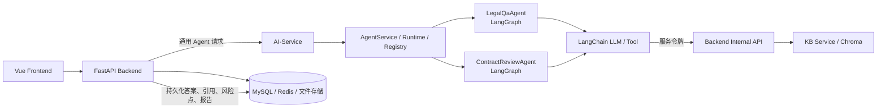

# P1 MVP 演示指南

本指南只覆盖当前已实现的 M1 用户、M2 合同智能审查、M3 法律 AI 问答。M4–M7、OCR 与生产级语义 Embedding 不在本次答辩承诺范围内。

## 演示前检查

1. 启动 MySQL 与 Redis，执行 Backend Alembic 迁移；导入核心法规和风险规则，并在 Chroma 后端建立索引。
2. 启动 Backend、AI-Service 与 Frontend。服务间使用独立共享令牌：Backend 的 `LAWWIZ_INTERNAL_SERVICE_TOKEN` 与 AI-Service 的 `AI_SERVICE_BACKEND_TOKEN` 必须一致；它不是用户 JWT。
3. 为 AI-Service 提供 `DEEPSEEK_API_KEY`、`DEEPSEEK_BASE_URL` 与 `DEEPSEEK_MODEL`。密钥仅存在于系统环境变量或未提交的 `.env` 中。
4. 访问 health 接口，确认 database、redis、vector_store 为 `ok`；使用 Frontend 注册并登录测试用户。

## 架构说明

- Backend 负责鉴权、文件解析、任务状态、事务与业务结果持久化。
- AI-Service 负责 Agent 输入输出、LangGraph 工作流、LangChain 模型调用与 Tool；它不直接访问业务数据库。
- Tool 经过受保护的 Backend Internal API 获取法规和风险规则，避免 Agent 直连 MySQL。

## Demo 流程一：法律 AI 问答

1. 登录后进入“法律问答”，创建会话。
2. 提问：`劳动合同约定的试用期工资有哪些法律限制？请给出依据。`
3. 页面先展示“正在思考”，随后通过轮询展示回答和法规引用。
4. 说明调用链：

   `Frontend → QA Pipeline → AiServiceClient → legal_qa → LegalQaGraph → LawRetrievalTool → Backend Internal API → KB/Chroma → DeepSeek → answer/citations → Backend 持久化`

5. 展示会话详情中的回答与引用，强调引用由 Backend 持久化，AI-Service 只返回结构化 `LegalQaResult`。

## Demo 流程二：合同智能审查

1. 进入“合同审查”，上传可提取文本的 PDF、DOCX 或 UTF-8 TXT。
2. 使用包含试用期工资、过高违约金、单方解除权等条款的劳动合同示例，发起审查。
3. 页面轮询显示文本提取、条款提取、法规检索、风险分析、报告生成阶段。
4. 展示高/中/低风险点、法律依据与下载的 PDF 报告。
5. 说明调用链：

   `Frontend → 文件上传/文本提取 → Review Pipeline → AiServiceClient → contract_review → ContractReviewGraph → 法规/风险规则 Tool → Backend Internal API → DeepSeek → risk_points → Backend 持久化与 PDF 报告`

## 演示中应说明的边界

- 扫描 PDF、图片合同与无法提取文本的文件会返回明确提示：当前版本暂不支持扫描件 OCR；不会向 Agent 发送空文本。
- 法律问答和合同审查输出均为辅助信息，不替代律师意见。
- Chroma 已验证持久化检索；当前嵌入为确定性开发实现，生产级语义 Embedding Provider 仍待接入。
- 自动化测试使用 Fake LLM、Fake Vector、Fake Backend Client；真实 DeepSeek 只在人工联调时由环境变量启用。

## 答辩验收点

| 项目 | 可观察结果 |
| --- | --- |
| 服务边界 | AI-Service 不直接访问业务数据库，Tool 经 Internal API 取数 |
| Legal QA | 结构化答案、引用持久化、会话可回看 |
| Contract Review | 文本化输入、异步阶段轮询、风险点与 PDF 报告持久化 |
| 可靠性 | Idempotency-Key、超时/连接失败转换、任务失败状态可见 |
| 安全 | 用户 JWT 与服务间共享令牌分离；密钥不进仓库 |
